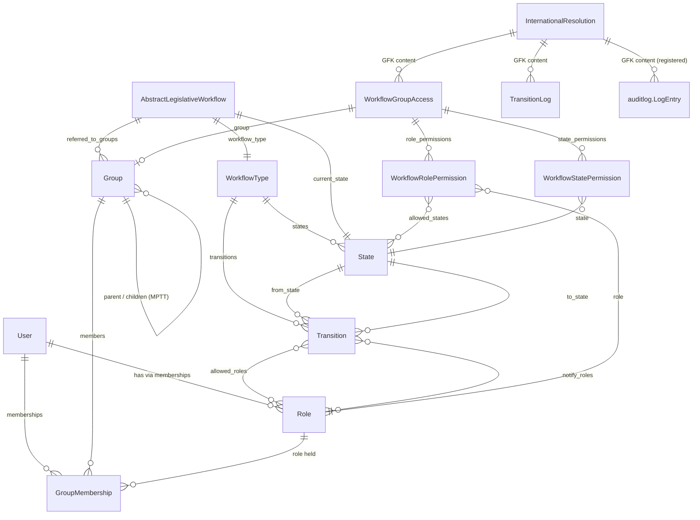

# Data Model

All `pwms` models are defined under `pwms/models/` and registered through
`pwms/models/__init__.py`. Database table names are prefixed `pwms_`
(e.g. `pwms_internationalresolution`).

---

## ERD (overview)

> The abstract `AbstractLegislativeWorkflow` is shown for clarity; it has no
> table. Its fields are copied onto each concrete subclass
> (`InternationalResolution` today).

---

## 1. `BaseModel` (abstract) — `pwms/models/base.py`

Shared by every pwms model.

| Field | Type | Notes |
| --- | --- | --- |
| `id` | BigAutoField | internal integer PK (used by GenericForeignKeys) |
| `public_id` | UUID | **uuid7**, unique, indexed — external/URL-safe identifier |
| `created_at` | DateTime | auto |
| `updated_at` | DateTime | auto (often excluded from audit diffs) |

---

## 2. Identity & organisation

### `User(AbstractUser, BaseModel)` — `pwms.User`

Django user with parliamentary profile fields:

| Field | Notes |
| --- | --- |
| `title`, `middle_name`, `gender`, `phone`, `bio`, `avatar` | profile |
| `employee_type` | staff / member / graduate |
| `positiondesc`, `supervisor` (self FK) | reporting |
| `department` (FK `Group`) | home department |
| `date_of_birth`, `date_joined_parliament`, `termination_date` | lifecycle |
| `idno_encrypted`, `idno_hmac` | ID number stored encrypted; HMAC (key from `IDNO_HMAC_KEY`) enables unique lookup |
| `is_mp`, `is_staff_member`, `is_active` | flags |
| `constituency`, `party_affiliation` | political attributes |

Methods include membership/role helpers and `can_transition_workflow(...)`.

### `Group(MPTTModel, BaseModel)` — `pwms.Group`

Hierarchical organisational unit:

| Field | Notes |
| --- | --- |
| `name`, `short_name`, `slug` (unique) | identity |
| `group_type` | legislature, house, portfolio/select/special/ad-hoc/joint/internal committee, administration, office, division, section, business_unit, party, executive, presidency, ministry, department, province, premier, delegation |
| `parent` (Tree FK) | MPTT hierarchy |
| `description`, `is_active`, `contact_email`, `contact_phone`, `location`, `start_date`, `end_date` | metadata |

Helpers: `get_full_path()`, `get_active_members()`.

### `Role(BaseModel)` — `pwms.Role`

| Field | Notes |
| --- | --- |
| `name`, `slug` (unique), `description` | identity |
| `can_transition_workflows`, `can_create_workflows`, `can_assign_workflows`, `can_manage_permissions` | workflow capability flags |

### `GroupMembership(BaseModel)`

Users hold roles **within** groups, over a period:

| Field | Notes |
| --- | --- |
| `user` (FK `User`, related `memberships`) | who |
| `group` (FK `Group`, related `members`) | where |
| `role` (FK `Role`, PROTECT) | what role |
| `start_date`, `end_date`, `is_active`, `notes` | membership period |
| `updated_by` (FK `User`) | who last edited |

Unique on `(user, group, role, start_date)`; `clean()` validates dates.

---

## 3. Workflow engine & instances — `pwms/models/workflows.py`

### `WorkflowType`

| Field | Notes |
| --- | --- |
| `name` (unique), `slug`, `description`, `enabled` | registry entry |

Reverse relations: `states`, `transitions`, `%(class)s_instances`.

### `State`

| Field | Notes |
| --- | --- |
| `workflow_type` (FK, related `states`) | owning machine |
| `name`, `slug`, `description` | identity (slug unique per type) |
| `is_initial`, `is_terminal`, `allows_referrals` | behaviour flags |
| `order`, `color` | display |

Uniqueness: `(workflow_type, name)` and `(workflow_type, slug)`.

### `Transition`

| Field | Notes |
| --- | --- |
| `workflow_type` (FK, related `transitions`) | owning machine |
| `name`, `slug` | identity (slug unique per type) |
| `from_state`, `to_state` (FK `State`) | the edge |
| `allowed_roles` (M2M `Role`) | who may take this transition |
| `notify_roles` (M2M `Role`) | who gets alerted on it |
| `requires_comment`, `order` | behaviour |

Uniqueness: `(workflow_type, from_state, to_state)` and `(workflow_type, slug)`.

### `AbstractLegislativeWorkflow` (abstract)

| Field | Notes |
| --- | --- |
| `workflow_type` (FK) | machine the instance follows |
| `title`, `description` | content |
| `current_state` (FK `State`) | where it is now (validated to belong to `workflow_type`) |
| `owner`, `assigned_to` (FK `User`) | responsible parties |
| `referred_to_groups` (M2M `Group`) | dynamic referrals |
| `deadline`, `priority` | due date + low/medium/high/urgent |

### `InternationalResolution(AbstractLegislativeWorkflow)`

Adds `resolution_number` (unique) and `adoption_date`.

---

## 4. RBAC layer

### `WorkflowGroupAccess`

| Field | Notes |
| --- | --- |
| `group` (FK `Group`, related `workflow_accesses`) | House/Committee granted access |
| `content_type` + `object_id` → `content_object` | **GFK** to the workflow instance |
| `can_view`, `can_edit`, `can_delete`, `can_transition` | group-level defaults |
| `is_primary`, `granted_by` (FK `User`), `granted_at` | grant metadata |

Indexed on `(content_type, object_id)`.

### `WorkflowRolePermission`

Per-role override inside a group access — **authoritative for that role** when a
row exists.

| Field | Notes |
| --- | --- |
| `group_access` (FK, related `role_permissions`) | parent |
| `role` (FK `Role`) | which role |
| `can_view/edit/delete/transition` | overrides |
| `allowed_states` (M2M `State`) | if set, override applies only in these states |

Unique `(group_access, role)`.

### `WorkflowStatePermission`

What the granted group may do **in a particular state**.

| Field | Notes |
| --- | --- |
| `group_access` (FK, related `state_permissions`) | parent |
| `state` (FK `State`) | the state |
| `can_view/edit/delete/transition` | abilities |

Unique `(group_access, state)`.

---

## 5. Auditing

### `TransitionLog` (plain `models.Model`, not `BaseModel`)

Domain event log for workflow progression — one table serves every subclass via
a GFK.

| Field | Notes |
| --- | --- |
| `content_type` + `object_id` → `content_object` | GFK to the workflow instance |
| `action` | e.g. `STATE_TRANSITION`, future `REFERRAL` |
| `from_state`, `to_state` (FK `State`) | the move |
| `actor` (FK `User`) | who performed it |
| `ip_address`, `timestamp`, `notes` | context |

Indexed on `(content_type, object_id, -timestamp)`.

### `auditlog.LogEntry` (third-party)

Automatic CRUD history for registered models. For `InternationalResolution` it is
written on create/update/delete with `actor`, `timestamp`, `remote_addr` and a
field-level `changes` diff (including M2M changes for `referred_to_groups`).
Reached via `auditlog.models.LogEntry` (see `pwms/utils/audit_helpers.py`).

---

## 6. Conventions worth remembering

- **GFK over FK-to-abstract:** cross-cutting tables that reference *any* workflow
  subclass use `GenericForeignKey` because Django forbids FKs to abstract models.
- **Integer PK is the GFK target** (`object_id` stores `pwms_internationalresolution.id`).
- **New concrete workflow model checklist:** subclass the abstract base, run
  `makemigrations`, register with `auditlog` in `apps.py`, add an audit API view.
