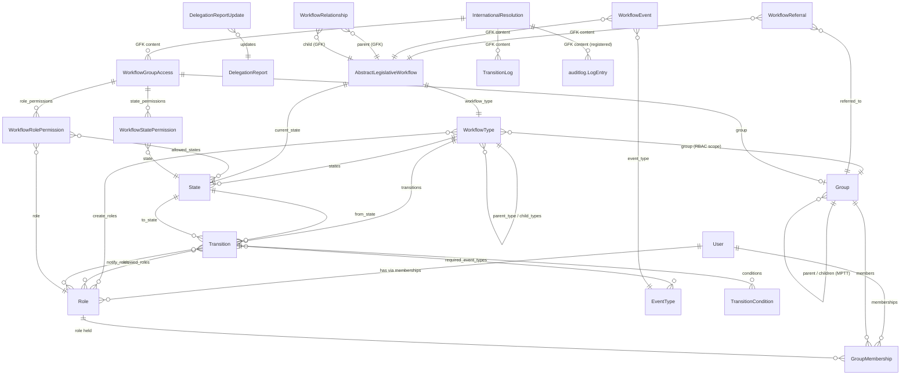

# Data Model

All `pwms` models are defined under `pwms/models/` and registered through
`pwms/models/__init__.py`. Database table names are prefixed `pwms_`
(e.g. `pwms_internationalresolution`).

---

## ERD (overview)

> The abstract `AbstractLegislativeWorkflow` is shown for clarity; it has no
> table. Its fields are copied onto each concrete subclass
> (`InternationalResolution`, `DelegationReport` today).

---

## 1. `BaseModel` (abstract) — `pwms/models/base.py`

Shared by every pwms model.

| Field | Type | Notes |
| --- | --- | --- |
| `id` | BigAutoField | internal integer PK (used by GenericForeignKeys) |
| `public_id` | UUID | **uuid7**, unique, indexed — external/URL-safe identifier |
| `created_at` | DateTime | auto |
| `updated_at` | DateTime | auto (often excluded from audit diffs) |

---

## 2. Identity & organisation

### `User(AbstractUser, BaseModel)` — `pwms.User`

Django user with parliamentary profile fields:

| Field | Notes |
| --- | --- |
| `title`, `middle_name`, `gender`, `phone`, `bio`, `avatar` | profile |
| `employee_type` | staff / member / graduate |
| `positiondesc`, `supervisor` (self FK) | reporting |
| `department` (FK `Group`) | home department |
| `date_of_birth`, `date_joined_parliament`, `termination_date` | lifecycle |
| `idno_encrypted`, `idno_hmac` | ID number stored encrypted; HMAC (key from `IDNO_HMAC_KEY`) enables unique lookup |
| `is_mp`, `is_staff_member`, `is_active` | flags |
| `constituency`, `party_affiliation` | political attributes |

Methods include membership/role helpers and `can_transition_workflow(...)`.

### `Group(MPTTModel, BaseModel)` — `pwms.Group`

Hierarchical organisational unit:

| Field | Notes |
| --- | --- |
| `name`, `short_name`, `slug` (unique) | identity |
| `group_type` | legislature, house, portfolio/select/special/ad-hoc/joint/internal committee, administration, office, division, section, business_unit, party, executive, presidency, ministry, department, province, premier, delegation |
| `parent` (Tree FK) | MPTT hierarchy |
| `description`, `is_active`, `contact_email`, `contact_phone`, `location`, `start_date`, `end_date` | metadata |

Helpers: `get_full_path()`, `get_active_members()`.

### `Role(BaseModel)` — `pwms.Role`

| Field | Notes |
| --- | --- |
| `name`, `slug` (unique), `description` | identity |
| `can_transition_workflows`, `can_create_workflows`, `can_assign_workflows`, `can_manage_permissions` | workflow capability flags |

### `GroupMembership(BaseModel)`

Users hold roles **within** groups, over a period:

| Field | Notes |
| --- | --- |
| `user` (FK `User`, related `memberships`) | who |
| `group` (FK `Group`, related `members`) | where |
| `role` (FK `Role`, PROTECT) | what role |
| `start_date`, `end_date`, `is_active`, `notes` | membership period |
| `updated_by` (FK `User`) | who last edited |

Unique on `(user, group, role, start_date)`; `clean()` validates dates.

---

## 3. Workflow engine & instances — `pwms/models/workflows.py`

### `WorkflowType`

| Field | Notes |
| --- | --- |
| `name` (unique), `slug`, `description`, `enabled` | registry entry |
| `group` (FK, related `workflow_types`) | RBAC scope: the group whose members/roles govern this type |
| `create_roles` (M2M to `Role`, related `creatable_workflow_types`) | roles **from that group** allowed to create instances; empty means superusers only |
| `parent_type` (self-FK, related `child_types`) | optional type hierarchy; declaring child types opts the parent into type-restricted instance links |

Reverse relations: `states`, `transitions`, `child_types`, `%(class)s_instances`.

Type-level hierarchy helpers: `is_root_type`, `get_ancestor_types()`,
`get_descendant_types()`, `allowed_child_types()` (empty means "unrestricted").

Group-scoped creation helpers: `group_roles()` (roles held by members of
`group`, i.e. the valid `create_roles` choices), `can_create(user)` (superuser
bypass; otherwise requires one of `create_roles` held in that exact group) and
the classmethod `creatable_by(user)` returning the enabled types a user may
create in. `group` is nullable in the database because the seeded types exist
before their group does, but it is **required in the admin**; the role/group
pairing is enforced by `WorkflowTypeAdminForm`.

### `State`

| Field | Notes |
| --- | --- |
| `workflow_type` (FK, related `states`) | owning machine |
| `name`, `slug`, `description` | identity (slug unique per type) |
| `is_initial`, `is_terminal`, `allows_referrals` | behaviour flags |
| `order`, `color` | display |

Uniqueness: `(workflow_type, name)` and `(workflow_type, slug)`.

### `Transition`

| Field | Notes |
| --- | --- |
| `workflow_type` (FK, related `transitions`) | owning machine |
| `name`, `slug` | identity (slug unique per type) |
| `from_state`, `to_state` (FK `State`) | the edge |
| `allowed_roles` (M2M `Role`) | who may take this transition |
| `notify_roles` (M2M `Role`) | who gets alerted on it |
| `required_event_types` (M2M `EventType`) | event guards — blocked until each type has been recorded on the instance |
| `requires_comment`, `order` | behaviour |

Uniqueness: `(workflow_type, from_state, to_state)` and `(workflow_type, slug)`.

### `TransitionCondition(BaseModel)`

Extra business rule guarding a transition, beyond the state machine and the
event guards. Evaluated by `unmet_transition_conditions()` together with
`required_event_types`.

| Field | Notes |
| --- | --- |
| `transition` (FK, related `conditions`) | guarded transition |
| `condition_type` | `no_open_referrals` / `all_children_closed` / `field_set` |
| `field_name` | parameter for `field_set`, e.g. `adoption_date` |
| `enabled`, `order` | switch + evaluation order |

Handlers live in the `TRANSITION_CONDITION_HANDLERS` registry (extend with the
`@transition_condition("name")` decorator). Unique
`(transition, condition_type, field_name)`.

### `AbstractLegislativeWorkflow` (abstract)

| Field | Notes |
| --- | --- |
| `workflow_type` (FK) | machine the instance follows |
| `title`, `description` | content |
| `current_state` (FK `State`) | where it is now (validated to belong to `workflow_type`) |
| `owner`, `assigned_to` (FK `User`) | responsible parties |
| `deadline`, `priority` | due date + low/medium/high/urgent |

Referrals are **not** an M2M: they are typed `WorkflowReferral` rows, so they
carry who referred, when, to whom, by when, and the response (see below). The
base class exposes `refer(group, ...)`, `referrals()` and `open_referrals()`;
creation is gated by `State.allows_referrals`.

**Parent / child hierarchy.** Concrete instances of different subtypes can be
nested (a `DelegationReport` contains many `InternationalResolution` rows).
Because a self-referential FK is impossible on an abstract model, the link
lives in `WorkflowRelationship` and the base class exposes a tree API:

| Helper | Purpose |
| --- | --- |
| `parent_relationship`, `parent_workflow`, `relationship_type` | link to / data about the parent (`None`/`''` when root) |
| `sub_workflows`, `has_sub_workflows` | direct children |
| `is_root_workflow`, `hierarchy_level` | position in the tree |
| `get_ancestors()`, `get_workflow_hierarchy_path()`, `get_all_descendants()` | tree traversal (cycle-safe) |
| `set_parent_workflow(parent, relationship_type=...)`, `clear_parent_workflow()` | attach / detach / re-parent |
| `add_sub_workflow(child, ...)`, `remove_sub_workflow(child)` | manage children |

### `DelegationReport(AbstractLegislativeWorkflow)`

A delegation's report on an international engagement/forum (BRS BR02/BR03). It
contains many `InternationalResolution` rows through `WorkflowRelationship`
and parents many `DelegationParticipant` rows.

| Field | Notes |
| --- | --- |
| `reference_number` (unique) | system-generated `DR-<year>-<sequence>` (BR02.6) |
| `engagement_name` | international engagement / forum (BR02.3.3) |
| `engagement_start_date`, `engagement_end_date` | validated: not future, end ≥ start (BR02.3.4/5) |
| `location_city`, `location_country` | engagement location (BR02.3.6) |
| `notes` | additional notes / follow-up action (BR02.3.13) |
| `report_document_url` | SharePoint link to the delegation report (BR02.3.14) |
| read-only `atc_reference`, `atc_publication_date`, `atc_page_number`, `atc_document_url` | latest values from the `updates` history (BR03.5.3/5) |
| inherited `deadline` | due date for implementation (BR02.3.12) |
| inherited `assigned_to` + `assigned_to_email` | assigned official + email (BR02.3.10/11) |

Helpers: `is_overdue` / `overdue_identifier` implement BR12 ("Due date expired
– pending follow up" when the deadline is past and the state is not terminal);
`record_update(...)` appends to the BR03 history (see
`DelegationReportUpdate`).

### `InternationalResolution(AbstractLegislativeWorkflow)`

A resolution adopted at an engagement, captured from the delegation report's
recommendations (BR02.3.9).

| Field | Notes |
| --- | --- |
| `resolution_number` (unique) | resolution reference |
| `resolution_text` | the resolution as concluded |
| `adoption_date` | date of adoption |
| `responsible_group` (FK `Group`) | committee/group responsible for implementation |
| `implementation_progress` | latest implementation narrative |

### `DelegationParticipant(BaseModel)`

Delegation members and support officials (BR02.3.7/8).

| Field | Notes |
| --- | --- |
| `delegation_report` (FK, related `participants`) | owning report |
| `participant_type` | `member` / `official` |
| `title`, `first_name`, `last_name`, `delegation_role` | person details |
| `user` (FK `User`, optional) | link to a system account |
| `order` | display order |

Property `full_name`. Indexed on `(delegation_report, participant_type)`.

### Seeded workflow definitions

Migration `0005_seed_workflow_definitions` creates (idempotently, matched by
natural key) the two BRS machines:

| Type | States |
| --- | --- |
| **Delegation Report** | Awaiting PGIR approval *(initial)* → Submitted for tabling → Tabled and referred to Committee → Closed – House approved *(terminal)* |
| **International Resolution** | Captured *(initial)* → Assigned → In Progress → Implemented → Closed *(terminal)*; `parent_type` = Delegation Report |

Each step has a single onward transition; roles are **not** attached to these
transitions (assign `allowed_roles` / `notify_roles` per environment).

Migration `0012_assign_workflow_type_rbac_group` points both seeded types at
group 98 — *IRP: MR: Man And Gen*, the Multilateral Relations unit that handles
international engagements. That migration is a no-op where the group does not
yet exist (a fresh or test database), because the types are seeded by `0005`
while group 98 only arrives with the Oracle organisational sync. `create_roles`
is intentionally left empty: assign the creating roles per environment in the
WorkflowType admin (only roles held by members of the type's group are offered).

Migration `0007_seed_event_types` adds the standard event types
(`report-document-attached`, `atc-update-published`, `implementation-reported`,
`referral-created`, `referral-responded`) and wires the first guard: *Delegation
Report → Close – House approved* requires an `atc-update-published` event.
Migration `0009` adds `referral-recalled` / `referral-expired`.

### `WorkflowReferral(BaseModel)`

A referral of a workflow instance to a committee/group. Replaces the old
`referred_to_groups` M2M, which could not carry who/when/by-when/response.
Created through `instance.refer(group, ...)`, gated by `State.allows_referrals`.

| Field | Notes |
| --- | --- |
| `content_type` + `object_id` → `content_object` | GFK to the workflow instance |
| `referred_to` (FK `Group`) | committee / group asked to consider |
| `referred_by` (FK `User`), `referred_at` | who / when |
| `due_date` | response deadline; `is_overdue` flag |
| `status` | `open` / `responded` / `recalled` / `expired` / `cancelled` |
| `responded_at`, `responded_by`, `response_document_url`, `response_notes` | response |
| `recalled_at`, `recalled_by`, `recall_reason` | withdrawal |
| `deadline_notified_at` | reminder job marker |
| `notes` | free text |

Lifecycle helpers `respond()`, `recall()`, `mark_expired()` and creation emit
`referral-created` / `referral-responded` / `referral-recalled` /
`referral-expired` events automatically (`save()` detects create/status
changes), so referrals always appear on the instance timeline.

### `WorkflowRelationship(BaseModel)`

Generic parent/child link between two concrete workflow instances (one table
serves every subclass, like the RBAC tables).

| Field | Notes |
| --- | --- |
| `parent_content_type`, `parent_object_id`, `parent` (GFK) | the containing workflow |
| `child_content_type`, `child_object_id`, `child` (GFK) | the contained workflow |
| `relationship_type` (`contains`/`follows_up`/`supersedes`/`relates_to`) | nature of the link |
| `order`, `notes` | display order + annotation |

Uniqueness: `(child_content_type, child_object_id)` — a child has a single
parent, so instances form a tree. `clean()` / `save()` reject self-parenting and
cycles, and enforce the parent type's declared child types when any exist.

### `DelegationReportUpdate(BaseModel)`

The BR03 update history for a delegation report: one row per update, replacing
the previous single-set ATC fields (now read-only "latest" properties on
`DelegationReport`). Append via `report.record_update(...)`.

| Field | Notes |
| --- | --- |
| `delegation_report` (FK, related `updates`) | owning report |
| `update_date` | BR03.5.2 (defaults to today) |
| `resulting_state` (FK `State`) | BRS "update type" — status after the update (BR03.5.1) |
| `atc_reference`, `atc_publication_date`, `atc_page_number` | ATC details (BR03.5.3) |
| `atc_document_url` | SharePoint link to the ATC document (BR03.5.5) |
| `notes`, `recorded_by` | free text + actor |

Creating a row **that carries ATC details** emits an `atc-update-published`
event (create-only — editing a row does not re-emit), which is the evidence the
seeded close guard requires.

---

## 4. RBAC layer

### `WorkflowGroupAccess`

| Field | Notes |
| --- | --- |
| `group` (FK `Group`, related `workflow_accesses`) | House/Committee granted access |
| `content_type` + `object_id` → `content_object` | **GFK** to the workflow instance |
| `can_view`, `can_edit`, `can_delete`, `can_share`, `can_comment`, `can_manage`, `can_transition` | group-level defaults |
| `is_primary`, `granted_by` (FK `User`), `granted_at` | grant metadata |

Indexed on `(content_type, object_id)`.

### `WorkflowRolePermission`

Per-role override inside a group access — **authoritative for that role** when a
row exists.

| Field | Notes |
| --- | --- |
| `group_access` (FK, related `role_permissions`) | parent |
| `role` (FK `Role`) | which role |
| `can_view/edit/delete/share/comment/manage/transition` | overrides |
| `allowed_states` (M2M `State`) | if set, override applies only in these states |

Unique `(group_access, role)`.

### `WorkflowStatePermission`

What the granted group may do **in a particular state**.

| Field | Notes |
| --- | --- |
| `group_access` (FK, related `state_permissions`) | parent |
| `state` (FK `State`) | the state |
| `can_view/edit/delete/share/comment/manage/transition` | abilities |

Unique `(group_access, state)`.

---

## 5. Auditing

### `TransitionLog` (plain `models.Model`, not `BaseModel`)

Domain event log for workflow progression — one table serves every subclass via
a GFK.

| Field | Notes |
| --- | --- |
| `content_type` + `object_id` → `content_object` | GFK to the workflow instance |
| `action` | e.g. `STATE_TRANSITION`, future `REFERRAL` |
| `from_state`, `to_state` (FK `State`) | the move |
| `actor` (FK `User`) | who performed it |
| `ip_address`, `timestamp`, `notes` | context |

Indexed on `(content_type, object_id, -timestamp)`.

### `EventType` (registry) and `WorkflowEvent` (append-only log)

`WorkflowEvent` records **business-meaningful lifecycle facts** ("Report document
attached", "ATC update published", "referral answered") as opposed to
`TransitionLog`, which records *state changes*. Events are evidence, not state:
rows are immutable (``save()`` refuses updates; corrections are compensating
events), so the timeline stays trustworthy (BR08).

| `EventType` field | Notes |
| --- | --- |
| `name` (unique), `slug`, `description` | registry entry |
| `is_system` | seeded standard type; treated as read-only |

| `WorkflowEvent` field | Notes |
| --- | --- |
| `content_type` + `object_id` → `content_object` | GFK to any concrete workflow instance |
| `event_type` (FK `EventType`) | what happened |
| `occurred_at` | when (defaults to now) |
| `actor` (FK `User`, nullable) | who caused it (null = system) |
| `origin` | `user` / `system` / `integration` |
| `payload` (JSON) | event-specific structured detail |
| `document_url` | optional SharePoint / document reference |
| `notes`, `transition_log` (FK, optional) | context + originating state change |

Indexed on `(content_type, object_id, -occurred_at)` and
`(event_type, -occurred_at)`. The base class exposes `record_event(...)` and
`events()`.

**Event guards on transitions.** `Transition.required_event_types` (M2M
`EventType`) blocks a transition until at least one event of each listed type
exists on the instance. `perform_transition()` evaluates the guards and raises
with *all* unmet requirements (via `unmet_transition_conditions()`).
Seeded example (migration `0007`): *Delegation Report → Close – House approved*
requires an `atc-update-published` event (BR03.5.3).

### `auditlog.LogEntry` (third-party)

Automatic CRUD history for registered models. For `InternationalResolution` and
`DelegationReport` it is written on create/update/delete with `actor`,
`timestamp`, `remote_addr` and a field-level `changes` diff (including M2M
changes for `referred_to_groups`). Reached via `auditlog.models.LogEntry`
(see `pwms/utils/audit_helpers.py`).

---

## 6. Conventions worth remembering

- **GFK over FK-to-abstract:** cross-cutting tables that reference *any* workflow
  subclass use `GenericForeignKey` because Django forbids FKs to abstract models.
- **Integer PK is the GFK target** (`object_id` stores `pwms_internationalresolution.id`).
- **New concrete workflow model checklist:** subclass the abstract base, run
  `makemigrations`, register with `auditlog` in `apps.py`, add an audit API view.
