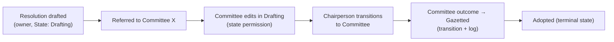

# Functional Design

This document describes **what PWMS does** for its users, feature by feature,
and the typical flows. It complements the structural documents
([System Design](./System%20Design.md), [Data Model](./Data%20Model.md)).

---

## 1. Personas

| Persona | Needs |
| --- | --- |
| **Member of Parliament (MP)** | table/own instruments, follow progress, receive alerts |
| **Parliamentary / Committee staff** | manage instruments through committee stages, draft documents, assign work |
| **Committee (Chairperson / Members / Secretary / Researcher)** | view instruments referred to the committee, move them through states, add comments |
| **Administrator / Clerk** | manage users, groups, roles, memberships, workflow definitions |
| **System operator** | run sync/jobs, monitor audit history |

---

## 2. Identity & organisation management

- **Users** are created from the admin and/or synchronised from the legacy Oracle
  source (`sync_users_oracle*` commands). Users carry parliamentary profile data
  (title, party, constituency, membership dates, encrypted ID number).
- **Sign-in** uses Active Directory (LDAP) when configured, falling back to the
  local database for identities with no AD account and a break-glass superuser
  during an outage; the login form has a show/hide password toggle. The
directory holds credentials only — authorisation stays with
  `Role`/`GroupMembership`.
- **Groups** form an MPTT hierarchy: Parliament → Houses → Portfolio / Select /
  Ad-hoc / Joint Committees → sub-units (offices, divisions, parties, …).
- **Roles** (`Role`) carry coarse workflow capability flags.
- **GroupMembership** ties user + group + role over a time window (start/end
  dates, active flag) so historical memberships are preserved.
- Lifecycle: members leave/join; memberships are deactivated rather than deleted.

**Functional rules**

- A user is “in a role in a group” only while an **active** membership exists.
- Of the `Role` capability flags, only `can_manage_permissions` is consulted
  (it grants `manage`); `can_transition_workflows`, `can_create_workflows` and
  `can_assign_workflows` are legacy fields with no effect — what a role may do on
  a record comes from the per-instance RBAC tables ([§4](#4-access-control)).

---

## 3. Workflow management

### 3.1 Definitions (the machine)

An administrator defines a **WorkflowType** and its **States** and **Transitions**.
Four state machines are seeded from the BRS (migrations `0005`, `0016` and
`0019`):

- **Delegation Report** — `Awaiting PGIR approval → Submitted for tabling →
  Tabled and referred to Committee → Closed – House approved` (BR02.8);
- **International Resolution** — `Captured → Assigned → In Progress →
  Implemented → Closed`, nested under the Delegation Report type;
- **International Agreement** — `Submitted for tabling → Agreement Tabled –
  referred to Committee → Committee considering and processing → Committee
  submitted report for tabling → House adopted – referred to Department →
  Closed – House approved` (International Agreements BRS);
- **Bill** — `Introduced → Referred to Committee → Public Participation →
  Committee Deliberation → Committee Report → House Debate and Voting → NCOP
  Consideration → Awaiting Presidential Assent → Signed into Law`, with
  mediation, presidential referral-back and withdrawal branches (Online Bill
  Tracking BRS).

Each type is **owned by a Group** (`WorkflowType.group`) that scopes its RBAC:
creation is limited to the type's `create_roles`, and those roles must be roles
held by members of that group. The three international types belong to group 98
(*IRP: MR: Man And Gen*, the Multilateral Relations unit) and the Bill type to
*LSO: Legal Services: Man And Gen* (the Legal Services Office's Management &
General section). Creation roles are configured per environment; while
`create_roles` is empty only superusers may create instances of that type.

**Public status.** Every state carries a `public_name` — the simplified,
citizen-facing status it maps to. The Bill machine uses the BRS §12 vocabulary
(*Introduced*, *Under Parliamentary Consideration*, *National Council of
Provinces*, *Mediation / Reconsideration*, *Awaiting Presidential Assent*,
*Signed into Law*, *Referred Back / Constitutional Review*), so the detailed
committee stages stay distinct internally while publishing as *Under
Parliamentary Consideration*. `Bill.public_status` exposes the current value.

**Version integrity.** A bill's versions are preserved as `BillVersion` rows —
newest first, never overwritten — distinguishing the introduced version,
amendment schedules and the amended bill. Exactly one row per bill is flagged
`is_current`, and `Bill.current_version` is derived from it (falling back to the
most recent row), so the current and previous versions are always identifiable.
Versions are recorded from the bill's page (**Record version**), corrected in
place from each row's **Edit** action — the row keeps its identity and original
recorder, the change lands in the audit trail, and no version is ever removed —
listed in the bill's detail page, editable through the Django admin, and can be
bulk-loaded with `manage.py import_bill_versions`.

Definitions are customisable in the admin, including:

- which states are initial/terminal;
- which transitions are allowed (from → to);
- which roles from the type's group may **create** instances (`create_roles`);
- which roles are named on each transition (`allowed_roles`) — **advisory**
  metadata: it labels the diagram and, with `notify_roles`, widens who is alerted
  when the move happens (`next_actor_roles()`), but it grants nothing
  (authorisation is the RBAC tables — see [§4](#4-access-control));
- which roles should be notified when it happens (`notify_roles`);
- whether a comment is mandatory.

Definitions are reusable: they are exported/imported as JSON
(`export_workflow_type` / `import_workflow_type`) and rendered as diagrams
(`generate_*diagrams`).

### 3.2 Instances

A workflow instance (today: **DelegationReport**, **InternationalResolution** —
which may nest inside a report — **InternationalAgreement** and **Bill**) is
created with:

- a workflow **type** and its **initial state**;
- an **owner** and optionally an **assignee**;
- a **deadline** and **priority**;
- initial **referrals** to one or more groups (committees/houses).

The instance always knows its `workflow_type` and `current_state`, and offers
only the **available transitions** for that state.

Creation is **group-scoped**: only a user holding one of the type's
`create_roles` in the type's own group (or a superuser) may create an instance.
The web create pages list only the types the signed-in user may create in and
refuse a hand-crafted POST that names another type with HTTP 403.

### 3.3 Transitioning

To move an instance forward, a user performs an available transition:

1. The system validates the transition belongs to the type and is valid from the
   current state; **event guards** (`required_event_types`) and **condition
   rules** (`TransitionCondition`: `no_open_referrals`, `all_children_closed`,
   `field_set`) must be satisfied, and a comment is required if configured. All
   unmet guards are reported at once by `unmet_transition_conditions()`.
2. `current_state` advances to the transition's `to_state`.
3. A `TransitionLog` entry is written (who, from → to, comment, IP).
4. The field change is also captured by auditlog.
5. Alerts are written for the transition's audience and alert email is queued
   (see [§6](#6-alerts-notifications--email)).

The **web UI performs transitions too**: every detail page's toolbar carries a
*Status* menu listing `get_available_transitions()` beside *Document*, and each
option opens a confirmation page that records the transition's comment — required
when `Transition.requires_comment` — and names any unmet guard before the POST.
Taking a transition needs the **`transition`** capability rather than `edit` (see
[§4](#4-access-control)), and the reader lands on the record's Timeline afterwards.

Alongside state changes, the instance keeps an **append-only event timeline**
(`WorkflowEvent`, e.g. *Report document attached*, *ATC update published*) via
`record_event()`. Events are the evidence guards check — they are never edited;
corrections are new compensating events.

### 3.4 Referrals

Instruments can be dynamically **referred to committees/groups** as typed
`WorkflowReferral` rows (`refer()`, gated by `State.allows_referrals`). Each
referral carries who referred it, when, its response deadline, status
(`open`/`responded`/`recalled`/`expired`/`cancelled`) and the response document.
Lifecycle actions (`respond()` / `recall()` / `mark_expired()`) automatically
emit `referral-*` events, so every referral action lands on the instance's
append-only `WorkflowEvent` trail (the *Timeline* tab merges only
`TransitionLog` and auditlog rows for the instance itself, so domain events
surface with the other `WorkflowEvent` rows rather than in the Timeline). An
open referral can block a transition via the `no_open_referrals` condition.

The **Referrals tab** on every detail page drives the lifecycle without the
admin: *Add Referral* opens a searchable committee picker plus a response
deadline and notes, and each open row carries *Respond* and *Withdraw*
(`pwms/templates/pwms/partials/referral_section.html`). Raising a referral and
withdrawing one need the record's `edit` right; **responding** is also open to an
active member of the referred-to committee (`views._can_answer_referral`). The
tab also lists the transitions available from the current state (performing them
from the web UI is still to come), and the deadline reminders / expiry are driven
by the `check_referral_deadlines` command.

---

## 4. Access control

Access decisions use the three RBAC layers (see
[System Design §4](./System%20Design.md#4-contenttype-based-rbac)):

| Question answered | Table |
| --- | --- |
| Does this committee/house have access to this instance at all? | `WorkflowGroupAccess` |
| Within that access, what may *this role* do (override)? | `WorkflowRolePermission` |
| Within that access, what may be done **in this state**? | `WorkflowStatePermission` |

**Example scenario — committee member editing in "Drafting" but not "Gazetted"**

1. `WorkflowGroupAccess(group=Committee X, content_object=resolution, can_view=T, can_edit=F)` —
   the committee may *view* but not *edit* by default.
2. `WorkflowStatePermission(group_access=…, state=Drafting, can_edit=T)` —
   while the resolution is in `Drafting`, the committee may edit.
3. No `WorkflowStatePermission` for `Gazetted` → falls back to the group default
   (view only).
4. `WorkflowRolePermission(group_access=…, role=Committee Chairperson,
   can_transition=T, allowed_states=[Drafting, Committee])` — only chairs can move
   it on, and only out of those states.

`instance.can(user, "transition")` encodes exactly this resolution chain.

Creation is gated at the **type** level instead of per instance: a
`WorkflowType` belongs to a `Group` and lists the `create_roles` (roles held in
that group) allowed to create instances — `WorkflowType.can_create(user)` and
`creatable_by(user)`. The instance `can()` chain above continues to govern
view / edit / delete / share / comment / manage / transition on existing rows.

A type may also declare **viewer groups** (`viewer_groups`): read-only
stakeholders with an interest in every instance but no active role in producing
it. When an instance is created it materialises its `WorkflowGroupAccess` rows
from the type — the type's owning `group` (flagged `is_primary`, granted view
**and** edit) and one read-only row per viewer group (view on, every other
capability off) — so members of those groups can see it and each grant appears
in the instance's own access table with a `granted_at` timestamp. Raise
individual capabilities per instance or through `WorkflowRolePermission` as
needed. This is creation-time materialisation only; run
`manage.py sync_type_group_access` to backfill instances that predate a
configuration change.

Materialised rows grant **view by default, and edit to the owning group only**:
the primary row (`is_primary`) gets `can_view` + `can_edit`, while viewer groups
get a view-only row (every other capability off). A brand-new instance is
therefore workable out of the box by its **owning group**, its **owner** and
superusers — which matches how the office is arranged (IRP owns the three
international-relations types, LSO the Bill); delete, share, comment,
manage and transition still need an explicit grant per instance or through
`WorkflowRolePermission`, and viewer groups never gain them by default.

All of this is exposed through one **`PermissionResolver` service**
(`pwms/services/permissions.py`), the single source of truth the web UI and the
API share: `resolve(user, resource, action)`, `permissions_for(user, resource)`
(the six capabilities) and `require(user, resource, action)`. It adds the
superuser bypass, grants `manage` to users holding the global
`Role.can_manage_permissions` capability, and treats two people named on a
workflow instance as implicitly authorised: its **owner** may always
view/edit/delete it, and its **assignee** (`assigned_to`) may always view it —
assignment is a work queue, so it confers reading rights only.

The service is wired in: the workflow CRUD views enforce `edit`/`delete` with
`require()` (both GET and POST) and hide the Edit/Delete buttons when they are
not permitted, and the DRF audit-history endpoint enforces `view` through
`WorkflowViewPermission` (`pwms/api/permissions.py`).

Every **write affordance** on a detail page is gated on a capability of its own
through `resolve(user, record, …)` — the same check `require()` enforces on the
POST. *Add attachment*, *Add Note*, *Add Referral* and the participant adder need
the record's `edit` right, so they appear exactly when the toolbar's Edit button
does; the toolbar's *Status* menu (the transitions available from the current
state) needs **`transition`** instead, so a group may be able to edit a record
without being able to move it on. Notes carry one extra rule on top: a note may be
changed only by its **author** (`views._can_change_note`). Given the defaults
above, the edit-gated controls are visible to a record's owning group and its
owner from the start, and to anyone else once those rights are granted.

### Who may move a record on

The **`transition`** capability is the whole authority for changing a record's
state: the toolbar's *Status* menu, the Referrals tab's transition links and the
`workflow_transition` view all resolve it, and `perform_transition()` itself
checks only the state machine, the declared guards and a required comment — never
the actor's roles.

It is granted by the RBAC tables, in the resolution order above:
`WorkflowRolePermission.can_transition` for the actor's role in that group
(optionally narrowed with `allowed_states`), else
`WorkflowStatePermission.can_transition` for the current state, else the group
default `WorkflowGroupAccess.can_transition`. Superusers bypass the lot.

Two things are easy to misread, so they are worth stating plainly:

- **`Transition.allowed_roles` is not an authorisation rule.** It is advisory
  metadata: a diagram label, and — through `next_actor_roles()` — extra
  recipients of the transition's alert. The seeded machines attach no roles to
  their transitions.
- **`Role.can_transition_workflows` is a legacy flag** that `PermissionResolver`
  never consults (see [§2](#2-identity--organisation-management)).

**Nothing is granted at creation.** Materialisation writes view (plus edit, for
the owning group) and stops there, so until an administrator raises
`can_transition` somewhere, **only superusers can perform a transition**: the
*Status* menu is not rendered for anyone else, and the Referrals tab shows the
transitions as plain reference. Raise it per instance (`WorkflowGroupAccess`),
per role (`WorkflowRolePermission`, optionally per state) or per state
(`WorkflowStatePermission`) in the admin.

---

## 5. Auditing & history

Every workflow instance has a **complete history**, rendered on its detail page
and exposed through the API:

| Event | Source | Example |
| --- | --- | --- |
| created | auditlog | CREATE entry with initial field values |
| edited (any field, incl. current_state) | auditlog | UPDATE entry with before/after diff |
| deleted | auditlog | DELETE entry |
| state transition | TransitionLog | `STATE_TRANSITION: Drafting → Gazetted` by alice@… |

Consumers:

- Each instance's **detail page** renders the history in its **Timeline** tab:
  state changes and the field-level CRUD audit merged into one newest-first table
  ([§9](#9-web-ui--api), `pwms.services.history`). Domain events
  (`WorkflowEvent`) surface where they belong — e.g. document events as the
  Attachments section's “Document activity”.
- The **REST API** exposes the auditlog CRUD trail for each instrument
  (`GET …/audit/`, see [API Reference](./API%20Reference.md)).

---

## 6. Alerts, notifications & email

People are told when something happens or is due, without watching a page:

- A **`Notification`** row is written per (recipient, channel, event): an
  `in_app` row that backs the navbar bell, and — when the recipient has an email
  address — an `email` row that is both the message and the delivery log.
- Dispatch happens on explicit **domain methods**, never on `save()`:
  `perform_transition()`, `refer()`,
  `WorkflowReferral.respond()` / `recall()` / `mark_expired()` and the create
  views. Fixtures, imports and admin writes notify nobody.
- **Audience is RBAC-aware**: the type's officer roles, the roles a transition
  names (`notify_roles` plus the roles allowed to act next), and the people the
  record names (`owner`, `assigned_to`) — minus the actor and anyone who cannot
  VIEW the instance. A referral notifies the referred group's active members plus
  the named people.
- **Email is queued, not sent inline**: the row's background task is written in
  the *same transaction* as the row, so a rolled-back workflow change queues
  nothing and a crash after COMMIT cannot lose the send. `manage.py
  process_tasks` delivers it, retrying transient failures and marking a row
  `failed` once the attempts are spent.
- The **bell** in the site chrome shows the unread count and the newest alerts;
  the **alerts page** (`/pwms/alerts/`) lists them and marks them read.
- `check_referral_deadlines` sends the 24-hour and 1-hour reminders and logs the
  expiry alert (see [Management Commands](./Management%20Commands.md)).

Details: [Roadmap § Email & notifications](./Roadmap%20&%20Planned%20Integrations.md).

## 7. Document attachments (SharePoint)

Every workflow detail page carries an **Attachments** section: an HTMX picker
that browses the user's SharePoint sites, links an existing document, or uploads
a local file into the chosen folder and attaches it in one step.

- An attachment is a `pwms.Attachment` row — a generic FK to the instance, so one
  table serves every subclass. The file itself stays in SharePoint; detaching
  removes only the link.
- Each row opens a **version history** panel (SharePoint's own versions, mirrored
  into `pwms.AttachmentVersion` when opened and each downloadable through a
  pre-authenticated redirect), and re-uploading a revision refreshes the
  attachment in place instead of failing.
- Attach, detach and revise are recorded as `document-*` `WorkflowEvent`s on the
  record's append-only audit trail and listed as the section's “Document
  activity”.
- Access is narrowed twice: the **record's** RBAC gates the picker calls, while
  SharePoint site membership gates the content itself.

Details: [SharePoint Sync § Attachments](./SharePoint%20Sync.md#attachments-documents-on-workflow-records).

## 8. Reporting, exports & sharing

The registers can be turned into figures people can filter, preview, forward and
file — without ever widening anyone's access.

- The **report builder** (`/pwms/reports/`) spans all four registers, with
  filters for report type, free text, workflow type, state, priority, owner,
  group, period or explicit date range, overdue-only / due-soon / unassigned-only,
  and sort order.
- Every figure comes from the same **permission-scoped** queryset the lists use
  (`visible_instances`), so a report — and its export — can never show a row the
  reader could not open.
- The live **preview** swaps in over HTMX (and degrades to a plain GET); it
  carries summary stats, breakdowns, the workflow register, a merged activity
  feed and referrals.
- **Exports** are xlsx, pdf, html and csv; **per-instrument documents** render a
  single record as a formal, filed-style document (`/pwms/instruments/<id>/document/`).
- **Sharing** mints a token-addressed read-only link (optionally expiring) and
  can email it — with the exported file attached — on a daily / weekly / monthly
  schedule. A share always re-renders the **creator's** figures, so a link never
  widens to the reader's access; opens are counted and a revoked or expired link
  answers 410 Gone.

Details: [Roadmap § Exports & reporting](./Roadmap%20&%20Planned%20Integrations.md).

---

## 9. Web UI & API

- **Server-rendered pages** (vendored Bootstrap 5 + lucide icons): a
  **dashboard**, home/about/contact, login/logout (with a show/hide password
  toggle), groups (all/mine/detail — the all-groups list filters by name and
  type), and full CRUD for the concrete workflow instances — Delegation Reports,
  International Resolutions, International Agreements and Bills — reached from
  the navbar *Workflows* dropdown. List pages carry a free-text filter.
- **Detail pages are tabbed**: one header plus a tab per concern — Overview (key
  information, ownership, description, type-specific facts and system
  information), **Progress**, Related, Notes, **Timeline**, Attachments, Diagram
  and Referrals. Every instrument fills the same shared shell
  (`templates/pwms/workflow-detail.html`) and inherits the same panels from it,
  and `static/js/workflow-tabs.js` mirrors the open tab into the URL hash so a
  refresh — or a shared link — returns to it. The panels are the shell's own, so
  a change to one lands on every instrument:

  - **Toolbar** — *Document* (the instrument as a PDF or standalone web page)
    and *Status* (the transitions available from the current state, each opening
    a confirmation page that records the transition's comment).
  - **Related** — the hierarchy plus each type's own tables: participants (added
    inline, and removed *softly*, so former delegates stay listed, muted,
    alongside who removed them and when; BR03 updates; bill versions).
  - **Notes** — a per-instrument note log (`WorkflowNote`) whose entries can be
    edited inline, plus the type's own `notes` text and progress fields where it
    has them.
  - **Referrals** — raise / respond / withdraw ([§3.4](#34-referrals)) and the
    transitions available from the current state, each row linking into the same
    confirmation page for a reader who may take one.

- **Progress**: a completion ring plus the type's state sequence, each state
  marked done / current / upcoming from the record's own transitions, and the
  journey it took (who moved it, when, with what comment). The percentage is
  measured along the *route to completion* over the transition graph rather than
  by counting states, so a branched machine reports honestly — a bill at *NCOP
  Consideration* is 75% of the way to *Signed into Law*, not “7 of 12 states”
  (`pwms.services.progress`). The dashboard's work lists (*Assigned to you*,
  *Due soon*, *Overdue*, *Awaiting your committees*) repeat the same measure as a
  thin bar on each row, so where a record stands is visible without opening it.
- **Unified Timeline**: `TransitionLog` state changes and the auditlog CRUD trail
  (create / update / delete, with the fields that changed) are merged into one
  newest-first table rather than the two separate tables the page used to carry.
- **Diagram**: the Diagram tab embeds the type's generated state machine
  (`GET /pwms/instruments/{public_id}/diagram.svg`), and names the command that
  renders it when the image is absent.
- **Flash messages**: a redirect that changed something — a create, an edit, a
  delete, a status change — lands with its message as a stack of toast-like boxes
  at the top of the page (`pwms/partials/messages.html`, `static/js/messages.js`),
  which fade on their own and can be dismissed by hand.
- **Alerts** in the site chrome: the navbar bell, the alerts page and read state
  ([§6](#6-alerts-notifications--email)).
- **Reports**: the builder, exports, per-instrument documents and the read-only
  shared view ([§8](#8-reporting-exports--sharing)).
- **Django Admin** for administration (users, groups, roles, memberships,
  workflow definitions, the SharePoint mirror, and notifications — read-only).
- **REST API (DRF)** exposing audit history; browsable, plus Swagger/ReDoc docs.
- **django-ninja spike** under `/ninja/` compares an alternative implementation —
  see [API Reference](./API%20Reference.md).

---

## 10. Automation & data operations

`manage.py` commands and background tasks provide (see
[Management Commands](./Management%20Commands.md)):

- **Synchronisation** from the legacy Oracle system (users, groups, roles,
  memberships) — basis for keeping identity data current.
- **SharePoint sync** (`populate_sites`) mirrors sites, drives and best-effort
  site members into the local tables the attachment picker reads.
- **Committee scraping** (Parliament website) to import committee members.
- **Notification / deadline jobs** — referral deadline reminders and expiry
  (email delivered) and the scheduled report-share drain; delegate expirations,
  overdue alerts and event-status jobs still to be repointed to `pwms.models`.
- **Workflow tooling** — state import, workflow-type import/export, diagrams.
- **Maintenance** — validate memberships, group-access backfill, bill versions,
  show hierarchy.

---

## 11. Security considerations

- Sign-in is **Active Directory** (LDAP) when configured, falling back to the
  local database when the directory is unavailable; every site route is
  login-required by default.
- Admin and API both require authentication; the API defaults to
  `IsAuthenticated` (session/basic) and data endpoints deny anonymous access.
- Sensitive personal data (ID numbers) is **encrypted at rest** and keyed by an
  HMAC for lookups (`cryptography`, `IDNO_HMAC_KEY`).
- Full audit trails enable accountability for every state change and edit.
- Alert recipients are filtered through the same RBAC as the UI, so
  notifications never leak a record to someone who cannot view it.

---

## 12. Typical end-to-end flow

Each arrow is a **Transition**; each step is audited; each participant’s right to
act was resolved through the **RBAC layers** for that instance and state.
