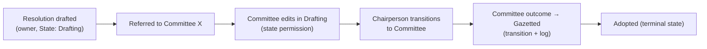

# Functional Design

This document describes **what PWMS does** for its users, feature by feature,
and the typical flows. It complements the structural documents
([System Design](./System%20Design.md), [Data Model](./Data%20Model.md)).

---

## 1. Personas

| Persona | Needs |
| --- | --- |
| **Member of Parliament (MP)** | table/own instruments, follow progress, receive alerts |
| **Parliamentary / Committee staff** | manage instruments through committee stages, draft documents, assign work |
| **Committee (Chairperson / Members / Secretary / Researcher)** | view instruments referred to the committee, move them through states, add comments |
| **Administrator / Clerk** | manage users, groups, roles, memberships, workflow definitions |
| **System operator** | run sync/jobs, monitor audit history |

---

## 2. Identity & organisation management

- **Users** are created from the admin and/or synchronised from the legacy Oracle
  source (`sync_users_oracle*` commands). Users carry parliamentary profile data
  (title, party, constituency, membership dates, encrypted ID number).
- **Groups** form an MPTT hierarchy: Parliament → Houses → Portfolio / Select /
  Ad-hoc / Joint Committees → sub-units (offices, divisions, parties, …).
- **Roles** (`Role`) carry coarse workflow capability flags.
- **GroupMembership** ties user + group + role over a time window (start/end
  dates, active flag) so historical memberships are preserved.
- Lifecycle: members leave/join; memberships are deactivated rather than deleted.

**Functional rules**

- A user is “in a role in a group” only while an **active** membership exists.
- Role capability flags gate coarse actions (e.g. `can_manage_permissions`).

---

## 3. Workflow management

### 3.1 Definitions (the machine)

An administrator defines a **WorkflowType** and its **States** and **Transitions**.
Two state machines are seeded from the BRS (migration `0005`):

- **Delegation Report** — `Awaiting PGIR approval → Submitted for tabling →
  Tabled and referred to Committee → Closed – House approved` (BR02.8);
- **International Resolution** — `Captured → Assigned → In Progress →
  Implemented → Closed`, nested under the Delegation Report type.

Each type is **owned by a Group** (`WorkflowType.group`) that scopes its RBAC:
creation is limited to the type's `create_roles`, and those roles must be roles
held by members of that group. Both seeded types belong to group 98
(*IRP: MR: Man And Gen*, the Multilateral Relations unit). Creation roles are
configured per environment; while `create_roles` is empty only superusers may
create instances of that type.

Definitions are customisable in the admin, including:

- which states are initial/terminal;
- which transitions are allowed (from → to);
- which roles from the type's group may **create** instances (`create_roles`);
- which roles may perform each transition (`allowed_roles`);
- which roles should be notified when it happens (`notify_roles`);
- whether a comment is mandatory.

Definitions are reusable: they are exported/imported as JSON
(`export_workflow_type` / `import_workflow_type`) and rendered as diagrams
(`generate_*diagrams`).

### 3.2 Instances

A workflow instance (today: **DelegationReport** and **InternationalResolution**,
the latter nested inside a report) is created with:

- a workflow **type** and its **initial state**;
- an **owner** and optionally an **assignee**;
- a **deadline** and **priority**;
- initial **referrals** to one or more groups (committees/houses).

The instance always knows its `workflow_type` and `current_state`, and offers
only the **available transitions** for that state.

Creation is **group-scoped**: only a user holding one of the type's
`create_roles` in the type's own group (or a superuser) may create an instance.
The web create pages list only the types the signed-in user may create in and
refuse a hand-crafted POST that names another type with HTTP 403.

### 3.3 Transitioning

To move an instance forward, a user performs an available transition:

1. The system validates the transition belongs to the type and is valid from the
   current state; **event guards** (`required_event_types`) and **condition
   rules** (`TransitionCondition`: `no_open_referrals`, `all_children_closed`,
   `field_set`) must be satisfied, and a comment is required if configured. All
   unmet guards are reported at once by `unmet_transition_conditions()`.
2. `current_state` advances to the transition's `to_state`.
3. A `TransitionLog` entry is written (who, from → to, comment, IP).
4. The field change is also captured by auditlog.
5. (Planned) role-based notification emails are dispatched.

Alongside state changes, the instance keeps an **append-only event timeline**
(`WorkflowEvent`, e.g. *Report document attached*, *ATC update published*) via
`record_event()`. Events are the evidence guards check — they are never edited;
corrections are new compensating events.

### 3.4 Referrals

Instruments can be dynamically **referred to committees/groups** as typed
`WorkflowReferral` rows (`refer()`, gated by `State.allows_referrals`). Each
referral carries who referred it, when, its response deadline, status
(`open`/`responded`/`recalled`/`expired`/`cancelled`) and the response document.
Lifecycle actions (`respond()` / `recall()` / `mark_expired()`) automatically
emit `referral-*` events, so the referral appears on the instance timeline; an
open referral can block a transition via the `no_open_referrals` condition.

---

## 4. Access control

Access decisions use the three RBAC layers (see
[System Design §4](./System%20Design.md#4-contenttype-based-rbac)):

| Question answered | Table |
| --- | --- |
| Does this committee/house have access to this instance at all? | `WorkflowGroupAccess` |
| Within that access, what may *this role* do (override)? | `WorkflowRolePermission` |
| Within that access, what may be done **in this state**? | `WorkflowStatePermission` |

**Example scenario — committee member editing in "Drafting" but not "Gazetted"**

1. `WorkflowGroupAccess(group=Committee X, content_object=resolution, can_view=T, can_edit=F)` —
   the committee may *view* but not *edit* by default.
2. `WorkflowStatePermission(group_access=…, state=Drafting, can_edit=T)` —
   while the resolution is in `Drafting`, the committee may edit.
3. No `WorkflowStatePermission` for `Gazetted` → falls back to the group default
   (view only).
4. `WorkflowRolePermission(group_access=…, role=Committee Chairperson,
   can_transition=T, allowed_states=[Drafting, Committee])` — only chairs can move
   it on, and only out of those states.

`instance.can(user, "transition")` encodes exactly this resolution chain.

Creation is gated at the **type** level instead of per instance: a
`WorkflowType` belongs to a `Group` and lists the `create_roles` (roles held in
that group) allowed to create instances — `WorkflowType.can_create(user)` and
`creatable_by(user)`. The instance `can()` chain above continues to govern
view / edit / delete / share / comment / manage / transition on existing rows.

All of this is exposed through one **`PermissionResolver` service**
(`pwms/services/permissions.py`), the single source of truth the web UI and the
API share: `resolve(user, resource, action)`, `permissions_for(user, resource)`
(the six capabilities) and `require(user, resource, action)`. It adds the
superuser bypass, grants `manage` to users holding the global
`Role.can_manage_permissions` capability, and lets a workflow instance's
**owner** always view/edit/delete their own record.

The service is wired in: the workflow CRUD views enforce `edit`/`delete` with
`require()` (both GET and POST) and hide the Edit/Delete buttons when they are
not permitted, and the DRF audit-history endpoint enforces `view` through
`WorkflowViewPermission` (`pwms/api/permissions.py`).

---

## 5. Auditing & history

Every workflow instance has a **complete history**, viewable through the API:

| Event | Source | Example |
| --- | --- | --- |
| created | auditlog | CREATE entry with initial field values |
| edited (any field, incl. current_state) | auditlog | UPDATE entry with before/after diff |
| deleted | auditlog | DELETE entry |
| state transition | TransitionLog | `STATE_TRANSITION: Drafting → Gazetted` by alice@… |

Consumers:
- Web/Admin views (planned) to render history timelines.
- REST API `GET …/audit/` returning both audit sources (currently auditlog).

---

## 6. Web UI & API

- **Server-rendered pages** (Bootstrap 5 + lucide icons): home/about,
  login/logout, groups (all/mine/detail), and full CRUD for the concrete workflow
  instances — Delegation Reports and International Resolutions — reached from the
  navbar *Workflows* dropdown. List pages carry a free-text filter; detail pages
  show the workflow metadata, participants, resolutions, BR03 updates, referrals
  and the audit trail.
- **Django Admin** for administration (users, groups, roles, memberships,
  workflow definitions).
- **REST API (DRF)** exposing audit history; browsable, plus Swagger/ReDoc docs.
- **django-ninja spike** under `/ninja/` compares an alternative implementation —
  see [API Reference](./API%20Reference.md).

---

## 7. Automation & data operations

`manage.py` commands provide (see [Management Commands](./Management%20Commands.md)):

- **Synchronisation** from the legacy Oracle system (users, groups, roles,
  memberships) — basis for keeping identity data current.
- **Committee scraping** (Parliament website) to import committee members.
- **Notification / deadline jobs** — delegate expirations, referral deadlines,
  overdue alerts (email delivery planned).
- **Workflow tooling** — state import, workflow-type import/export, diagrams.
- **Maintenance** — validate memberships, fix missing group access, update event
  statuses, show hierarchy.

---

## 8. Security considerations

- Admin and API both require authentication; the API defaults to
  `IsAuthenticated` (session/basic) and data endpoints deny anonymous access.
- Sensitive personal data (ID numbers) is **encrypted at rest** and keyed by an
  HMAC for lookups (`cryptography`, `IDNO_HMAC_KEY`).
- Full audit trails enable accountability for every state change and edit.
- (Planned) notification content must respect access rules so MPs/staff only see
  what they may.

---

## 9. Typical end-to-end flow

Each arrow is a **Transition**; each step is audited; each participant’s right to
act was resolved through the **RBAC layers** for that instance and state.
