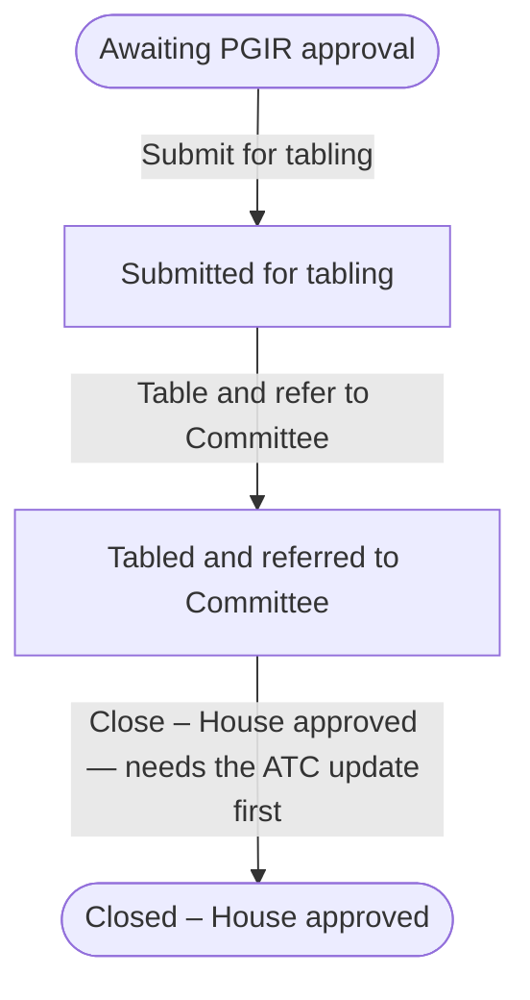

# PWMS Introductory Lesson Plan

**Parliamentary Workflow Management System — introducing the IRPD section to its workflows**

| | |
| --- | --- |
| **Lesson** | An introduction to PWMS for the IRPD section |
| **Audience** | IRPD section staff who will create, monitor and report on **Delegation Reports**, **International Resolutions** and **International Agreements** |
| **Group size** | 6–12 (one trainer; a second pair of hands helps at 10+) |
| **Duration** | 90 minutes, single session (a 45-minute short form is offered in §3) |
| **Mode** | Instructor-led, in person, with a live system and hands-on practice |
| **Prerequisite** | An activated PWMS account, active membership of the section's group, and basic browser skills |
| **Takeaway** | The [Training Manual](./Training%20Manual.md) and the [Quick Reference Card](./Quick%20Reference%20Card.pdf) |
| **Version** | 1.0 (aligned with PWMS `0.1.0`) |

> **This is the induction, not the course.** It gives the section a working mental
> model of PWMS and the confidence to open it on Monday. The
> [Training Manual](./Training%20Manual.md) is the reference course behind it —
> fourteen modules, an assessment and a full set of exercises — and is what
> participants are asked to read afterwards.

---

## 1. Why this lesson

The section already does this work. What changes is where it lives: instead of
spreadsheets, shared drives and email threads, each instrument becomes a single
record in PWMS that shows where it stands, who may act on it next, what documents
belong to it, and what has happened to it so far.

The purpose, in the terms used at the start of the session:

> The purpose of PWMS is to give Parliament one trustworthy, shared place to manage
> its legislative work, in place of scattered spreadsheets, shared drives and email
> chains where items can be forgotten, duplicated, or quietly changed without anyone
> noticing. It exists to make the progress of every instrument clear and visible to
> the people who need it, to make sure that only the right people are able to act at
> the right stage, and to leave a complete and reliable record of how each decision
> was reached. In short, PWMS is there to make parliamentary workflow more
> transparent, more accountable and less prone to error — so that nothing falls
> through the cracks and everyone involved can see exactly where things stand.

**What success looks like at the end of 90 minutes.** Every participant can sign
in, find the records they owe action on, read a record's stage and history, create
a delegation report, move a record forward — including recording the ATC
publication that allows a report to be closed — and find a document, a note, a
referral and a report. Nobody needs to remember a reference number or a field name;
they need to know where to look.

**What this lesson deliberately does not do.** It does not cover the administrator
side (workflow definitions, roles, memberships), the API, or the fine detail of
every field. Those belong to the Training Manual and to the section's own
house rules.

---

## 2. Objectives and outcomes

### 2.1 Learning objectives

By the end of the lesson the section will be able to use PWMS as the authoritative
record of its international engagement work.

| # | Objective |
| --- | --- |
| **O1** | Understand what PWMS is for, and what it replaces |
| **O2** | Recognise the three IRPD instruments and how each one moves through its stages |
| **O3** | Find their own work and read where any record stands |
| **O4** | Capture and progress an IRPD record correctly, including the ATC publication |
| **O5** | Know where to look for help, and what the section must agree among itself |

### 2.2 Learning outcomes

Outcomes are written so the trainer can observe them. Each is demonstrated live,
and confirmed again by the exit ticket in §8.

| # | By the end of the lesson, each participant can… | Demonstrated by | Checked by |
| --- | --- | --- | --- |
| **LO1** | State, in one sentence each, what PWMS replaces and why the section is using it | Discussion in §6.1 | Exit ticket Q1 |
| **LO2** | Name the three instruments and give the stage sequence of one, including its final stage | Discussion in §6.2 | Exit ticket Q2 |
| **LO3** | Sign in and use the dashboard's four work lists to say what they owe action on | Task A in §7 | Exit ticket Q3 |
| **LO4** | Open a record and read its stage, its progress and its history without help | Task A in §7 | Exit ticket Q3 |
| **LO5** | Create a delegation report, including its engagement dates, delegates and a resolution | Task B in §7 | Exit ticket Q4 |
| **LO6** | Move a record forward from the **Status** menu, and record the ATC publication that unblocks closing a report | Task B in §7 | Exit ticket Q5 |
| **LO7** | Raise a referral, and say what a referral does and does not grant a committee | Demonstration in §6.7 | Exit ticket Q6 |
| **LO8** | Attach, open and detach a document, and add a note | Demonstration in §6.8 | Exit ticket Q7 |
| **LO9** | Build a filtered report and export it | Demonstration in §6.9 | Exit ticket Q8 |
| **LO10** | Say where to get help, and name the two things the section must agree itself | §6.10 | Exit ticket Q9 |

---

## 3. Session at a glance

Ninety minutes, ten segments. Timings assume a single trainer and a live system.

| Time | Mins | Segment | Who is active |
| --- | --- | --- | --- |
| 0:00 | 7 | **1. Welcome, purpose and outcomes** | Trainer talks; section answers one question |
| 0:07 | 11 | **2. The big picture** — three instruments, stages, who may act | Trainer talks with a diagram; section reads a lifecycle |
| 0:18 | 14 | **3. Getting around** — sign in, dashboard, registers, a record's anatomy | Trainer demos; section follows on screen |
| 0:32 | 8 | **4. Task A** — find your work, read a record | **Section works**, trainer circulates |
| 0:40 | 13 | **5. Capture** — creating a delegation report | Trainer demos, then section starts one |
| 0:53 | 13 | **6. Progress** — moving on, and the ATC publication | Trainer demos the blocked-then-unblocked close; section completes Task B |
| 1:06 | 6 | **7. Committees** — referrals | Trainer demos; section answers one question |
| 1:12 | 6 | **8. Documents and notes** | Trainer demos; section answers one question |
| 1:18 | 6 | **9. Reporting and alerts** | Trainer demos a report and an export |
| 1:24 | 6 | **10. Wrap** — help, house rules, exit ticket | Section completes the exit ticket |

**Short form (45 minutes).** Run segments **1, 2, 3, 6 and 10** only: the reason,
the model, the tour, the ATC close, and the wrap. Hand out the
[Quick Reference Card](./Quick%20Reference%20Card.pdf) and set the
[Training Manual](./Training%20Manual.md) as the follow-up, then arrange the
hands-on tasks as a supervised clinic in the following week.

**Two half-sessions instead of one.** Break after segment 4 (45 + 45): the first
half is orientation and reading the system, the second is capture, progress and
practice. This suits a section that cannot all leave the desk at once.

---

## 4. Before the session

The lesson fails unhelpfully if the environment is not ready, so confirm these the
day before. Items marked **admin** need the PWMS administrator; the rest are the
trainer's own preparation.

### 4.1 Accounts and access

| # | Item | Why it matters |
| --- | --- | --- |
| 1 | **admin** — every participant can sign in | The whole session depends on it |
| 2 | **admin** — each participant is an **active member of the section's group** (`IRP: MR: Man And Gen`) | Group ownership is what gives the section view, edit and move-on rights on its own records |
| 3 | **admin** — the roles allowed to **create** each of the three types are configured, and the participants hold one | Until this is set, **New Report**, **New Resolution** and **New Agreement** refuse a normal user with *"You do not have a role that may create delegation reports."* This is the first thing that will break in front of the section |
| 4 | **admin** — SharePoint sites are enabled and memberships synced for the participants | The document picker lists only the sites a user belongs to; an unsynced account shows an empty tree |
| 5 | **admin** — a training record is prepared (see 4.2) | The ATC demonstration needs a record in exactly the right shape |

### 4.2 The training records to prepare

Use a sandbox or a clearly marked training record; never run the class against a
live instrument.

| # | Record | State it must be in | Used for |
| --- | --- | --- | --- |
| T1 | A **delegation report** | *Tabled and referred to Committee*, with **no ATC update recorded** | Segment 6: the close is **blocked**, then **unblocked** once the ATC publication is recorded. This is the high point of the lesson — set it up carefully |
| T2 | A **delegation report** | *Awaiting PGIR approval*, with two delegates and one resolution | Segments 3 and 4: reading a record's anatomy, its resolutions, participants and history |
| T3 | An **international resolution** | *Captured* | Segments 2 and 5: the shorter lifecycle |
| T4 | An **international agreement** | The starting stage | Segment 2: note that it starts part-way along, not at the top |
| T5 | A record with a **document attached** and an **open referral** | whichever stage | Segments 7 and 8: something to look at rather than create |

### 4.3 Rehearse the ATC sequence once

Segment 6 depends on a sequence that must work first time. Walk it end to end on
T1 before the session:

1. Open T1 → **Status → Close – House approved**. The confirmation page shows
   **This transition cannot be taken yet** with *"Requires a 'ATC update published'
   event on this workflow."*
2. Leave the confirmation page without applying it.
3. On the record's **Overview** tab, find the **BR03 updates** card and select
   **Add update**. Enter a date and any one ATC detail (reference, publication
   date, page or document link) → **Record update**.
4. Confirm PWMS answers with *"ATC update published recorded. The report may now be
   closed from the Status menu."*
5. **Status → Close – House approved → Confirm status change**, and confirm the
   record lands on its **Timeline** with the move recorded.

Then **undo it** so the class can see the blocked state for themselves: either use
T1's copy, or clear the update afterwards through the administrator.

### 4.4 Trainer's own rehearsal list

- Sign in as a **participant-like account** once (not as a superuser). A superuser
  sees buttons and options that the section will not, which makes for a confusing
  demonstration.
- Have the three registers and one record's tabs open in advance, so no segment
  begins with hunting.
- Know where the section's SharePoint documents live, so the document segment does
  not stall on browsing.

---

## 5. Materials and handouts

| Item | Notes |
| --- | --- |
| Projector / large screen, and a second screen or printout for the trainer | The trainer should be able to see the click-path notes while the room sees the system |
| A browser with the participant-like account signed in | See 4.4 |
| The training records in §4.2 | |
| [Quick Reference Card](./Quick%20Reference%20Card.pdf) — printed A4, one per participant | The wall card; the section's daily companion |
| [Training Manual](./Training%20Manual.md) — handed out as a PDF or link | The reference course |
| Printed task sheet (§7) | One per participant; three tasks with success criteria |
| Printed exit ticket (§8) | One per participant |
| The delegation-report lifecycle from §6.2 — printed or on a slide | The single picture participants will remember |

---

## 6. Running order

Each segment gives the trainer: **what to say**, **what to show**, and **what to
ask**. Labels in `code` are field names; labels in **bold** are buttons, menus or
tabs exactly as they appear on screen.

### 6.1 Segment 1 — Welcome, purpose and outcomes (7 min)

Say what the session is and is not: *we are not going through every field today;
we are going to leave knowing what PWMS is for, how our three instruments move, and
how to find and progress our own work.*

Read the purpose statement from §1 aloud, then tie it to the section's own
experience: an item chased twice by email; a report whose stage nobody could state
with certainty; a resolution that stalled after adoption because ownership of its
implementation was never written down.

State the outcomes in one sentence each (O1–O5 in §2.1) and say that the exit
ticket at the end is not a test of them, but a way for the trainer to see what
needs a follow-up session.

> **Ask:** *"In one sentence — what would you like PWMS to stop you having to do?"*
> Take three answers, write them up, and return to them in the wrap. It gives the
> section ownership of the session and tells you where the resistance is.

### 6.2 Segment 2 — The big picture (11 min)

Three ideas, no clicking yet.

**One: three instruments, one system.** IRPD's work in PWMS is
**Delegation Reports**, **International Resolutions** and **International
Agreements** — plus the section's own organisational group, which holds the roles
and people. Everything else in PWMS (referrals, documents, notes, alerts, reports)
is attached to those records.

**Two: every record sits at a stage, and only certain moves are allowed.** A record
has a **stage** (where it is), a **public status** (the simplified version the
outside world sees) and a **transition** (a permitted move to the next stage). Only
the moves legal from the current stage are ever offered, and each move is recorded
against the person who took it.

Show the lifecycle of the section's primary instrument — the delegation report —
and note that it is the one with a precondition on its final move:

Then give the other two, briefly:

- **International Resolution** — *Captured → Assigned → In Progress → Implemented →
  Closed*. Resolutions are adopted at an engagement and belong to the report they
  came out of.
- **International Agreement** — starts at *Agreement Tabled – referred to
  Committee* and runs through committee consideration and House adoption to
  *Closed – House approved*. It does **not** start at the first stage printed on
  the diagram, because a captured agreement has normally already been tabled.

**Three: who may act.** The section — as the group that owns these three types —
may view, edit and move its own records. Two people named on a record are treated
specially: its **owner** may always view, edit and delete it, and the person it is
**assigned to** may always view it. Everyone else sees a record only if it is
referred to them or access is granted.

> **Ask:** *"Which of the three instruments contains the other two?"* (A delegation
> report contains its international resolutions.) *"Does reading a report let you
> change the resolutions inside it?"* (No — reading a report gives you view of its
> resolutions, nothing more.)

**Trainer tip.** Do not demo the `Current state` dropdown on the edit form. It
changes a record's stage without taking a transition, checks nothing and records no
history — it is an administrator's correction tool. Mention it only if asked, and
discourage it.

### 6.3 Getting around (14 min)

Demonstrate on the participant-like account; participants follow on their own
screens.

1. **Sign in.** Your normal Parliament directory account; no separate PWMS
   password. Point out the **show/hide** control beside the password box.
2. **The dashboard.** Read the four figures and the four work lists out loud, and
   say what each is for:

   | On the dashboard | What it is telling you |
   | --- | --- |
   | **Total workflows** | Everything you can see, with open and unassigned counts beneath |
   | **Assigned to you** | What you owe the next action on |
   | **Due in 7 days** | Deadlines in the next week that have not yet passed |
   | **Overdue** | Deadline passed while the record is still open |
   | **Assigned to you** / **Due soon** / **Overdue** / **Awaiting your committees** | The four work lists; the last one is the committees that owe *you* an answer |

   Say plainly: *the dashboard is the section's work list. If you look at nothing
   else each morning, look at this.*

3. **The registers.** **Workflows** opens the cross-instrument list, with filters
   for type, status and priority. The three instrument registers are narrower, each
   with a single search box. Show the **New Report** button but do not press it yet.
4. **A record's anatomy.** Open T2 and walk the tabs in order, saying what each is
   for: **Overview** (what it is, who owns it, its facts, and for a report its BR03
   updates) · **Progress** (how far along, and the journey so far) · **Related**
   (on a report: the resolutions captured at the engagement, and the delegates; on
   the other instruments: the parent and attached records) · **Notes** ·
   **Attachments** · **Referrals** · **Diagram** · **Timeline**.
5. **The toolbar.** Point out **Document** (the record as a formal PDF or web
   page), **Status** (the moves available now), **Edit** and **Delete** — and say
   that each of these appears only if you are allowed to use it, so a missing button
   is nearly always a permission rather than a fault.
6. **The Timeline.** This is the answer to *"when did that happen, and who did it?"*
   Show it once and say that nothing on a record is ever quietly changed.

> **Ask:** *"Where would you go to find out what you owe action on today?"*
> (*Assigned to you*.) *"And to find out who moved a report last Tuesday?"* (That
> record's **Timeline**.)

**Two practical tips to give here**, because trainees will otherwise waste time:
the search box in the page header is decorative and does nothing — use the
**Search** on the page you are in; and the lists are not paged, so narrow them with
search rather than scrolling.

### 6.4 Task A — find your work, read a record (8 min)

Participants work on their own screens. Success criteria are on the task sheet.

- Sign in, and from the dashboard say out loud which work list you would start with
  and why.
- Open the **Delegation Reports** register and find T2 by typing part of its
  reference into **Search**.
- Open T2 and answer three questions: what stage is it at; who owns it; what was
  the last thing that happened to it.
- Switch to the **Progress** tab and read how many steps remain to the final stage.

Trainer circulates. Watch for anyone who cannot find a record — that is almost
always an access question, not a skill question, and it is worth noting for the
administrator.

### 6.5 Capture — creating a delegation report (13 min)

Demonstrate once on screen, then let participants start their own.

1. **Workflows → Delegation Reports → New Report**.
2. Fill the **Workflow** section: `Title` (required), `Description`, `Deadline` —
   say that the deadline is what drives the dashboard's *Due soon* and *Overdue*
   figures, so it is worth setting even when it feels optional — and `Priority`.
   Mention that `Owner` is not on the form: whoever creates the record becomes its
   owner, and `Workflow type` is fixed to *Delegation Report*.
3. Fill the **Engagement details** section, and pause on the date rules:
   **an engagement date may never be in the future**, and the end date may not
   precede the start date. (This is why a record for an engagement still to come is
   created with the dates blank and filled in afterwards.)
4. Add a delegate under **Delegates**: search for the person, choose the **Type**
   (*Parliamentary Delegation Member* or *Support Official*), give the **Delegation
   role** they held, then **Add Delegate**.
5. Add a resolution under **Resolutions adopted**: number, title, adoption date,
   then **Add Resolution**. Say that this creates a real international resolution
   and links it to this report, so the section does not capture the same thing
   twice — and that it can also be done later from the report's **Related** tab,
   where the **Resolutions adopted** card lists them and carries its own
   **Add Resolution** form.
6. **Create report.** Read the confirmation aloud: *"Delegation report "DR-…"
   created."* Point out the reference number PWMS generated.

> **Ask:** *"Who types the reference number?"* (Nobody — PWMS issues `DR-<year>-
> <sequence>` on first save, restarting each January. Resolutions are the
> exception: you type that number, so the section must agree its own numbering.)

Participants now begin their own report and aim to reach the confirmation message.

### 6.6 Progress — moving on, and the ATC publication (13 min)

The centrepiece of the lesson. Demonstrate the **blocked** close first, so the
requirement is felt rather than described.

1. Open T1 (the report in *Tabled and referred to Committee*) and look at the
   **Status** menu. Say what it is: only the moves legal from this stage, and each
   one opens a confirmation page.
2. Choose **Close – House approved**. The confirmation page refuses:
   **This transition cannot be taken yet**, and beneath it *"Requires a 'ATC update
   published' event on this workflow."* Read it out.
3. Explain why: the rule is that a report is not closed until its update has
   actually appeared in the Announcements, Tablings and Committee Reports. The
   system will not let the section assert a publication that has not been recorded.
   Point out that this is the one precondition the section will meet in practice.
4. Say where it is recorded, then show it: back on the record's **Overview** tab,
   the **BR03 updates** card, **Add update**. Give the update's date, then enter
   **any one** ATC detail — the reference, the publication date, the page number, or
   the document link — and select **Record update**.
5. Read the reply: *"ATC update published recorded. The report may now be closed
   from the Status menu."*
6. **Status → Close – House approved → Confirm status change.** Point out that the
   confirmation page now records a **Comment** — optional here, but the section
   should make it a habit, because the comment lands on the record's history — and
   that PWMS then lands the reader on the **Timeline** so the move can be seen
   alongside everything else.
7. Show the **Progress** tab one last time: the record is complete, and the journey
   shows who moved it, when, and with what comment.

> **Ask:** *"What if you record an update without any ATC detail?"* (It is kept as
> part of the report's update history, but it publishes nothing, so the close stays
> blocked — PWMS tells you exactly that.)

**Also say, briefly:** a move is not the same as an edit. Moving a record on is a
right of its own, and the section — as the group that owns these instruments — has
it. A committee the record is referred to may read and edit it, but cannot move it
on. That is deliberate: the *Status* menu offers every move out of the current
stage, so lending it to a committee would let that committee close a record it was
only asked to advise on.

Participants complete **Task B**: record an ATC update on their own record and take
one transition, then find the move on the **Timeline**.

### 6.7 Committees — referrals (6 min)

1. Open T5 and its **Referrals** tab. Raise one: **Add Referral**, `Refer to` a
   committee, set `Response due` — say that setting it is what drives the reminders
   — add a note saying what the committee should consider, then **Send referral**.
2. Show an open referral's row and its **Respond** and **Withdraw** actions. Say who
   may answer (the referred committee) and who may withdraw (whoever raised it).
3. Explain what a referral actually does, because this surprises people: it not only
   tells the committee, it **grants them access** — view, plus edit while the
   referral is open — and leaves them view afterwards, so they can still see what
   they were asked about. It does **not** let them move the record on.

> **Ask:** *"A committee answers our referral. Can they now close the record?"*
> (No.)

### 6.8 Documents and notes (6 min)

1. **Attachments** tab → **Add attachment**. Browse *Sites you are a member of*,
   then either **Attach** an existing document or upload a new one with an
   **Attachment type** and **Upload & attach**. Say the important thing: **the file
   stays in SharePoint** — PWMS holds the link.
2. Open a document (a new tab) and show **Versions**. Explain that re-uploading a
   file of the same name into the same folder becomes a new version rather than a
   second document, and that **detach** removes only the link.
3. Say the one thing that trips people up: the address behind an open document
   expires within the hour, so **never copy it into an email** — send the record, and
   the reader opens the document from there.
4. **Notes** tab. Add a note. Then draw the distinction that confuses everyone at
   first: the record's **Notes field** (free text captured on the form, shown as
   *Notes on the record*) is **not** the **note log** — and a note may be changed or
   deleted **only by its author**.

> **Ask:** *"A colleague wants to correct a note you wrote. What should they do?"*
> (Add their own correcting note — the log is a record of what each person wrote.)

### 6.9 Reporting and alerts (6 min)

1. **Reports → Report builder**. Set a filter or two (workflow type, period, overdue
   only) and say the single most important sentence on the page: **a report can only
   ever contain records you could open yourself** — the same is true of its exports
   and of any link you share from it.
2. Show the summary figures, then **Export** and name the four formats. Warn about
   the trap: the **Report** selector changes what you see on screen, but **every
   export carries the summary, the breakdowns, the register, the activity and the
   referrals**; **CSV is the register only**.
3. Show **Share**: a link, an expiry, and an optional repeat. Say that the recipient
   must sign in, that they see the *creator's* figures, that a share cannot be
   edited afterwards, and that only an administrator can revoke it.
4. Finally, the bell. Open it, then **View all alerts**. Say that opening an alert
   marks it read but *viewing the page marks nothing*, and that **Mark all read**
   clears everything. Then the caution: alert email depends on the mail service and
   a background worker being configured, so if email is not arriving, the bell is
   still telling the truth — check with the administrator rather than re-recording
   anything.

### 6.10 Wrap — help, house rules and the exit ticket (6 min)

1. Return to the answers the section gave in segment 1 and say honestly which of
   them PWMS already handles and which are still the section's own discipline.
2. **Where to get help.** For access: the PWMS administrator. For how the section
   works: the [Training Manual](./Training%20Manual.md), and the
   [Quick Reference Card](./Quick%20Reference%20Card.pdf) on the wall.
3. **Two things the section must agree itself**, because PWMS will not decide them:

   - **How resolutions are numbered.** The number is typed by you and only checked
     for uniqueness, so the section needs one house style.
   - **What a transition comment should contain.** Comments are optional in
     PWMS, so make it a rule that every move records the minute or correspondence
     behind it.

4. Hand out and collect the **exit ticket** (§8). Say what happens next: the
   administrator acts on any access problem found today, and the Training Manual
   is circulated for the section to work through, with the exercises in its
   Appendix F run as a supervised clinic.

---

## 7. Task sheet

Hand one to each participant. Success criteria are what the trainer looks for while
circulating.

### Task A — Find your work and read a record

| Step | Success criterion |
| --- | --- |
| 1. Sign in and open the dashboard | You can name the figure that tells you what you owe action on |
| 2. Find the training report by searching the **Delegation Reports** register | The register shows the one matching row and a count |
| 3. Open the record and use the tabs | You can state its stage, its owner, and the last thing that happened to it |
| 4. Open **Progress** | You can say how many steps remain to the final stage |

### Task B — Capture and progress a record

| Step | Success criterion |
| --- | --- |
| 1. **New Report** and complete the Workflow section | `Title` and `Priority` set; `Deadline` set |
| 2. Complete the Engagement details section | Dates are not in the future and the end date is not before the start |
| 3. Add one delegate, and one resolution — on the form or afterwards from the report's **Related** tab | Both appear in the report; the resolution is linked to it |
| 4. **Create report** | PWMS confirms and issues a `DR-…` reference |
| 5. On the **Overview** tab, record an **Add update** carrying one ATC detail | PWMS confirms the ATC update was recorded |
| 6. Take a transition from the **Status** menu, with a comment | The move appears on the **Timeline**, with your name against it |

### Task C — (optional, if the room is quick)

Find the record with an open referral, answer a question about who owes the
response, and open one of its attached documents without copying the address
anywhere.

---

## 8. Exit ticket

Nine questions, five minutes, no marks — it tells the trainer what to follow up.
Collect the sheets before anyone leaves.

1. In one sentence, what does PWMS replace for this section?
2. Name the three instruments IRPD works with, and say which one contains another.
3. Which dashboard list shows what you owe action on, and where do you read a
   record's full history?
4. Who types a delegation report's reference number?
5. What must be recorded before a delegation report can be closed, and where do you
   record it?
6. What does a committee get when we refer a record to it — and what does it not
   get?
7. (a) Where does an attached document actually live? (b) Whose note may you edit?
8. How many export formats does a report offer, and which one carries the register
   only?
9. Name one thing the section still has to decide for itself.

### Answers

1. Scattered spreadsheets, shared drives and email threads — one shared, auditable
   place for the section's instruments.
2. **Delegation Report**, **International Resolution**, **International
   Agreement**; a delegation report contains its international resolutions.
3. **Assigned to you** (with **Due soon**, **Overdue** and **Awaiting your
   committees** beside it) for the workload; the **Timeline** tab for a record's
   history.
4. Nobody — PWMS issues it (`DR-<year>-<sequence>`), restarting each January.
   (A resolution's number is the exception: that one you type.)
5. An **ATC update published** entry, recorded on the report's **Overview** tab
   under **BR03 updates → Add update**, giving at least one ATC detail.
6. It gets **view**, plus **edit while the referral is open**, and keeps view after
   it closes. It does **not** get the right to move the record on.
7. (a) In **SharePoint** — PWMS holds a link, and detaching removes only that link.
   (b) Only **your own** notes.
8. Four — **Excel (.xlsx)**, **PDF (.pdf)**, **Web page (.html)** and
   **Comma-separated (.csv)**; **CSV** carries the register only.
9. Any of: how resolutions are numbered; what a transition comment should contain;
   who may create each type of record (with the administrator).

---

## 9. Contingencies

| If… | Then… |
| --- | --- |
| A participant cannot sign in | Take it offline with the administrator; pair them with a neighbour so they still follow the session, and fix it the same day |
| A participant cannot create a record | This is the §4.1 access configuration. Let them work on another participant's record for Task B, and note it — it is the most common first-day problem |
| The document picker is empty | The SharePoint site is not enabled or the membership is not synced. Fall back to T5's already-attached document and cover §6.8 from that |
| The ATC demonstration does not unblock the close | Do **not** improvise a workaround in front of the room. Say that this is the one thing the section must get right, take the question away, and have the administrator confirm afterwards. (The likely cause is a typo in the date or an update saved with every ATC field left blank.) |
| The room is slower than planned | Drop segment 9 to a demonstration only, and give the report builder as reading. Never drop segment 6 |
| The room is faster | Run Task C, then have participants each find one record that is **Overdue** and explain to a neighbour what should happen to it next |
| The live system is unavailable | Run the session from the printed lifecycle diagram and the wall card, and rebook the hands-on half. The model in segment 2 survives without the system |
| Someone is anxious about "getting it wrong" | Say plainly: the system is built so the wrong move is usually not offered, nothing is quietly changed, and every action is recorded against a name rather than hidden |

---

## 10. Where to go next

| For | Read |
| --- | --- |
| The full course, with exercises and an assessment | [Training Manual](./Training%20Manual.md) |
| A one-page reminder for the desk or wall | [Quick Reference Card](./Quick%20Reference%20Card.pdf) |
| The plain-language description of what PWMS is and why | [User Manual Introduction](./User%20Manual%20Introduction.md) |
| The form the section signs to accept PWMS formally | [UAT Form](./UAT%20Form.pdf) |
| Any term you heard today and did not recognise | Glossary, Appendix C of the Training Manual |

**A suggested follow-up for the section leader.** Ask each participant to bring one
real piece of work to a follow-up clinic two weeks later and complete it in PWMS
end to end, with the trainer present. Nothing consolidates this lesson faster than
doing one genuine record while someone is on hand to answer the question they
thought was too small to ask.

---

## Appendix A — Slide outline

One line per slide. The lesson needs no more than this.

| # | Slide | Segment |
| --- | --- | --- |
| 1 | Welcome — introducing PWMS to IRPD | 6.1 |
| 2 | Why: what PWMS replaces, and the purpose statement | 6.1 |
| 3 | What you will be able to do by the end (objectives O1–O5) | 6.1 |
| 4 | Three instruments, one system | 6.2 |
| 5 | The lifecycle of a delegation report (with the ATC precondition marked) | 6.2 |
| 6 | Resolution and agreement lifecycles, side by side | 6.2 |
| 7 | Stage, public status, transition — and who may act | 6.2 |
| 8 | Signing in, and the dashboard's four figures | 6.3 |
| 9 | The four work lists | 6.3 |
| 10 | The registers, and how to search them | 6.3 |
| 11 | A record's tabs, one line each | 6.3 |
| 12 | The toolbar: Document, Status, Edit, Delete — and why a button is missing | 6.3 |
| 13 | Capture: the delegation report form | 6.5 |
| 14 | The date rules, and the reference number PWMS issues | 6.5 |
| 15 | Moving a record on: the Status menu and the confirmation page | 6.6 |
| 16 | Blocked: the ATC requirement, and where it is recorded | 6.6 |
| 17 | Referrals: what a committee gets, and what it does not | 6.7 |
| 18 | Documents live in SharePoint; notes belong to their author | 6.8 |
| 19 | Reporting: only what you can open, and the four export formats | 6.9 |
| 20 | Alerts: the bell, and why email needs the administrator | 6.9 |
| 21 | Where to get help; the two things we must agree ourselves | 6.10 |

---

## Appendix B — The terms to use, and to avoid

Trainers should use the screen's language, because participants will meet the
screen again alone. These are the words that matter, in plain terms.

| Say this | Not this | Why |
| --- | --- | --- |
| **stage** | state, status code | The system says *Current state*, but the screen also shows a **public status**; keeping "stage" for the internal one stops the two blurring |
| **move it on** | transition it, advance the workflow | *Transition* is the model's word, not the user's |
| **the section's records** | our workflow instances | Everyone's instinct is "records" |
| **referral** | task, assignment | A referral is a specific, dated request to a committee, and it grants access |
| **the update's ATC details** | the atc fields | Name what the person is typing, not the database column |
| **BR03 updates** | the updates table | Match the card's own heading so it can be found again |

Also use **record** rather than **instrument** in speech, but keep **instrument**
for the slide titles, since the documentation uses it and the distinction between
the three kinds matters.
