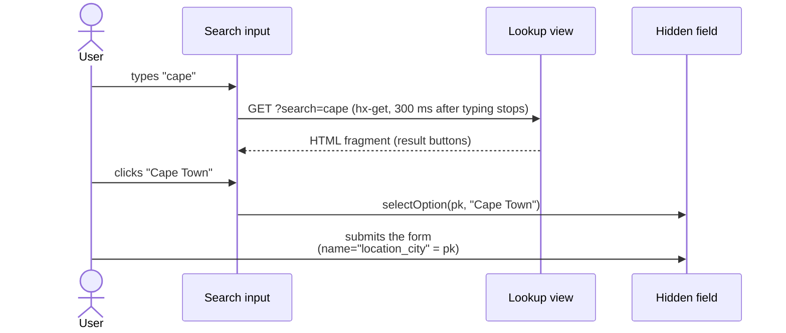

# Search Lookups

The form fields that point at a long list — the owner and assignee of a
workflow instance, the responsible group, the engagement country and city — are
rendered as **search pickers**: a text box that fetches matching options from the
server with HTMX, plus the real form field kept hidden so an ordinary POST still
works.

Five lookups back them. All five return an **HTML fragment, not JSON** — they
are UI endpoints, so they are not part of the
[API Reference](./API%20Reference.md).



## 1. The five lookups

| Field(s) | Endpoint | Request parameters | Matching | Order | Fragment |
| --- | --- | --- | --- | --- | --- |
| `assigned_to`, `sponsor`, `responsible_minister` | `pwms:user_search` — `/pwms/user-search/` | `search` | active users by `username`, `first_name`, `last_name` (`icontains`) | first name, last name, username | `pwms/partials/user_search_results.html` |
| `responsible_group`, `responsible_committee` | `pwms:group_search` — `/pwms/group-search/` | `search` | `name` (`icontains`) | name | `pwms/partials/group_search_results.html` |
| `parent_report` (resolutions only) | `pwms:report_search` — `/pwms/report-search/` | `search` | delegation reports the user may **edit**, by `reference_number` or `title` | newest first | `pwms/partials/report_search_results.html` |
| `location_country` | `pwms:country_search` — `/pwms/country-search/` | `search` | `name` (`icontains`) or ISO code (`iexact`) | names starting with the query first, then name | `pwms/partials/country_search_results.html` |
| `location_city` | `pwms:city_search` — `/pwms/city-search/` | `search`, `country` | `name` or `ascii_name` (`istartswith`), limited to `country` when it is a number | population desc, then name | `pwms/partials/city_search_results.html` |

Every view caps its result set at 20 rows and lives in `pwms/views.py` next to
the workflow views. `owner` is deliberately **not** a picker: it is disabled and
taken from the acting user on create (`WorkflowInstanceFormMixin.__init__`).
`report_search` filters through `resolve(user, report, EDIT)` rather than taking
the whole register, because nesting a resolution under a report edits that
report's hierarchy too. Two behaviours are deliberate:

- `city_search` **ranks by population**, which keeps village namesakes out of the
  way (`cities.csv.gz` also carries 13,529 South African township sections, see
  [Data Model §7](./Data%20Model.md#7-reference-data--countries--cities)).
- `country_search` **ranks prefix matches first**, so typing `south` offers
  South Africa before French Southern Territories. An empty search still returns
  the first rows in order, so a picker can be used as a browse control.

## 2. Request and response contract

```django
<input type="text"
       id="{{ field.auto_id }}_search"
       name="search"
       hx-get=""
       hx-trigger="keyup changed delay:300ms"
       hx-target="#{{ field.auto_id }}_results"
       hx-swap="innerHTML"
       hx-indicator="#{{ field.auto_id }}_indicator">
```

- **`name="search"` is required.** htmx only includes an element's own value when
  it has a name (`shouldInclude` in htmx), and the views read
  `request.GET["search"]` — drop the name and every request arrives empty.
- `hx-trigger` fires 300 ms after typing stops, and `changed` skips repeat
  requests for the same text.
- The panel is a `.lookup-results` element that starts `d-none`; the script
  removes that class on `htmx:afterSwap` and adds it again on an outside click or
  once a result is picked.
- `.lookup-results` carries a **positive `z-index` (1050)** in `style.css`. That
  value is load-bearing: every picker wrapper is `position: relative`, so with
  `z-index: auto` the picker that comes later in the form wins the tree-order tie
  and its input paints over the open results.
- A result row is a `list-group-item-action` button whose inline `onclick` calls
  one of the `select*` helpers below. Any string interpolated into that call
  **must** go through `|escapejs` (a group named “Women's Caucus” would otherwise
  break the JavaScript).

## 3. Form side

`WorkflowInstanceFormMixin` (`pwms/forms.py`) owns the decision, so templates
never choose between a select and a picker:

| Attribute | Meaning |
| --- | --- |
| `search_picker_threshold = 10` | option lists **longer** than this become pickers |
| `search_picker_fields` | the fields that may become pickers. An allowlist on purpose: every entry needs a results endpoint, so `workflow_type`/`current_state` stay selects however many rows they have |
| `form.search_pickers` | names of the fields that became pickers for this instance |
| `form.picker_labels` | `{field: label}` for the selected option, used to prefill the visible box |

In `__init__` each candidate field is measured with `queryset.count()`:

- **over the threshold** → `field.widget = forms.HiddenInput()` and the name is
  added to `search_pickers`. The queryset stays on the field: it is what
  validates the submitted pk.
- **at or under** → the field keeps its `Meta.widgets` `Select` and gets its
  `empty_label = "—"` back, so a small list is a plain, JavaScript-free dropdown.

Because of that swap, `Meta.widgets` must declare `forms.Select` (not
`HiddenInput`) for those fields.

`picker_labels` reads the value from the model instance, falls back to the form's
initial (`owner` defaults to the acting user on create) and then looks the option
up in the field's queryset, returning `display_name` or `str(option)`. That is
what makes the box show “South Africa” next to the pk that would be submitted —
including on a create form, where no instance exists yet.

### Partials

```
pwms/_picker_field.html          if field.name in form.search_pickers
├── pwms/_lookup_field.html      → hidden field + search box + results panel
└── pwms/_form_field.html        → the ordinary label + <select>
```

Form templates include **`_picker_field.html`** for every searchable field:

```django

```

| Include argument | Required | Meaning |
| --- | --- | --- |
| `field` | yes | the bound field; its id drives every id in the partial |
| `search_url` | yes | URL **name** of the lookup view (``) |
| `placeholder` | no | defaults to “Type to search…” |
| `selected_name` | no | prefills the box; pass `form.picker_labels.<field>` |
| `wrapper_class` | no | grid classes, defaults to `col-12` |
| `depends_on`, `depends_param`, `clears` | no | see [cascades](#5-cascades) |

## 4. Client script

`static/js/htmx-lookup.js` (loaded with `defer` from `base.html`) is generic: it
knows nothing about users, groups, reports, countries or cities. htmx itself comes from
`` in the same template (django-htmx ships htmx 2 in its own
static files, so nothing is fetched from a CDN).

A picker is a `[data-lookup]` wrapper containing the hidden field, one text
input and one `.lookup-results` container. The script derives everything from the
wrapper, and the ids are derived from the field id
(`id_<field>`, `id_<field>_search`, `id_<field>_results`,
`id_<field>_indicator`, `id_<field>_picker`), so several pickers can share a page.

| Helper | Called from | Behaviour |
| --- | --- | --- |
| `selectOption(pk, label)` | country, city fragments | writes the pk and the label |
| `selectGroup(pk, label)` | group fragment | same, kept for its fragment |
| `selectUser(pk, username, fullName)` | user fragment | label is the full name, else the username |

They all write into the wrapper the user is working in (tracked on `focusin`),
then close the panel and reset any dependent pickers. Two automatic behaviours
follow from the same idea — the hidden pk must never describe a label the user
has since changed:

- **typing** in a picker clears its stored pk (and its dependents);
- **`htmx:afterSwap`** opens that wrapper's results panel, and a click outside
  closes every open panel.

## 5. Cascades

`location_city` depends on `location_country`: the city request carries the
selected country, and changing the country drops the city. Both directions are
declared in the template, not in the script:

```django
{# country: resets the city picker when it changes #}


{# city: sends the country's stored pk as the "country" parameter #}

```

- `depends_on` renders
  `hx-vals='js:{"country": document.getElementById("id_location_country").value}'`,
  so the request becomes
  `/pwms/city-search/?search=cap&country=250`.
- `clears` renders `data-clears="#id_location_city_picker"` on the country
  wrapper; `resetDependents()` in the script empties the hidden pk **and** the
  visible label of the pickers it names.
- Typing in the country box clears the country pk, so the city is reset too.
  That is on purpose: without it the form could be submitted with a country that
  no longer matches the stored city.

## 6. Adding another lookup

1. Put the choice list behind a queryset (a `ForeignKey` is the natural shape).
2. Add a view that returns a fragment, mirroring the five above — filter on
   `request.GET["search"]`, rank results sensibly, cap at 20.
3. Add the route in `pwms/urls.py` (`<thing>-search/`, e.g. `thing_search`).
4. Add `pwms/partials/<thing>_search_results.html`; every row is a button
   calling `selectOption('{{ row.pk }}', '{{ row.label|escapejs }}')`.
5. Add the form field name to `WorkflowInstanceFormMixin.search_picker_fields`
   (only fields with an endpoint belong there).
6. Include `_picker_field.html` in the form template with `search_url`,
   `placeholder`, `selected_name`, and `depends_on`/`clears` if it is part of a
   cascade.
7. Test it: the endpoint's fragment and filters, the threshold behaviour, and a
   POST round trip — the location pickers are covered in `PlaceDataTests` and
   `WorkflowCrudViewTests` in `pwms/tests.py`.

## 7. Testing and verification

| What | Where |
| --- | --- |
| Loader, fragment contents, city scoping, country ranking, loader idempotency | `PlaceDataTests` in `pwms/tests.py` |
| Picker vs select threshold, linked country/city attributes, POST round trip | `WorkflowCrudViewTests` in `pwms/tests.py` |
| Report (`parent_report`) picker RBAC filtering and POST round trip | `WorkflowCrudViewTests` in `pwms/tests.py` |
| End-to-end typing, swapping, cascading | served the real page over HTTP and stubbed the endpoints (Playwright `page.route`), which is how the requests, the swap and the cascade reset were confirmed |

## 8. Limits worth knowing

- **Without JavaScript** a picker's box does nothing: the value that would be
  submitted is whatever the hidden field already holds. Fields with a short
  option list deliberately stay a `<select>` so those pages keep working.
- If the open results appear *behind* another field's input, the browser is
  running a cached `style.css` — the `z-index: 1050` rule is what prevents it.
- The city list is reference data: it only contains what
  `manage.py load_places` imported, and the location fields degrade to empty
  selects if that command has never run (see
  [Management Commands](./Management%20Commands.md) and the
  [data README](../data/README.md) for the GeoNames/CC BY 4.0 attribution).
- `ascii_name` matching means `cape` finds `Cape Town`, but a query with
  diacritics only matches the spelled name — the picker never transliterates.
