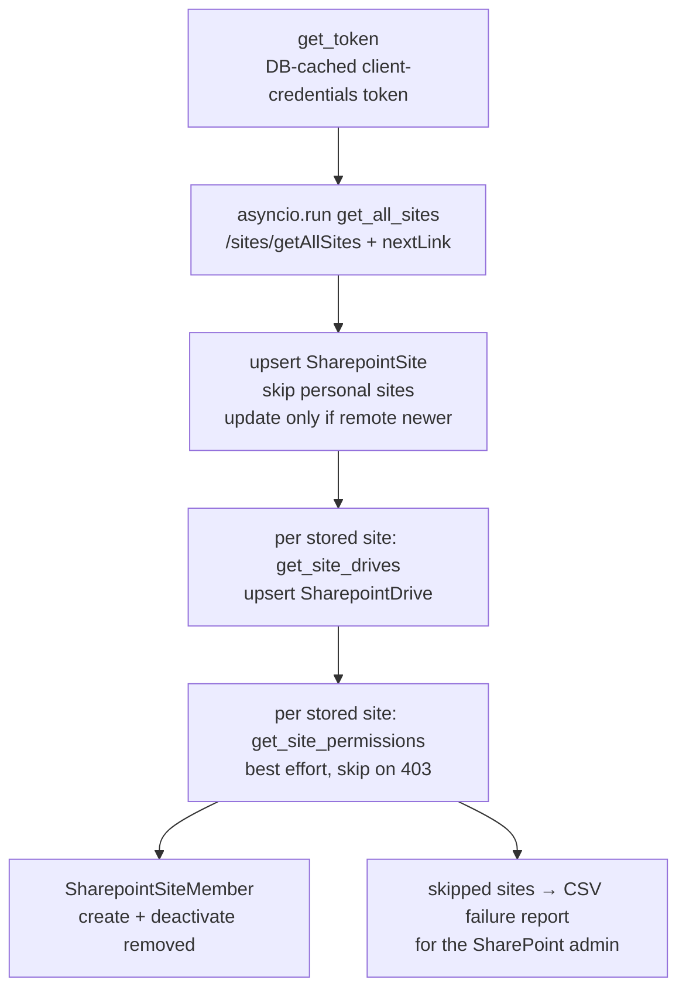

# SharePoint Sync

> **Status (2026-09-10):** Sites and Drives sync is **live** and idempotent.
> Site-**member** sync is implemented but is **skipped at runtime** because the
> app token currently lacks the Graph permission needed to read site
> permissions (`Sites.Manage.All` / `Sites.FullControl.All`). See
> [Site members](#site-members-sharepointsitemember) below.

This page documents the offline SharePoint synchronisation: the `populate_sites`
management command, the `pwms/utils/sharepoint.py` Graph client, the
`SHAREPOINT_*` settings, and the local `Sharepoint*` models.

Related pages: [Management Commands](./Management%20Commands.md) ·
[Roadmap & Planned Integrations](./Roadmap%20&%20Planned%20Integrations.md).

---

## What it does

`populate_sites` mirrors a SharePoint tenant into local Django tables so the
rest of the app can work offline (no live Graph calls per page view):

| Local model | Remote source | Upsert key |
| --- | --- | --- |
| `pwms.SharepointSite` | `GET /sites/getAllSites` | `site_id` |
| `pwms.SharepointDrive` | `GET /sites/{id}/drives` | `(site, drive_id)` |
| `pwms.SharepointSiteMember` | `GET /sites/{id}/permissions` (best effort) | `(site, user)` — natural key |

Run it from the repo root:

```bash
.venv/bin/python manage.py populate_sites
```

Sites whose member list cannot be read are written to a CSV hand-off report; the
path can be chosen explicitly:

```bash
.venv/bin/python manage.py populate_sites --failures-file reports/member_access_gaps.csv
```

The command is **safe to re-run**: it upserts, never deletes rows, and skips a
record when the remote copy is not newer than what is stored.

---

## Prerequisites & configuration

The app authenticates to Microsoft Graph with an **application token**
(OAuth 2.0 client-credentials flow) — i.e. a service principal / "system
account", not a user. There is no interactive login.

Environment variables (read by `python-decouple` from `.env` at the repo root):

| `.env` key | Settings attribute | Purpose |
| --- | --- | --- |
| `CLIENT_ID` | `SHAREPOINT_CLIENT_ID` | Azure AD app (client) ID |
| `CLIENT_SECRET` | `SHAREPOINT_CLIENT_SECRET` | Azure AD app client secret |
| `TENANT_ID` | `SHAREPOINT_TENANT_ID` | Azure AD tenant ID |

Derived automatically in `settings.py`:

- `SHAREPOINT_TOKEN_URL` = `https://login.microsoftonline.com/{TENANT_ID}/oauth2/v2.0/token`
- `SHAREPOINT_SCOPE` = `https://graph.microsoft.com/.default` (app-only, grants
  whatever the app registration has been consented for)

### Token handling

`pwms.utils.sharepoint.get_application_token()` (aliased as `get_token()`):

1. Reuses the most recent **active** cached `pwms.SharepointToken` row if it has
   not expired (there is a 5-minute safety buffer before the real expiry).
2. Otherwise requests a fresh token from `SHAREPOINT_TOKEN_URL` using
   `client_credentials`, deactivates the old active row(s) and stores the new
   token in `pwms.SharepointToken`.

So a valid token is cached in the database after the first run; you do not pass
a token on the command line.

---

## What happens on each run

The `handle()` pipeline in `populate_sites`:



### 1. Sites (`_process_sites`)

- Calls `GET /sites/getAllSites?$top=200&$select=…` and follows `@odata.nextLink`
  until exhausted (the previous code only fetched the first page and silently
  truncated large tenants).
- OneDrive **personal sites** (`isPersonalSite`) are filtered out.
- New sites are `bulk_create`d; existing sites are updated **only when** the
  remote `lastModifiedDateTime` is newer than the stored
  `remote_modified_at` (or when either side lacks a timestamp).
- Tracks `last_synced_at` (when we last pulled) alongside the remote
  `remote_modified_at`.

### 2. Drives (`_process_drives`)

- For every stored site, calls `GET /sites/{site_id}/drives?$select=id,name`
  (pagination-aware) and upserts `SharepointDrive` rows.
- A failure on one site is logged and the loop continues; it never aborts the
  whole run.

### 3. Site members (`_process_site_members`)

- For every stored site, calls `GET /sites/{site_id}/permissions` and flattens
  each permission with `pwms.utils.sharepoint.iter_permission_identities`
  (handles `grantedTo`/`grantedToIdentities` v1 and `grantedToV2`/…V2 shapes).
- Only identities that are **people** (`user` / `siteUser`) are considered;
  groups / site-user groups are not mapped to individuals.
- Each principal is matched to a local `pwms.User` by lower-cased **email**
  (then username) — via `email`, `mail` or `userPrincipalName` from Graph.
- Matches are stored as `SharepointSiteMember(site, user)` (unique on the pair);
  rows whose principal no longer holds access are **deactivated**
  (`is_active=False`), never deleted.
- Principals that matched no local user are counted and reported as `unmatched`.

> **Current limitation — insufficient app permissions.** Reading
> `/sites/{id}/permissions` requires an application permission of at least
> **`Sites.Manage.All`** (or `Sites.FullControl.All`). The configured Azure AD
> app currently only has enough to read sites/drives, so Graph returns `403`
> and the command reports each site as skipped —
> *“Site members unavailable for …”* — while the site/drive sync completes
> normally.

#### Failure report for the SharePoint admin

Every site whose `/sites/{id}/permissions` call fails is recorded in a CSV
report, written by default to
`logs/site_member_failures_<YYYYmmdd_HHMMSS>.csv` and overridable with
`--failures-file PATH`. The timestamped default means a fresh report is
produced per run, so an already-sent report is never silently overwritten.

The report has one row per failing site, with the columns **Site Name, Site
URL, Site ID, HTTP Status, Graph Endpoint, Error, Recommended Action** — the
*Recommended Action* is derived from the HTTP status (e.g. `403` → grant the
app `Sites.Manage.All`, `404` → site not visible to the app). It is written as
UTF-8 with a BOM so Excel opens it cleanly, and no file is produced when every
site succeeds.

---

## Granting member access (to enable the member sync)

To lift the limitation above, grant the Azure AD app the **Microsoft Graph →
Application permission** and admin-consent it:

| Permission | Effect |
| --- | --- |
| `Sites.Read.All` | list/read sites & drives (what you have today) |
| `Sites.Manage.All` **or** `Sites.FullControl.All` | also read/write site **permissions** — enables `_process_site_members` |

Steps (Azure portal):

1. **App registrations → your app → API permissions → Add a permission.**
2. Choose **Microsoft Graph → Application permissions**, add
   `Sites.Manage.All` (least-privilege option that exposes `/permissions`).
3. Click **Grant admin consent** for the tenant.
4. Re-run `manage.py populate_sites` — member rows should now populate.

Notes on scope:

- With an **app-only** token, `GET /sites/{id}/permissions` returns the
  *principals* (users and groups) granted access, not the individual members of
  an M365 **group**. A site backed by an M365 group that grants “Everyone in
  <group>” will surface as a **group** principal, which this sync deliberately
  does not expand into people.
- Expanding group membership would additionally require `Group.Read.All` plus
  group expansion logic, and is out of scope for the current member sync.

---

## Idempotency & safety

- Re-runnable any number of times.
- Rows are never hard-deleted by this command: sites/drives are upserted,
  members are deactivated instead of removed.
- Locally curated columns are excluded from the sync's update list, so a re-run
  never undoes an administrator's change — in particular
  `SharepointSite.enabled`, the flag that gates the attachment picker above.
- Updates are conditional on the remote timestamp (sites).
- Writes happen inside `transaction.atomic()` per batch.
- Sites that the permissions API rejects are skipped and counted, without
  affecting the site/drive data already stored.

---

## Graph endpoints used

| Purpose | Endpoint | Helper |
| --- | --- | --- |
| Token (app-only) | `POST …/oauth2/v2.0/token` | `get_application_token` |
| All sites | `GET /sites/getAllSites` | `get_all_sites` |
| Site drives | `GET /sites/{id}/drives` | `get_site_drives` |
| Site permissions | `GET /sites/{id}/permissions` | `get_site_permissions` |
| Drive root children | `GET /sites/{id}/drive/root/children` | `get_site_details` |
| Drive items / folders | `GET /drives/{id}/root/children`, `/items/{fid}/children` | `get_drive_items`, `get_folder_items` |
| Item metadata | `GET /drives/{id}/items/{iid}` | `get_item` |
| Item versions | `GET /drives/{id}/items/{iid}/versions` | `get_item_versions` |
| Version content | `GET …/versions/{vid}/content` (302) | `get_version_download_url` |
| File upload / folders | `PUT …:/content`, `POST …/createUploadSession`, `POST …/children` | `upload_file`, `create_folder` |

The item/upload helpers are driven by the attachment picker (below) rather than
by a management command.

---

## Attachments (documents on workflow records)

Every workflow instance (`DelegationReport`, `InternationalResolution`,
`InternationalAgreement`, `Bill`) has an **Attachments** section on its detail
page. It is a lazy HTMX picker that browses SharePoint and attaches documents to
the record through `pwms.Attachment` — a generic FK (`content_type` +
`object_id`), so one table serves every concrete subclass.

The flows the picker supports:

1. **Browse** — the tree lists the sites the user is an active
   `SharepointSiteMember` of (superusers see every enabled, non-personal
   mirrored site), expanding to their drives and folder hierarchy. Only
   **enabled** sites are offered: `SharepointSite.enabled` is a local curation
   flag (uncheck it in the admin to hide a library from the picker) and it binds
   everyone, superusers included. Sites and drives come from the local mirror; a
   folder's children are read from Graph on demand (`get_folder_items`).
2. **Select** — opening a folder lists its documents; **Attach** links an
   existing file (`get_item` for its metadata) as a new `Attachment`.
3. **Upload & attach** — the folder's upload form sends a local file straight to
   SharePoint (`upload_file`) and records the returned item as an attachment in
   the same step.
4. **Version history** — a document's row opens a panel listing SharePoint's own
   versions (label, size, author, timestamp), refreshed from
   `get_item_versions` each time it is opened; each version links to a download
   that resolves its pre-authenticated SharePoint URL.
5. **Activity** — every attach, detach and superseding upload is appended to the
   record's domain event log (see below), and the section lists the recent ones.

Graph is authenticated with the same DB-cached application token as the sync
(`get_application_token`), so no interactive login is involved. Access is
narrowed twice: the **record's** RBAC (`edit`, via
`pwms.services.permissions.resolve`) gates the mutating picker calls and `view`
gates reading a version history, while **site membership** gates the SharePoint
content itself.

### Endpoints

| Route | Method | Purpose |
| --- | --- | --- |
| `attachments/browser/` | GET | The picker shell (tree + document panel) |
| `attachments/tree/` | GET | One expanded tree level: a site's drives, or a folder's subfolders |
| `attachments/folder/` | GET | The documents in a selected folder, plus its upload form |
| `attachments/link/` | POST | Attach an existing document |
| `attachments/upload/` | POST | Upload a file into the selected folder and attach it |
| `attachments/<public_id>/delete/` | POST | Detach a document (the file stays in SharePoint) |
| `attachments/<public_id>/versions/` | GET | Version history for one attachment, refreshed from SharePoint |
| `attachments/versions/<public_id>/download/` | GET | Redirect to that version's pre-authenticated SharePoint URL |

The `content_type` (`"app.model"`) + `object_id` parameters name the target
record, so the routes are shared by every workflow subclass. Deleting an
attachment removes only the local row; it never deletes the file.

Code: the `attachment_*` views in `pwms/views.py`, the service in
`pwms/services/attachments.py`, the models in `pwms/models/attachments.py`, and
the fragments in `pwms/templates/pwms/partials/attachment_*.html`.

### Version history

`populate_sites` mirrors *sites*, not documents, so version history is mirrored
on demand: `sync_versions()` reads `get_item_versions` and upserts one
`pwms.AttachmentVersion` per remote version (unique on attachment + version id),
flagging the newest `is_current`. The panel is served by that same call, so
opening it always shows fresh data; a version SharePoint no longer reports is
left in place rather than deleted.

Downloading a version never streams the file through the app:
`get_version_download_url` reads the `Location` header of Graph's redirect and
`attachments/versions/<public_id>/download/` forwards the browser to that
short-lived, pre-authenticated URL.

Re-uploading a document with the same folder + filename returns the *same*
SharePoint item, so `upload_document()` refreshes the existing attachment in
place (size, MIME type, URLs) instead of raising “already attached”, and records
the change as a new version. Its original attachment **type** is kept — a
revision does not reclassify a document.

### The document audit trail

Attaching, detaching and revising are recorded as `WorkflowEvent`s on the target
record's **append-only domain event log** (see
[Data Model §5](./Data%20Model.md#5-auditing)), through three seeded
`EventType`s — `document-attached`, `document-detached` and
`document-version-added` (migration `0031`). They surface as the section's
“Document activity” list, and in the record's event log generally.

This is deliberately *not* inferred from `Attachment.created_at`: a detach
deletes the row, so the event payload carries a **snapshot** of the document
(name, item id, drive, folder path, URL) that outlives it, alongside the `actor`
and timestamp. Detaching removes only the local link — the file and its version
history stay in SharePoint. Recording is best effort: a target with no event log,
or a registry whose event type has been removed, is warned about and skipped so
a document can still be filed.

> **Dependency:** browsing is membership-based, so it needs the
> `SharepointSiteMember` rows written by `populate_sites`. Until the app token
> can read site permissions (see [Site members](#site-members-sharepointsitemember)),
> only superusers see a populated tree.

---

## Troubleshooting

| Symptom | Likely cause / fix |
| --- | --- |
| `SHAREPOINT_TOKEN_URL not configured` / empty `CLIENT_ID`/`CLIENT_SECRET` | `.env` missing `CLIENT_ID`, `CLIENT_SECRET` or `TENANT_ID` at the repo root |
| Token request `HTTP 401/400` | wrong client id/secret or tenant; check Azure AD app registration |
| `…Site members unavailable for <site>: …403…` | app lacks `Sites.Manage.All`/`Sites.FullControl.All` — see [Granting member access](#granting-member-access-to-enable-the-member-sync); the affected sites are listed in the CSV failure report |
| Need the list of sites whose member sync failed | read `logs/site_member_failures_<timestamp>.csv` from the last run (or pass `--failures-file PATH`) and send it to the SharePoint admin |
| Sites fetched but a large tenant looks incomplete | should no longer happen — `get_all_sites`/`get_site_drives` follow `@odata.nextLink` |
| Drives empty for a site | that site may genuinely have no document library |
| Command fails early | token expired **and** no cached active row → re-run after granting/refreshing consent |

---

## Related

- `pwms/utils/sharepoint.py` — the Graph client (imports `SharepointToken` from `pwms.models`).
- `pwms/models/sharepoint.py` — `SharepointSite`, `SharepointDrive`,
  `SharepointSiteMember`, `SharepointToken`, `SharepointFolder`.
- [Roadmap & Planned Integrations](./Roadmap%20&%20Planned%20Integrations.md) —
  what remains on top of this sync (restoring a superseded version, pinning a
  version to a record).
