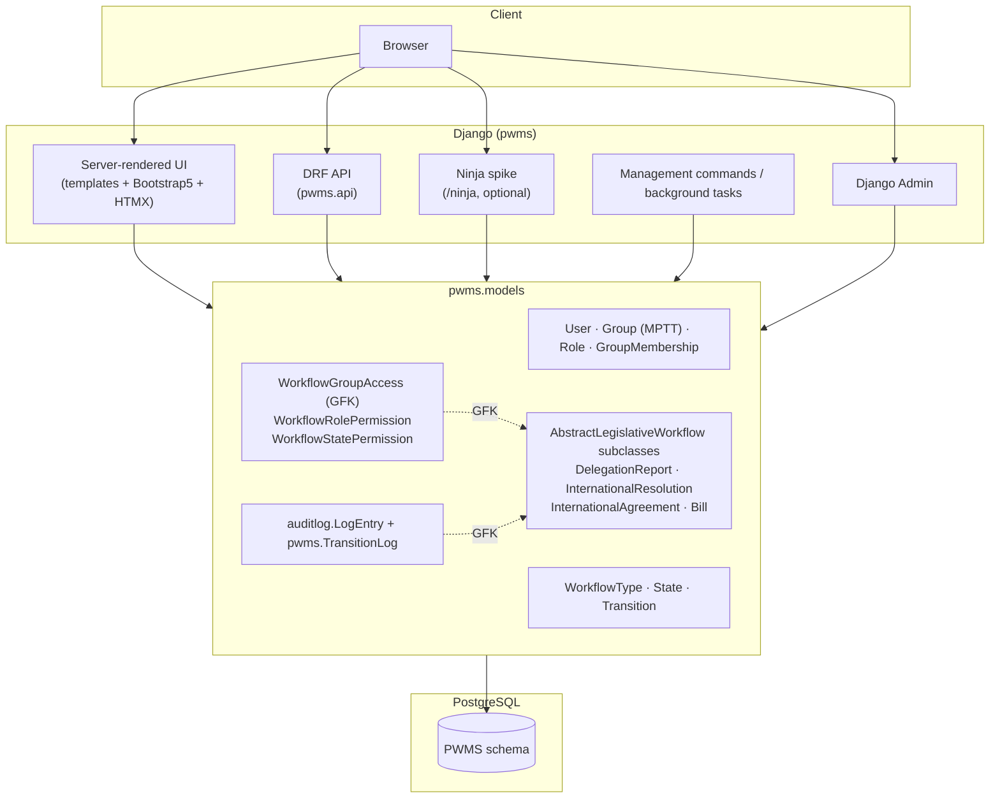
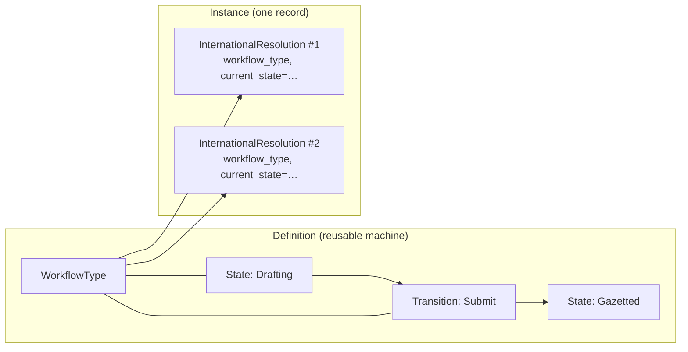
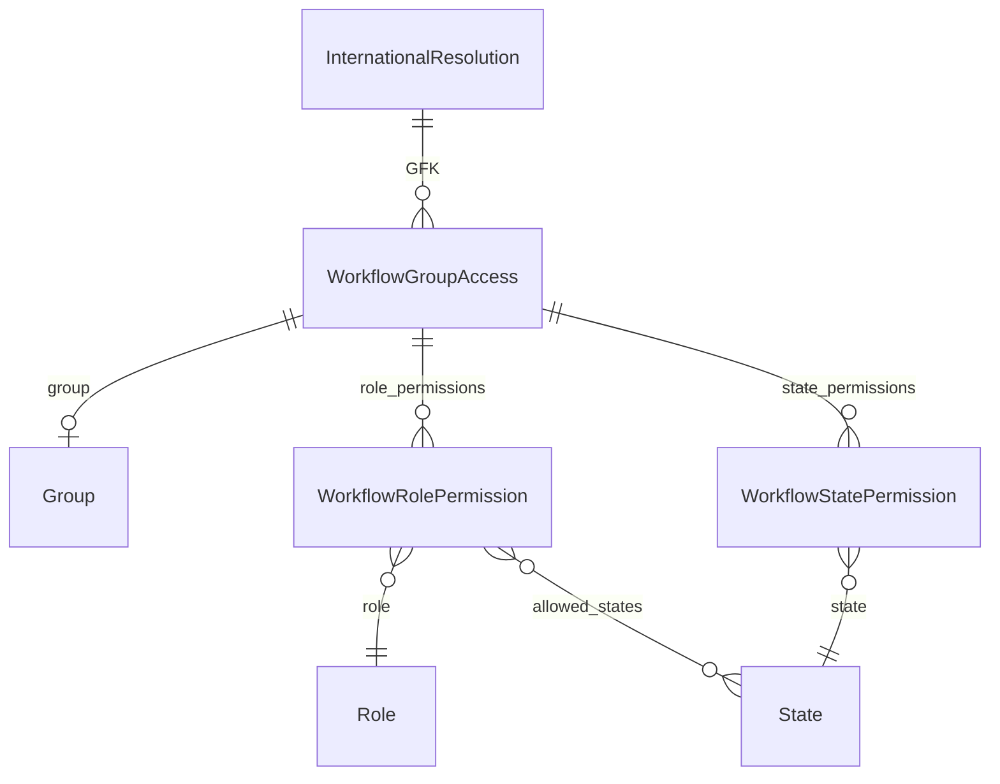
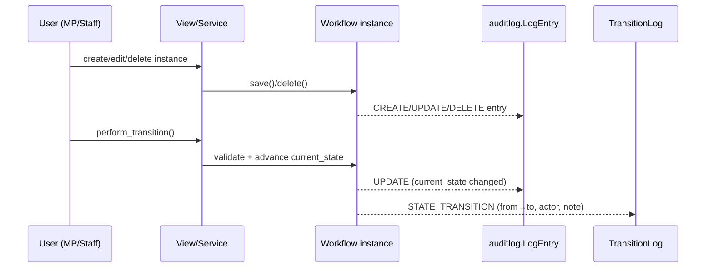

# System Design

PWMS models parliamentary workflow as two cooperating layers:

1. **A reusable state machine** (`WorkflowType` → `State`/`Transition`) that
   describes how a kind of legislative instrument moves through Parliament.
2. **Workflow instances** — concrete records (e.g. `InternationalResolution`)
   that share one abstract schema and simply point at a machine and a
   `current_state`.

All **authorisation** and **auditing** are layered on top of the instance.

---

## 1. High-level architecture



### Module map

```
pwms_project/                     # repo root (git) — run manage.py from here
├── manage.py                     # entry point
├── .env                          # python-decouple secrets
├── pyproject.toml / uv.lock      # uv-managed dependencies (distribution: pwms)
├── logs/                         # runtime logs
└── src/pwms/                     # single top-level package (installed as `pwms`)
    ├── settings.py               # env-driven settings (python-decouple)
    ├── root_urls.py              # project URL root (admin, pwms, api, ninja, docs)
    ├── asgi.py / wsgi.py
    ├── tasks.py                  # django-background-tasks entry points
    ├── templates/                # server-rendered UI (Bootstrap 5 + HTMX)
    ├── static/                   # CSS / JS / images
    ├── admin.py                  # admin registrations
    ├── apps.py                   # PwmsConfig; ready() registers auditlog
    ├── urls.py / views.py        # app pages under /pwms/ (dashboard, auth, groups,
    │                             #   workflow CRUD, attachments, alerts, reports)
    ├── backends.py               # GracefulLDAPBackend + local fallback
    ├── middleware.py             # login-required-by-default middleware
    ├── decorators.py / navigation.py
    ├── models/
    │   ├── base.py               # BaseModel (uuid7 public_id, timestamps)
    │   ├── users.py              # User
    │   ├── groups.py             # Group (MPTT)
    │   ├── permissions.py        # Role, GroupMembership
    │   ├── geography.py          # Country, City (reference data)
    │   ├── sharepoint.py         # SharePoint sync models
    │   ├── attachments.py        # Attachment, AttachmentVersion
    │   ├── notifications.py      # Notification (bell + delivery log)
    │   ├── reports.py            # ReportShare
    │   └── workflows.py          # engine + instances + RBAC + events
    ├── api/
    │   ├── urls.py / views.py / serializers.py   # DRF endpoints
    │   └── ninja.py              # django-ninja evaluation spike
    ├── notifications/            # audience rules, dispatch, bell context
    ├── reporting/                # builder, exports, instruments, sharing
    ├── membership/
    │   └── sync_service.py       # MembershipSyncService (Oracle/legacy sync)
    ├── services/
    │   ├── permissions.py        # unified permission resolver (UI + API)
    │   ├── attachments.py        # SharePoint attachment service
    │   ├── history.py            # merged TransitionLog + auditlog timeline
    │   └── progress.py           # where a record sits in its state machine
    ├── management/commands/      # sync, jobs, diagrams (see Management Commands)
    ├── utils/                    # audit_helpers.py, sharepoint.py, diagrams.py
    ├── migrations/
    ├── tests*.py                 # tests, tests_api, tests_ninja, tests_notifications, …
    └── docs/                     # this documentation
```

---

## 2. URL map

| Path | Purpose | Auth |
| --- | --- | --- |
| `/admin/` | Django admin | admin |
| `/` | redirect → `/pwms/` | – |
| `/pwms/` , `/pwms/about/` , `/pwms/contact/` | public pages | public |
| `/pwms/dashboard/` | dashboard (figures scoped to the user) | session |
| `/pwms/login/` , `/pwms/logout/` | session login/logout (web) | – |
| `/pwms/workflows/…` | list / detail / create / update / delete per instrument (incl. bill versions) | session + RBAC |
| `/pwms/instruments/{public_id}/document/` | one instrument as a formal PDF/HTML document | session + RBAC |
| `/pwms/instruments/{public_id}/diagram.svg` | the workflow type's generated state-machine diagram | session + RBAC |
| `/pwms/instruments/{public_id}/transition/` | confirm (GET) and apply (POST) one state transition | session + RBAC |
| `/pwms/attachments/…` | SharePoint picker + open / link / upload / detach / version history | session + RBAC |
| `/pwms/alerts/` , `/pwms/alerts/{public_id}/` | alerts page and open/read state | session |
| `/pwms/reports/…` | report builder, HTMX preview, export, share | session + RBAC |
| `/pwms/reports/shared/{token}/` | read-only shared report (token-addressed) | token |
| `/pwms/*-search/` | HTMX search fragments (users, groups, reports, countries, cities) | session |
| `/api/` | DRF API root | session/basic |
| `/api/{resolutions,agreements,bills}/{public_id}/audit/` | auditlog CRUD history for one instrument | session/basic |
| `/api/auth/login/` , `/api/auth/logout/` | DRF browsable-API auth | – |
| `/api/schema/` , `/api/docs/` , `/api/redoc/` | OpenAPI schema + Swagger/ReDoc | public (docs) |
| `/ninja/…` | django-ninja spike endpoints + auto docs | session (spike) |

---

## 3. The workflow engine

### Two levels — definitions vs instances



- **`WorkflowType`** — a registry entry (name, slug, enabled) **owned by a
  `Group`** (`group`, the RBAC scope) with a `create_roles` M2M drawn from that
  group's roles. Owns its `State`s and `Transition`s. States/transitions are
  **shared** by every instance of that type — they are not duplicated per record.
- **`State`** — name/slug, flags (`is_initial`, `is_terminal`,
  `allows_referrals`), ordering and colour; unique per workflow type.
- **`Transition`** — an allowed `from_state → to_state`, with `notify_roles` (the
  alert audience) and `allowed_roles` (**advisory** — a diagram label that
  `next_actor_roles()` adds to that audience, *not* an authorisation rule: who may
  move a record on is the `transition` RBAC capability, see §4); may require a
  comment; unique per workflow type.

### Instances

`AbstractLegislativeWorkflow` is the **abstract common schema**:

- `workflow_type` → the machine it follows
- `current_state` → where it is now (must belong to `workflow_type`)
- `title`, `description`, `owner`, `assigned_to`, `deadline`, `priority`
- referrals are typed `WorkflowReferral` rows (GFK) — see §5
- notes are typed `WorkflowNote` rows (GFK) — usable by every subclass, so no
  instrument needs a `notes` column to carry a note log

Because the base is abstract, every concrete subclass gets its own table. Today
that is:

- **`DelegationReport`** — BRS report fields (engagement, location, ATC links).
- **`InternationalResolution`** — `resolution_number`, `adoption_date`,
  `responsible_group`, `implementation_progress`; may nest inside a report.
- **`InternationalAgreement`** — `reference_number`, `agreement_type`,
  `submitting_department`, `responsible_minister`, ATC tabling fields.
- **`Bill`** — `bill_number`, `short_title`, `bill_type`, `house_of_origin`,
  sponsor and responsible committee, with `public_status` derived from the state
  and a preserved `BillVersion` history.

Helpers on the base provide lifecycle navigation:

| Method | Purpose |
| --- | --- |
| `clean()` | validate `current_state` belongs to `workflow_type` |
| `get_available_transitions()` | transitions valid from `current_state` |
| `perform_transition(transition, actor, comment, ip)` | validate → advance state → write a `TransitionLog` |
| `can(user, action)` | effective RBAC resolution (see §4) |
| `group_accesses()` / `audit_logs()` | access & audit rows for this instance |

> **Design rule:** Django cannot create a `ForeignKey` to an *abstract* model
> (`fields.E300`). Cross-cutting tables that must point at *any* workflow subclass
> therefore use a **GenericForeignKey** (`WorkflowGroupAccess`, `TransitionLog`).

---

## 4. ContentType-based RBAC

**Creation** is scoped at the **type** level: a `WorkflowType` belongs to a
`Group` and lists the `create_roles` (roles held by members of that group) that
may create instances — `WorkflowType.can_create(user)` / `creatable_by(user)`.
Superusers bypass the check; an empty `create_roles` means superusers only.

**View / edit / delete / share / comment / manage / transition** on existing
rows are granted **per workflow instance** and are keyed to the instance via a
generic foreign key (`ContentType` + internal PK). There are three layers:



1. **`WorkflowGroupAccess`** — "which House/Committee may access this instance",
   plus group-level defaults `can_view/edit/delete/share/comment/manage/transition`,
   `is_primary`, grantor and grant time.
2. **`WorkflowRolePermission`** — per `(group_access × Role)` overrides of the
   seven capabilities. If a row exists it is *authoritative* for that role; an
   optional `allowed_states` M2M scopes the override to specific states.
3. **`WorkflowStatePermission`** — per `(group_access × State)` rows describing
   what the group may do *while the workflow is in that state* (e.g. view/edit in
   "Drafting" vs only view in "Gazetted").

### Resolution order (`instance.can(user, action)`)

For each Group the user actively belongs to (`GroupMembership`, active) that also
holds a `WorkflowGroupAccess` on the instance:

1. **Role override** — if a `WorkflowRolePermission` exists for the user’s role
   and applies in the current state, it wins (grant **or** explicit deny).
2. **State permission** — else a `WorkflowStatePermission` row for
   `(group_access, current_state)`.
3. **Group default** — else the base flags on `WorkflowGroupAccess`.

Actions are `view | edit | delete | share | comment | manage | transition`.

The **`PermissionResolver` service** (`pwms/services/permissions.py`) is the
single entry point the UI and API both call: `resolve(user, resource, action)`,
`permissions_for(user, resource)` (the six capabilities) and `require(...)`.
It dispatches by resource type — workflow instances go through `can(...)` above,
other models fall back to a conservative default or a registered resolver —
adds the superuser bypass, grants `manage` to anyone holding the global
`Role.can_manage_permissions` capability, and treats two people named on a
workflow instance as implicitly authorised — its **owner** may always
view/edit/delete it and its **assignee** may always view it (assignment confers
reading rights only). The DRF audit endpoint consumes it via
`WorkflowViewPermission` (`pwms/api/permissions.py`).

---

## 5. Auditing

Two complementary mechanisms record history:

| Mechanism | Records | Granularity |
| --- | --- | --- |
| `auditlog.LogEntry` | every **create / update / delete** of a registered workflow instance | field-level before/after diffs, actor, IP, timestamp |
| `pwms.TransitionLog` | every **semantic state transition** | `from_state → to_state`, actor, comment, IP, action label |
| `pwms.WorkflowEvent` | every **domain event** (document attached, ATC published, referral created/responded/...) | append-only, typed registry (`EventType`), JSON payload, actor, origin |

- Registration happens in `PwmsConfig.ready()`: all four concrete subclasses
  (`InternationalResolution`, `DelegationReport`, `InternationalAgreement`,
  `Bill`) are registered with `exclude_fields=["updated_at"]`. Add each new
  concrete subclass there. Two child-row models are registered as well —
  `DelegationParticipant` (removal is a soft delete, so the row survives and
  auditlog keeps the actor) and `WorkflowNote` (a note is its own row, so it
  needs a trail of its own) — because they change without touching their parent.
  Extend that list for each new child model. Referral changes are no longer M2M
  audit entries — they are typed rows whose lifecycle emits `WorkflowEvent` rows.
- `perform_transition()` writes a `TransitionLog` row **and** the resulting
  `current_state` change is captured by auditlog as an UPDATE entry.
- `utils/audit_helpers.py` exposes `get_audit_trail_for_instance(instance)` and
  `get_audit_trail_by_public_id(model_class, public_id)` used by the API.



---

## 6. API layer

- **DRF** (`pwms/api/`) is the current API: an API root
  (`@api_view`), an audit-history endpoint
  (`GET /api/resolutions/{public_id}/audit/`), and the browsable renderer.
- **OpenAPI** is generated by `drf-spectacular` (schema at `/api/schema/`,
  Swagger `/api/docs/`, ReDoc `/api/redoc/`).
- **django-ninja** (`pwms/api/ninja.py`, mounted at `/ninja/`) is a **side-by-side
  evaluation spike** of the same endpoint to compare DX. **Decision pending** —
  if DRF is kept, remove the ninja module, its URL and dependency; if ninja is
  chosen, port the API over.

See [API Reference](./API%20Reference.md).

---

## 7. Background jobs & commands

`pwms/tasks.py` registers the queued jobs `django-background-tasks` runs (alert
email delivery and the scheduled-report drain), served by
`manage.py process_tasks`. Separately, Django management commands cover data
synchronisation (legacy Oracle), SharePoint/GeoNames import, committee scraping,
referral-deadline checks and diagram generation. Several commands **still import
the legacy `workflows.models`** (the old app this codebase was migrated from) and
will only work after being repointed to `pwms.models`. See
[Management Commands](./Management%20Commands.md) for the per-command status.

---

## 8. Known design debt / decisions

- **`Role` vs `UserRole`:** the role model is `Role` (`pwms.Role`). Historically
  renamed; keep references consistent.
- **Stale imports:** many `management/commands/*` reference the legacy
  `workflows.models` app that no longer exists. They fail only when invoked.
- **Concrete-only audits:** because auditing/RBAC hang off the abstract base,
  a new workflow type (Motion, Question, …) must (a) subclass
  `AbstractLegislativeWorkflow`, (b) be registered with `auditlog` in
  `PwmsConfig.ready()`, and (c) get an `*AuditHistoryView` subclass for the API.
  The four shipped instruments each follow this.
- **Dev DB reset:** full destructive reset recipe is in
  [Technical Stack → Database reset](./Technical%20Stack.md#database-reset-development).
