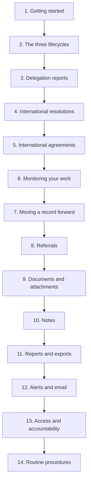
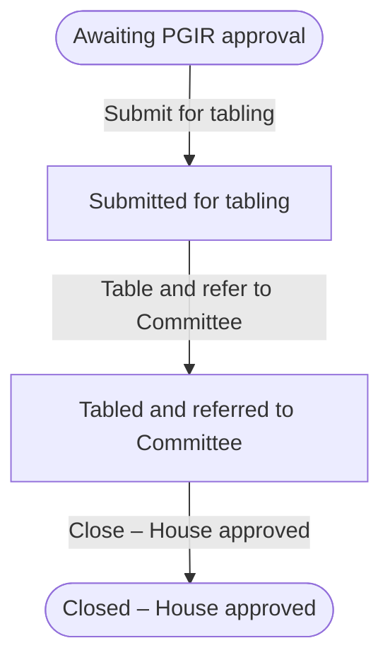
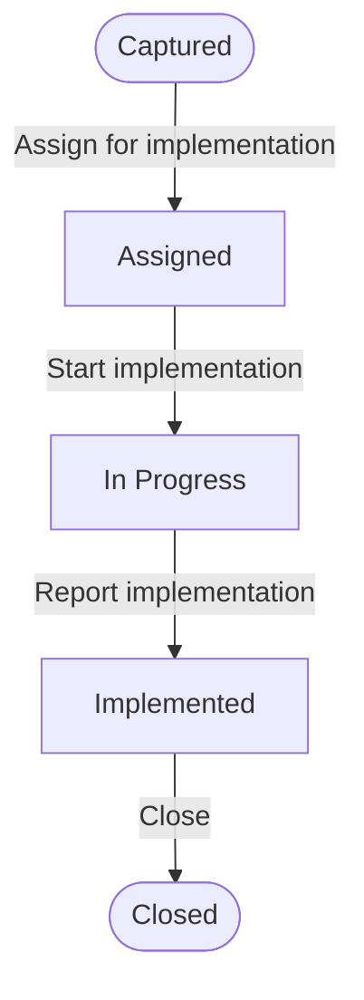
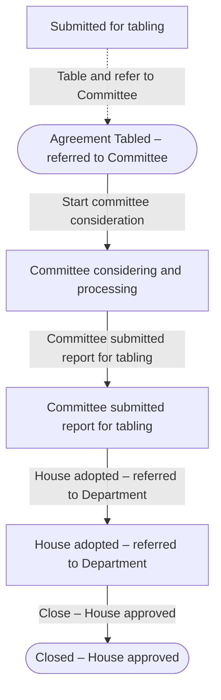

# PWMS Training Manual

**Parliamentary Workflow Management System — IRPD Section**

| | |
| --- | --- |
| **Audience** | IRPD section staff responsible for creating, monitoring and reporting on Delegation Reports, International Resolutions and International Agreements |
| **Version** | 1.0 (aligned with PWMS `0.1.0`) |
| **Delivery** | Self-paced reading, or instructor-led over two half-day sessions |
| **Prerequisite** | A PWMS account with an active membership in the section's group; basic web browser skills |

> **Companion document.** The two opening paragraphs of Part A are reproduced from
> [`User Manual Introduction.md`](./User%20Manual%20Introduction.md). Keep the two
> in step when either is edited.

---

## How to use this manual

The manual is in four parts.

- **Part A — Orientation** explains what PWMS is, what it is for, and the
  vocabulary the rest of the manual uses.
- **Part B — Learning Objectives and Outcomes** states what the training sets out
  to achieve, and the specific, measurable results each participant should reach.
- **Part C — Training Modules** is the course itself: fourteen modules, each with
  a purpose, step-by-step instructions, a worked example, warnings, and a
  "Check your understanding" prompt.
- **Part D — Appendices** holds the field reference, the state-and-transition
  reference, the glossary, quick-reference cards, practical exercises, an
  assessment, and the administrator prerequisites and known limitations.

**Conventions.** Menu and button labels appear in **bold** exactly as they appear
on screen. Field labels appear in `code`. Anything that must be confirmed with
your PWMS administrator before training is marked **⚠ Administrator task**.

> **Wall card.** A printable one-page summary of this manual —
> [`Quick Reference Card.pdf`](./Quick%20Reference%20Card.pdf) — is meant to be
> pinned up beside the section's workstations. Print it A4 portrait at 100%.
>
> **Before this manual.** The 90-minute session that first introduces the section
> to PWMS — with its timed running order, demonstration scripts, hands-on tasks
> and trainer checklist — is the
> [Introductory Lesson Plan](./Introductory%20Lesson%20Plan.md).

---

# Part A — Orientation

## 1. Systems Overview

PWMS (the Parliamentary Workflow Management System) is a single, secure web
application that keeps track of the documents Parliament works through —
delegation reports, international resolutions, international agreements and bills
— from the moment they are first drafted until the work on them is finished. Each
item travels along an agreed route of stages, such as *Drafted*, *Referred to
Committee* or *Signed into Law*, and at every stage the system knows who is
allowed to see the item and who is allowed to move it forward. It also manages the
people side of the work: it records which Members, staff, committees and
departments are involved, keeps their details, roles and terms of service up to
date, and links all of this to your normal organisational sign-in, so there is no
separate password to remember. Supporting documents are stored alongside each
record rather than scattered across inboxes, alerts and email tell people when
something happens or is due without anyone having to watch a screen, and a
complete history is kept of every action taken — who did it, when, and what
changed. From that same information, reports and printable copies can be produced
and filtered to show only what the reader is entitled to see, and can be shared
safely with colleagues, committees or the public.

## 2. The Purpose

The purpose of PWMS is to give Parliament one trustworthy, shared place to manage
its legislative work, in place of scattered spreadsheets, shared drives and email
chains where items can be forgotten, duplicated, or quietly changed without anyone
noticing. It exists to make the progress of every instrument clear and visible to
the people who need it, to make sure that only the right people are able to act at
the right stage, and to leave a complete and reliable record of how each decision
was reached. In short, PWMS is there to make parliamentary workflow more
transparent, more accountable and less prone to error — so that nothing falls
through the cracks and everyone involved can see exactly where things stand.

## 3. The IRPD section in PWMS

PWMS groups people into organisational **groups** that mirror Parliament's
structure. Your section is represented in PWMS by an organisational group named
**`IRP: MR: Man And Gen`** — the Multilateral Relations unit within International
Relations and Protocol. Throughout this manual, **IRPD** means your section; where
a screen shows a group name, it will show `IRP: MR: Man And Gen`.

That group **owns** the three workflow types this manual covers:

| Workflow type | Seeded description (as configured in PWMS) |
| --- | --- |
| **Delegation Report** | Delegation report lifecycle (BRS BR02): Awaiting PGIR approval → Submitted for tabling → Tabled and referred to Committee → Closed – House approved. |
| **International Resolution** | International resolution implementation tracking: Captured → Assigned → In Progress → Implemented → Closed. |
| **International Agreement** | International agreement lifecycle: Submitted for tabling → Agreement Tabled – referred to Committee → Committee considering and processing → Committee submitted report for tabling → House adopted – referred to Department → Closed – House approved. |

Owning a workflow type has three practical consequences for IRPD.

1. **Your group is granted access automatically.** When anyone creates one of
   these records, PWMS immediately grants your group the right to **view, edit and
   move on** the new record. Nobody has to ask an administrator for access first.
2. **Your group is the natural home of the work.** By default, IRPD (and the
   record's owner) can see and work on these records; the rest of Parliament
   cannot see a record until it is referred to them or granted access explicitly.
3. **Access is still per record.** "Owning the type" is a starting position, not a
   blanket permission. A record can be narrowed or widened per record, per role or
   per stage by an administrator, and the system always re-checks before it acts.

**⚠ Administrator task.** Who may *create* a new record of each type is a
per-environment setting, not something PWMS assumes. Until the administrator names
the roles allowed to create each type, the **New Report**, **New Resolution** and
**New Agreement** buttons will refuse you with the message *"You do not have a
role that may create delegation reports."* (or the equivalent for the other two).
Confirm the arrangement before training, because it is the first thing a trainee
will hit.

## 4. Key vocabulary

| Term | What it means in PWMS |
| --- | --- |
| **Instrument** | Any one of the four kinds of parliamentary record PWMS tracks. IRPD works with three of them: delegation reports, international resolutions and international agreements. |
| **Record / instance** | A single instrument — for example, one specific delegation report. Every record has its own reference, its own people, its own documents and its own history. |
| **Workflow type** | The definition of how a kind of instrument is worked — the list of stages it passes through and the moves allowed between them. The type is shared by all records of that kind. |
| **State / stage** | Where a record currently sits in its route, for example *Captured* or *Tabled and referred to Committee*. |
| **Public status** | The simplified, outward-facing version of the state. Several internal stages can publish under one public status, so committee detail stays distinct internally while the outside world sees a single, ordinary status. |
| **Transition** | A permitted move from one state to another, for example *Submit for tabling*. The system will only offer moves that are legal from the record's current state. |
| **Owner** | The person accountable for the record. An owner may always view, edit and delete their own record — but owning a record does **not** by itself let you move it forward. |
| **Assigned to** | The person currently working on the record. Assignment is a work queue: being assigned lets you *view* the record, not act on it. |
| **Group / committee** | An organisational unit. Access to a record is granted to groups, not only to individuals. |
| **Referral** | A formal request to a committee or group to consider a record and respond by a date. |
| **Attachment** | A link from a record to a document held in SharePoint. The document itself stays in SharePoint. |
| **Note** | A dated, attributed entry in the record's note log — the running record of decisions, follow-ups and conversations. **Not** the same as the record's own *Notes* field. |
| **Timeline** | The merged, newest-first history of everything recorded against a record: state changes, edits, and creations. |
| **Alert** | An in-app notification, shown on the bell, with an email copy where an address is on file. Alerts always link back to the record they concern. |

### The three IRPD instruments at a glance

| | **Delegation Report** | **International Resolution** | **International Agreement** |
| --- | --- | --- | --- |
| **What it is** | The report on an international engagement or forum, and the resolutions concluded there | A resolution adopted at an engagement, tracked through to implementation | A government international agreement tabled in Parliament and followed through committee and House adoption |
| **Reference** | `DR-<year>-<number>`, generated by PWMS on first save | You type the resolution number; it must be unique | `IA-<year>-<number>`, generated by PWMS on first save |
| **Starts at** | *Awaiting PGIR approval* | *Captured* | *Tabled and referred to Committee* |
| **Ends at** | *Closed – House approved* | *Closed* | *Closed – House approved* |
| **Signature feature** | Delegates and support officials; nested resolutions | Links to the report it came out of | Agreement type (Section 231(2) or 231(3)); referring committees |
| **Routes** | `/pwms/workflows/delegation-reports/` | `/pwms/workflows/international-resolutions/` | `/pwms/workflows/international-agreements/` |

**Resolutions belong to reports.** A delegation report can contain international
resolutions, and a resolution can be created either from its own page or from the
report's form. A resolution may also stand alone with no parent report.

---

# Part B — Learning Objectives and Outcomes

## 5. Learning Objectives

The training sets out to achieve seven objectives. On completion, the IRPD
section will be able to use PWMS as the single, authoritative record of its
international engagement work.

| # | Objective |
| --- | --- |
| **O1** | **Operate confidently in PWMS.** Sign in, navigate the site, read the dashboard, and find the three IRPD instruments without assistance. |
| **O2** | **Understand the lifecycles.** Explain, for each of the three instruments, the stages it passes through, what each stage means, and what a public status does and does not reveal. |
| **O3** | **Create records accurately.** Capture a delegation report, an international resolution and an international agreement completely and correctly, including the people, dates and documents each requires. |
| **O4** | **Monitor work proactively.** Use the dashboard, the Progress tab and the unified register to know what is assigned, what is due, what is overdue, and what is waiting on a committee. |
| **O5** | **Move records forward correctly.** Take the right transition at the right time, satisfy any precondition the system enforces, and understand how a state change is recorded and communicated. |
| **O6** | **Manage referrals and documents.** Raise, answer and withdraw committee referrals, and attach, open, version and detach SharePoint documents on a record. |
| **O7** | **Report and share responsibly.** Build, preview, export and share reports that contain exactly the records the reader is entitled to see, and produce a formal document for a single instrument. |

## 6. Learning Outcomes

Learning outcomes are written so they can be observed and assessed. Each is mapped
to the module that delivers it and to the assessment question that confirms it.

### 6.1 Terminal outcomes

By the end of the training, a participant will be able to:

1. **LO-T1** — Log in to PWMS and identify, from the dashboard alone, the records
   assigned to them, the records due in the next seven days, and any open referrals
   to their committees. *(Modules 1, 6 — Assessment Q1, Q10)*
2. **LO-T2** — State the stage sequence and the terminal stage of each of the three
   IRPD instruments, and name the transition that leaves each stage. *(Modules 2, 7 —
   Assessment Q3, Q4)*
3. **LO-T3** — Create a delegation report, including engagement dates and location,
   at least one delegate and, where appropriate, a nested resolution — and confirm
   that PWMS generated the reference number. *(Modules 3, 4 — Assessment Q5, Q6)*
4. **LO-T4** — Create an international agreement with the correct agreement type,
   a valid responsible minister (or a recorded minister name), and the referring
   committees. *(Module 5 — Assessment Q7)*
5. **LO-T5** — Take a transition from a record's **Status** menu, explain what the
   confirmation page records, and resolve a blocked transition by meeting the
   precondition it names. *(Module 7 — Assessment Q8, Q9)*
6. **LO-T6** — Raise a referral to a committee, respond to a referral addressed to
   their own committee, and state what a referral does and does not grant.
   *(Module 8 — Assessment Q11, Q12)*
7. **LO-T7** — Attach a SharePoint document to a record by linking an existing file
   and, in a second exercise, by uploading a new one; then open its version history
   and explain what detaching does. *(Module 9 — Assessment Q13)*
8. **LO-T8** — Distinguish the record's *Notes* field from the note log, and add,
   edit and delete a note subject to the author's rights. *(Module 10 — Assessment
   Q14)*
9. **LO-T9** — Build a filtered report over the IRPD registers, read its summary
   figures, export it in the correct format for the task, and create a time-limited
   read-only share link. *(Modules 11, 12 — Assessment Q15, Q16, Q17)*
10. **LO-T10** — Explain why a control may be missing from a page, what the record's
    Timeline proves, and how to escalate an access problem. *(Modules 6, 13 —
    Assessment Q2, Q18)*

### 6.2 Outcome map

| Module | Outcomes delivered | Assessed by |
| --- | --- | --- |
| 1. Getting started | LO-T1 (part), LO-T10 (part) | Q1, Q2 |
| 2. The three lifecycles | LO-T2 | Q3, Q4 |
| 3. Creating a delegation report | LO-T3 | Q5 |
| 4. Creating an international resolution | LO-T3 | Q6 |
| 5. Creating an international agreement | LO-T4 | Q7 |
| 6. Monitoring your work | LO-T1, LO-T10 | Q10, Q18 |
| 7. Moving a record forward | LO-T2, LO-T5 | Q8, Q9 |
| 8. Referrals | LO-T6 | Q11, Q12 |
| 9. Documents and attachments | LO-T7 | Q13 |
| 10. Notes and the record's notes | LO-T8 | Q14 |
| 11. Reports and exports | LO-T9 | Q15, Q16 |
| 12. Alerts and email | LO-T9, LO-T10 | Q17 |
| 13. Access, accountability and the audit trail | LO-T10 | Q2, Q18 |
| 14. Routine procedures | All — consolidation | Practical exercises |

---

# Part C — Training Modules

---

## Module 1 — Getting started

**Purpose.** Get signed in, find your way around, and understand what the opening
screen is telling you.

**What you will be able to do.** Sign in, locate the three IRPD registers, and read
the dashboard.

### 1.1 Signing in

1. Open the PWMS address in your browser. You will be taken to the sign-in page.
2. Enter your normal Parliament credentials. PWMS uses your organisational
   directory account, so there is no separate PWMS password to remember. Use the
   **show/hide** control beside the password box to check what you have typed.
3. If your account has no directory identity, PWMS falls back to its own local
   sign-in for that account. Your administrator will tell you if this applies to
   you.
4. Select **Log in**. You land on the dashboard.

### 1.2 The parts of every page

- **The top strip** carries the Parliament emblem, the title **PWMS** and the
  subtitle **PARLIAMENT WORKFLOW MANAGEMENT SYSTEM**.
- **The navigation bar** is your main menu: **Dashboard**, **Workflows**,
  **Groups**, **Reports**, **About**, and **Admin** (administrators only).
- **The Workflows menu** opens an **Overview** entry, which lists every record you
  can see across all instruments, plus a **Create a workflow** submenu naming the
  types you may create.
- **The bell** on the right shows your alerts. Its badge carries the number of
  unread alerts.
- **Your name** and **Log out** sit at the far right, beside a control that toggles
  the colour theme.

> **Note.** There is a search box in the page header on every screen. It is
> decorative and does not search anything. Use the **Search** box on the page you
> are working in, or the **Search** field in the Report builder.

### 1.3 Finding the three IRPD registers

Open the **Workflows** menu and select the register you need, or go straight to it:

| Register | What it lists | Menu path |
| --- | --- | --- |
| **Delegation Reports** | Every delegation report you may see | Workflows → Delegation Reports |
| **International Resolutions** | Every international resolution you may see | Workflows → International Resolutions |
| **International Agreements** | Every international agreement you may see | Workflows → International Agreements |

Each register has a single **Search** box with a **Clear** link, and shows a count
of the matching records above its table. Use **New Report**, **New Resolution** or
**New Agreement** to create a record — subject to the administrator task noted in
Part A.

### 1.4 Reading the dashboard

The dashboard is the first thing you see after signing in. Interpreting it
correctly is a core IRPD skill, because it is the section's daily work list.

**Four figures across the top:**

| Figure | Meaning |
| --- | --- |
| **Total workflows** | Everything you can currently see. The note beneath shows how many are open and how many are unassigned. |
| **Assigned to you** | Records where you are the person named in *Assigned to* — you owe the next action. |
| **Due in 7 days** | Records whose deadline falls in the next seven days and which are not yet overdue. |
| **Overdue** | Records whose deadline has passed while the record is still open. |

**Two breakdown cards** — **By type** and **By public status** — show how your
visible workload is distributed.

**Four work lists**, each showing up to five rows with a **Show all** link:

1. **Assigned to you** — *"Nothing is assigned to you."* when empty.
2. **Due soon** — *"Nothing falls due in the next 7 days."* when empty.
3. **Overdue** — *"Nothing is past its deadline."* when empty.
4. **Awaiting your committees** — open referrals addressed to committees you belong
   to. *"No open referrals to your committees."* when empty.

**Recent activity** lists the most recent state changes across the records you can
see.

**Worked example.** On a Monday morning, an IRPD officer opens the dashboard and
sees *Assigned to you: 4*, *Due in 7 days: 2*, *Overdue: 1* and *Awaiting your
committees: 3*. That is the day's order of work: clear the overdue item first,
then look at the three referrals, then the two items falling due.

**Watch out for.** A record can appear in more than one list. "Overdue" is defined
by the deadline only: a record whose deadline has passed while it is still open is
overdue, however recently it was touched. A record in a terminal stage is never
overdue, even if its deadline has passed.

**Check your understanding.** Which four work lists does the dashboard show, and
which of them tells you that a committee, rather than you, owes the next action?

---

## Module 2 — The three lifecycles

**Purpose.** Learn the route each instrument travels, and why the outward-facing
status differs from the internal stage.

**What you will be able to do.** Describe each instrument's stages in order, name
the moves between them, and read the Progress and Diagram tabs.

### 2.1 Delegation Report

| Stage | Meaning | Public status |
| --- | --- | --- |
| **Awaiting PGIR approval** | The report has been captured but not yet approved for tabling. This is where every new report starts. | *New* |
| **Submitted for tabling** | Approved and submitted to be tabled. | *In progress* |
| **Tabled and referred to Committee** | Tabled and now before a committee. | *Referred* |
| **Closed – House approved** | The House has approved the report. The record is complete. | *Closed* |

**Precondition on the final move.** *Close – House approved* will not be offered
until the record has an **ATC update published** entry against it — that is, the
report update has appeared in the Announcements, Tablings and Committee Reports
with its reference, date and page. If you try to close the report before that
evidence exists, PWMS refuses with the message *"Requires a 'ATC update published'
event on this workflow."* See Module 7.4 and item E1.6 in Appendix E.

### 2.2 International Resolution

| Stage | Meaning | Public status |
| --- | --- | --- |
| **Captured** | The resolution has been recorded. Every new resolution starts here. | *New* |
| **Assigned** | Responsibility for implementation has been allocated. | *In progress* |
| **In Progress** | Implementation work is under way. | *In progress* |
| **Implemented** | Parliament has implemented the resolution. | *Implemented* |
| **Closed** | The record is complete. | *Closed* |

### 2.3 International Agreement

| Stage | Meaning | Public status |
| --- | --- | --- |
| **Submitted for tabling** | The agreement has been received and is ready to be tabled. **Not** the starting point of a new record — see the note below. | *New* |
| **Agreement Tabled – referred to Committee** | Tabled and referred. Every new agreement starts here. | *Referred* |
| **Committee considering and processing** | Committee work is under way. | *In progress* |
| **Committee submitted report for tabling** | The committee has reported and its report awaits tabling. | *In progress* |
| **House adopted – referred to Department** | The House has adopted the agreement and referred it to the responsible department. | *Implemented* |
| **Closed – House approved** | The House has approved the agreement. The record is complete. | *Closed* |

> **Important.** A new international agreement begins at **Agreement Tabled –
> referred to Committee**, not at *Submitted for tabling*. The earlier stage exists
> so that an agreement already in progress can be recorded at the right point, but
> nothing moves a record into it automatically. It is reachable only by an
> administrator, or by changing the record's state directly on the edit form (see
> Module 7.7).

### 2.4 Public status versus internal stage

The internal stage is precise, so that IRPD can see exactly where a matter stands.
The **public status** is the simplified version used whenever the status is
published: several internal stages can share one public status. The five public
statuses are *New*, *In progress*, *Referred*, *Implemented* and *Closed*. A bill at
a late committee stage and a report awaiting tabling may both read *In progress* to
the public while remaining distinct inside PWMS.

### 2.5 Reading the Progress tab

Open any record and select the **Progress** tab. It shows:

- a **completion ring** with a percentage;
- a headline such as *"N steps left to [final stage]"* or *"Closed — the record
  has reached a terminal state."*;
- facts: **Current state**, **Public status**, **States visited**, **Started**,
  **Last movement** and **In this state** (how many days);
- the **state sequence**, with each stage marked done, current or upcoming and
  terminal stages badged *Terminal*;
- the **Journey** table — *When*, *Move*, *By*, *Comment* — or *"This record has not
  moved from its first state yet."*

The percentage measures the distance along the **route to completion**, not the
number of stages passed. A branched workflow therefore reports its progress
honestly rather than counting stages.

### 2.6 Reading the Diagram tab

The **Diagram** tab shows a picture of the record's workflow type, generated from
the type's own stages and transitions. Use it when you are unsure what may follow
the current stage. If the diagram has not been generated, the tab says so and names
the command an administrator must run.

**Check your understanding.** What is the terminal stage of each of the three
instruments, and what must be true before a delegation report may be closed?

---

## Module 3 — Creating a delegation report

**Purpose.** Capture a new delegation report completely, including its delegates
and, where relevant, the resolutions adopted at the engagement.

**What you will be able to do.** Create a delegation report from scratch and verify
what PWMS generated for you.

### 3.1 Before you start

Have to hand: the engagement name, its dates, its location, the report document's
SharePoint link, the list of delegates and support officials with the roles they
held, and any resolutions adopted.

### 3.2 Create the report

1. Go to **Workflows → Delegation Reports** and select **New Report**.
2. Complete the **Workflow** section:

| Field | Guidance |
| --- | --- |
| `Title` | Required. Give the report the name the section will recognise it by. |
| `Description` | A short summary of the engagement and the report. |
| `Assigned to` | The officer who will act on the record next, if it is not you. Optional. |
| `Deadline` | The implementation due date. This is what drives the dashboard's *Due* figures and the overdue flag. Optional but strongly recommended. |
| `Priority` | `Low`, `Medium`, `High` or `Urgent`. Defaults to `Medium`. |

> `Owner` and `Workflow type` are set by PWMS and are not visible on the form: you
> become the owner by creating the record, and the type is fixed to *Delegation
> Report*.

3. Complete the **Engagement details** section:

| Field | Guidance and rules |
| --- | --- |
| `Engagement name` | Name of the engagement or forum. |
| `Engagement location – country` | Search and choose the country. Changing the country clears the city, so choose the country first. |
| `Engagement location – city` | Search and choose the city. If you leave the search box empty, PWMS lists that country's largest cities, which is often the quickest way to find one. |
| `Engagement start date` | **May not be a future date.** |
| `Engagement end date` | **May not be a future date, and may not be before the start date.** |
| `Report document URL` | The SharePoint link to the report document. |
| `Notes` | Additional notes or follow-up action by Presiding Officer(s) or Parliamentarian(s). |

4. Under **Delegates**, add each member of the delegation and each support official:
   search for the person, choose their **Type** (`Parliamentary Delegation Member`
   or `Support Official`), give the **Delegation role** they held (for example
   *Leader of the Delegation*, *MP*, *Secretary*) and select **Add Delegate**.
5. Under **Resolutions adopted** — shown only if you may create resolutions — add
   each resolution adopted at the engagement: its **Number**, **Title** and
   **Adopted** date, then select **Add Resolution**. Anything already linked is
   listed under *Already linked to this report*. A resolution can also be added
   later from the report's **Related** tab, so a missed one is never a problem.
6. Select **Create report**.

PWMS confirms with *"Delegation report "DR-…" created."* and assigns the reference
number.

### 3.3 What PWMS generated

The reference number is issued automatically on first save in the form
`DR-<year>-<sequence>`, for example `DR-2026-0001`. Numbers run in sequence within
each calendar year and restart at `0001` in January. You never type or change a
reference number.

### 3.4 Adding delegates afterwards

Open the record, go to the **Related** tab, and use **Add Participant** in the
**Participants** table. The same fields apply — search for the person, choose the
type and give the delegation role — then select **Add participant**.

Taking someone off the delegation does **not** delete them. PWMS keeps the row,
struck through and badged *Removed*, showing who took them off and when: *"Taken off
by [name] on [date]"*. That is deliberate — the report should still show who
was on the delegation. You may add that person again later if needed.

### 3.5 Worked example

IRPD is recording a delegation that attended a multilateral forum in Geneva from
3 to 7 February.

1. **New Report**; `Title` = *Report on the 2026 Multilateral Disarmament Forum*;
   `Deadline` set to the date implementation is due; `Priority` = `High`.
2. `Engagement name` = *Multilateral Disarmament Forum*;
   country = *Switzerland*; then city = *Geneva*.
3. Start date `2026-02-03`, end date `2026-02-07`. Both are in the past, so both
   pass the date rules.
4. `Report document URL` pasted from SharePoint.
5. Two **Parliamentary Delegation Member** rows added, with the role each held;
   one **Support Official** row for the section's researcher.
6. One resolution added under **Resolutions adopted**.
7. **Create report** → the record is created as `DR-2026-0007` in the stage
   *Awaiting PGIR approval*, and the section can see and work on it immediately.

### 3.6 Watch out for

- A future engagement date cannot be recorded. If you must prepare a record in
  advance, leave the dates empty and add them after the engagement returns.
- The end date cannot precede the start date.
- Only delegation reports may contain resolutions; a resolution cannot be nested
  under an agreement.
- The report's `Notes` field and the **Notes** tab are different things — see
  Module 10.

**Check your understanding.** What reference will a delegation report created in
March 2026 receive if it is the third report created that year, and what happens if
you try to record an engagement end date next month?

---

## Module 4 — Creating an international resolution

**Purpose.** Capture a resolution and — where it came from a delegation report —
link it to that report.

**What you will be able to do.** Create a resolution on its own or from its parent
report, and link or unlink the parent.

### 4.1 Two ways to create a resolution

| Route | When to use it | Effect |
| --- | --- | --- |
| **From the report's form** — *Resolutions adopted* | During the capture of a delegation report | The resolution is created, placed in the stage *Captured*, owned by you, and linked to the report |
| **From the report's page** — **Related** tab → *Resolutions adopted* → **Add Resolution** | When a resolution is captured after the report exists, or when one was missed | The resolution is created, placed in the stage *Captured*, owned by you, and linked to the report |
| **From the resolution register** — **New Resolution** | When a resolution is recorded independently, or when it belongs to a report already on file | The resolution is created as a root record; you may then link it to a report |

Whichever route you take from a report, you need **both** the **edit** right on
that report **and** a role that may create resolutions: capturing one creates a
new instrument, so editing the report is not enough on its own.

### 4.2 Create a resolution from the register

1. Go to **Workflows → International Resolutions** and select **New Resolution**.
2. Complete the **Workflow** section: `Title` (required), `Description`,
   `Assigned to`, `Deadline` and `Priority`, as for a report. The
   `Delegation report` field is specific to this instrument: search for and choose
   the report the resolution came out of, or leave it empty. Its help text reads
   *"The delegation report this resolution came out of, if any."*
3. Complete the **Resolution details** section:

| Field | Guidance |
| --- | --- |
| `Resolution number` | **Required, and you type it.** It must be unique across all resolutions — PWMS rejects a duplicate with *"International Resolution with this Resolution number already exists."* |
| `Adoption date` | The date the resolution was adopted. |
| `Responsible group` | The committee or group responsible for implementation. |
| `Resolution text` | The resolution as concluded, captured from the delegation report's recommendations. |
| `Implementation progress` | The latest narrative on Parliament's implementation of the resolution. |

4. Select **Create resolution**. PWMS confirms with *International resolution
   "[number]" created.*

### 4.3 Linking a resolution to its report

- **From the resolution**: set the `Delegation report` field on the edit page and
  save. Clearing the field detaches the resolution from its report.
- **From the report**: add the resolution under *Resolutions adopted* when creating
  or editing the report, or at any time afterwards from the report's **Related**
  tab (**Add Resolution**).

The **Related** tab of either record shows the link: the resolution shows its
parent, and the report lists its resolutions on the **Resolutions adopted** card
— which is also where **Add Resolution** lives.

**Two limits worth knowing.**

1. Linking a resolution to a report changes both records, so you need the **edit**
   right on the report as well as the resolution. The picker offers only reports you
   may edit, plus the one already linked.
2. Reading a report gives you **view** of the resolutions it contains — the grant
   flows down the hierarchy — but it gives you no right to *act* on them. Editing,
   moving on or deleting a resolution still needs access to that resolution in its
   own right.

### 4.4 Standards to agree as a section

`Resolution number` is free text, so the section should agree a house style (for
example *GA/RES/78/220* or an internal series) before training. Otherwise the same
resolution may be recorded twice under two different numbers, and nothing in PWMS
will detect it — the uniqueness check is on the exact string only.

**Check your understanding.** Can a resolution exist without a delegation report?
What happens if a colleague records the same resolution number you are about to
use?

---

## Module 5 — Creating an international agreement

**Purpose.** Capture an agreement tabled in Parliament with its constitutional
basis, its responsible minister and the committees it is referred to.

**What you will be able to do.** Create an agreement, record the minister
correctly, and set up the referring committees.

### 5.1 Create the agreement

1. Go to **Workflows → International Agreements** and select **New Agreement**.
2. Complete the **Workflow** section: `Title` (required), `Description`,
   `Assigned to`, `Deadline` and `Priority`, as for the other instruments.
3. Complete the **Agreement details** section:

| Field | Guidance and rules |
| --- | --- |
| `Agreement type` | The constitutional basis: **Section 231(2) agreement** or **Section 231(3) agreement**. May be left blank at capture, but should be completed before the record moves on. |
| `ATC tabling date` | The date the agreement was tabled in the ATC. |
| `Submitting department` | The government department that submitted the agreement. |
| `Responsible minister` | Search and choose the Minister or Deputy Minister. **PWMS only offers serving office holders.** |
| `Responsible minister name` | Use this free-text field for a former office holder, or a minister with no PWMS account. |
| `Referral committees` | Select one or more committees. Hold Ctrl (or Cmd on a Mac) to select several. |
| `ATC reference` | Reference details of the ATC and any other relevant documents. |
| `Notes` | Additional notes or follow-up action by Presiding Officer(s) or Parliamentarian(s). |
| `Agreement document URL` | SharePoint link to the uploaded agreement. |
| `Explanatory memorandum URL` | SharePoint link to the explanatory memorandum. |

4. Select **Create agreement**. PWMS confirms with *"International agreement
   "IA-…" created."*

### 5.2 Recording the responsible minister

There are two ways to name the minister, and choosing the wrong one is the most
common error with this instrument:

- **Use `Responsible minister`** when the minister currently holds office and has a
  PWMS account. This creates a proper link, so the agreement appears on that
  person's record.
- **Use `Responsible minister name`** when the minister is a former office holder,
  or has no PWMS account. Type the name exactly as it appears on the tabled
  document. This is the field that keeps the historical record accurate.

If you try to link someone who holds no executive appointment, PWMS refuses with
*"[person] holds no executive appointment: link a Minister or Deputy Minister, or
record the name in the responsible-minister name field instead."* This is intended:
an agreement already on file must not be invalidated by a reshuffle.

### 5.3 The starting stage

A new agreement is created in the stage **Agreement Tabled – referred to
Committee**. That reflects the BRS's automatic status for a newly captured
agreement: by the time IRPD captures it, it has normally been tabled. The earlier
stage *Submitted for tabling* is not part of the normal route.

### 5.4 Worked example

An agreement is tabled on 12 May 2026 and referred to the Portfolio Committee on
International Relations.

1. **New Agreement**; `Title` = the agreement's short name.
2. `Agreement type` = *Section 231(2) agreement*.
3. `ATC tabling date` = `2026-05-12`; `Submitting department` = *Department of
   International Relations and Cooperation*.
4. `Responsible minister` — search and select the serving Minister.
5. `Referral committees` — select the Portfolio Committee on International
   Relations.
6. Paste the agreement and explanatory memorandum SharePoint links.
7. **Create agreement** → `IA-2026-0004`, stage *Agreement Tabled – referred to
   Committee*, with IRPD able to view, edit and move it on.

**Watch out for.** If the referring committee is not in the list, do not settle for
the nearest match — the referral and the committee's access to the record both hang
off the correct group. Ask the administrator to add or correct the group first.

**Check your understanding.** A reshuffle replaced the minister who signed a tabled
agreement last year. Which field should carry that minister's name, and why?

---

## Module 6 — Monitoring your work

**Purpose.** Use the tools that show where every IRPD record stands, so that
nothing is missed and nothing is chased unnecessarily.

**What you will be able to do.** Monitor records daily from the dashboard, the
registers and a record's own tabs.

### 6.1 The daily rhythm

| Tool | Question it answers |
| --- | --- |
| Dashboard → **Assigned to you** | What do I owe action on? |
| Dashboard → **Due soon** and **Overdue** | What is about to fall due, and what already has? |
| Dashboard → **Awaiting your committees** | Which committees owe the section a response? |
| Dashboard → **Recent activity** | What has moved since I last looked? |
| Registers (Workflows menu) | What exists, and in what state? |
| Record → **Progress** | How far along is this particular matter? |
| Record → **Timeline** | What has happened to this record, in order? |

### 6.2 The unified register

**Workflows → Overview** lists every record you may see across all instruments. It
carries filters for **Type**, **Status** and **Priority**, and a search box for a
title or reference. Use it when you need a cross-instrument view — for example,
everything currently *Referred*.

The three instrument registers are narrower: they list only their own kind of
record, with a single search box. Each shows the columns most useful to that
instrument:

- **Delegation Reports** — Reference, Title (with the engagement name beneath),
  State, Owner, Deadline, Priority.
- **International Resolutions** — Number, Title, State, Responsible group, Owner,
  Adopted.
- **International Agreements** — Reference, Title, Type, State, Owner, ATC tabling
  date.

A record that is overdue is flagged in the register as well as on the record.

### 6.3 The record's own tabs

Open a record to reach its tabs:

| Tab | What it is for |
| --- | --- |
| **Overview** | Key information, ownership, description and the instrument's own facts — plus, on a report, the **BR03 updates** history and the form that records one. Start here for a record you do not know. |
| **Progress** | The completion ring, the state sequence and the journey so far. |
| **Related** | What belongs to the record: on a report, the resolutions captured at the engagement (with **Add Resolution**) and the delegates; on the other instruments, the hierarchy (parent and attached records). |
| **Notes** | The note log, plus the record's own notes text where the instrument has one. |
| **Attachments** | The documents held against the record. |
| **Referrals** | Referrals raised and received, and the transitions available from the current state. |
| **Diagram** | A picture of the workflow type. |
| **Timeline** | Every state change and edit, newest first. |

The record's current tab is kept in the address bar, so a refresh — or a link you
send a colleague — returns to the same tab.

### 6.4 Reading the Timeline

The **Timeline** tab merges two kinds of history into one newest-first table with
columns **When**, **Event**, **Detail** and **Actor** (with the network address the
action came from beneath the actor's name). State changes and field-level
create/update/delete entries appear together. The tab shows the 50 most recent
entries and says so when there are more.

### 6.5 A weekly check the section should adopt

1. Open the dashboard; clear anything **Overdue** or **Due soon**.
2. Open **Awaiting your committees** and chase anything close to its response date.
3. Open each register and filter or search for records whose `State` has not
   changed in some time.
4. Check **Workflows → Overview** filtered to *Referred*, to confirm every referral
   is being worked.

**Check your understanding.** A colleague asks whether a report has been tabled
yet, and when that happened. Which tab answers both parts of the question, and
which column gives the date?

---

## Module 7 — Moving a record forward

**Purpose.** Change a record's stage correctly, in the right order, with the
evidence the system requires.

**What you will be able to do.** Take an available transition, interpret the
confirmation page, resolve a blocked transition, and understand what the change
records and triggers.

### 7.1 The Status menu

Each record's page carries a toolbar with **Document**, **Status**, **Edit** and
**Delete**, each shown only if you hold the right to use it.

- **Document** offers the record as **PDF (.pdf)** or **Web page (.html)** — a
  formal, printable version of the instrument.
- **Status** lists the transitions available *from the current stage*. Each entry
  shows the transition's name and its destination.
- **Edit** and **Delete** do what their names suggest, subject to your rights.

The **Referrals** tab lists the same available transitions as row links, for
convenience, and shows the columns **Transition**, **To state**, **Comment
required** and **Conditions**.

> **If there is no Status menu**, either the record's stage has no transitions
> defined, or you do not hold the right to move the record on. The latter is the
> usual explanation: moving a record on is a distinct right from editing it. A
> committee that a record has been referred to may read and edit it but may not
> move it on.

### 7.2 Taking a transition

1. Open the **Status** menu and choose the move you want.
2. Read the confirmation page — titled **Change status**. It shows the current
   stage, the destination stage, and the transition's name, shown as *via
   "[transition]"*.
3. Add a **Comment** if there is anything worth recording. The field is labelled
   **Comment (optional)** unless the transition requires one, in which case it is
   labelled **Comment** and the page notes *"This transition is recorded with a
   comment."* For IRPD's three instruments, **no transition requires a comment by
   default** — but a comment is good practice and it appears on the record's
   Timeline.
4. Select **Confirm status change**.
5. PWMS confirms with *"[reference] moved to "[new stage]""* and takes you to the
   record's **Timeline**, so you can see the change you just made together with the
   rest of the record's history.

### 7.3 What a transition records and triggers

Taking a transition does four things, all automatically:

1. It validates that the move belongs to the record's workflow type, is legal from
   the current stage, and that any preconditions are met.
2. It advances the record to the destination stage.
3. It writes a history entry naming who moved it, from which stage to which, with
   the comment and the network address.
4. It raises **alerts** for the people who need to know, including an email copy
   where an address is on file.

### 7.4 When a transition is blocked

If a precondition is not met, the confirmation page shows a warning box headed
**This transition cannot be taken yet.** listing every unmet requirement, and the
**Confirm status change** button is disabled. All unmet requirements are listed at
once, so you can see everything that stands in the way.

For IRPD's instruments there is one such precondition in the seeded configuration:

> **Closing a delegation report.** The move *Close – House approved* requires an
> **ATC update published** event on the record. Until the report's update has been
> published in the Announcements, Tablings and Committee Reports with its
> reference, date and page, PWMS refuses with **"Requires a 'ATC update published'
> event on this workflow."** Recording that publication is IRPD's own job — see
> below.

Two practical points:

- The **Conditions** column on the Referrals tab may show `—` for that same
  transition, because it lists a different kind of rule. Only the confirmation page
  reveals the event requirement. Do not read `—` as "nothing to satisfy".
- **Recording it is yours to do.** Open the report's **Overview** tab, find the
  **BR03 updates** card and select **Add update**. Give the update's date and any
  one of the ATC reference, publication date, page number or document link, then
  select **Record update**. PWMS replies that the report may now be closed, and the
  *Status* menu's move will go through.
- An update recorded **without** any ATC detail is still kept — it is the report's
  update history — but it publishes nothing and leaves the close blocked. That is
  what the *"Add the ATC reference, date, page or document to record the
  publication."* answer means.

### 7.5 When a move is not offered

| Symptom | Cause |
| --- | --- |
| The **Status** menu is missing | You do not hold the right to move records of this type on, or no transitions exist from the current stage |
| The move you expect is not in the list | It is not a legal move from the current stage — check the **Diagram** tab |
| The record is in a terminal stage | *Closed – House approved* and *Closed* are final; nothing follows them |
| Your colleague can see the move but you cannot | The right to move a record on can be limited per role and per stage |

### 7.6 Agreeing an IRPD convention

Because comments are optional, the section should adopt its own rule and record it
here — for example: *"Every transition is recorded with a comment naming the minute
or correspondence that authorises it."* PWMS will not enforce it, but the Timeline
will show whether the section honoured it.

### 7.7 Two cautions for administrators and trainers

- **Changing the state on the edit form bypasses the workflow.** The edit form for
  each instrument includes a `Current state` dropdown. Changing it moves the record
  without taking a transition, so no precondition is checked — including the ATC
  requirement above — and no transition entry, alert or journey step is written.
  Treat the dropdown as an administrative correction tool, not a way to progress
  work, and restrict the **edit** right accordingly.
- **A stage with no way in.** *Submitted for tabling* on the international
  agreement type has an outgoing move but no incoming one, so it can never be
  reached by working normally; only the edit form can place a record there. If IRPD
  needs to record agreements at that stage, raise it with the administrator.

**Check your understanding.** Why might the **Status** menu legitimately be missing
from a record you can otherwise edit, and what are the two ways a stage change can
be made without any precondition being checked?

---

## Module 8 — Referrals

**Purpose.** Ask a committee to consider a record formally, and answer referrals
addressed to IRPD's committees.

**What you will be able to do.** Raise, answer and withdraw a referral, and explain
what a referral grants.

### 8.1 Raising a referral

1. Open the record and go to the **Referrals** tab.
2. Select **Add Referral**.
3. Complete the form:

| Field | Guidance |
| --- | --- |
| `Refer to` | Search for and choose the committee or group. |
| `Response due` | The date and time by which a response is expected. Set this — it drives the reminder and expiry alerts. |
| `Notes` | What should the committee consider? |

4. Select **Send referral**. PWMS confirms with *"Referred to [group]."*

Raising a referral requires the **edit** right on the record. The current stage must
also allow referrals; for IRPD's instruments every stage does.

### 8.2 What a referral does

A referral is more than a message. It:

- **notifies** the referred committee's active members, plus the record's owner and
  assignee;
- **grants the referred committee access to the record**: view, plus edit for as
  long as the referral is open, so the committee can read the record and contribute
  its answer;
- **keeps view after the referral closes**, so the committee can still see what it
  was asked to consider;
- **records an event** on the record's history each time its status changes.

A referral does **not** grant the right to move the record on. Moving a record
forward remains the owning unit's job: the *Status* menu offers every transition
out of the current stage, so lending that right to a committee that was only asked
to advise would let it close or withdraw a record it does not own.

### 8.3 Answering a referral

1. Open the record and go to the **Referrals** tab. Open referrals appear with their
   status, who referred them and the due date.
2. Select **Respond** on the relevant row.
3. Give the **Response document (optional)** — a link to the committee's response —
   and any **Notes**.
4. Select **Record response**. PWMS confirms with *"The referral has been
   answered."*

**Who may answer.** An active member of the committee the record was referred to,
or someone who may edit the record and is answering on that committee's behalf.

### 8.4 Withdrawing a referral

Select **Withdraw** on the row, give the reason if you wish (the field is labelled
**Why is the referral being withdrawn?**), and select **Withdraw referral**. PWMS
confirms with *"The referral has been withdrawn."* Withdrawal is for the person who
raised the referral, or an editor of the record.

### 8.5 Deadlines, reminders and expiry

PWMS watches every referral's response date:

- a first reminder goes out when a referral is **due within 24 hours**;
- a second goes out when it is **due within 1 hour**;
- once the date passes unanswered, the referral is marked **expired** and an alert
  is raised.

Expired referrals do not disappear; they remain on the record's Referrals tab and
in the history.

### 8.6 Worked example

A delegation report is tabled and referred to the Portfolio Committee on
International Relations for comment, with a response due in ten days.

1. IRPD opens the report's **Referrals** tab, selects **Add Referral**, chooses the
   committee, sets `Response due` ten days out, and records what the committee
   should consider.
2. The committee's members receive an alert; the committee can now open the report
   and edit it while the referral is open.
3. The committee's secretary drafts its comment, then selects **Respond** and
   records the response document link.
4. The report's Timeline and referral table show the referral as answered, and the
   committee retains view of the report afterwards. The report's stage is
   unchanged: only IRPD can move it on.

**Watch out for.** The `Response document` field is a link only. It does not attach
a file to the record — use the **Attachments** tab (Module 9) for that.

**Check your understanding.** A committee answers a referral on a resolution. What
may that committee now do with the resolution, and what may it not do?

---

## Module 9 — Documents and attachments

**Purpose.** Keep the evidence for each record with the record, without moving
files out of SharePoint.

**What you will be able to do.** Attach a document by linking or uploading, open
it, read its version history, and detach it.

### 9.1 How PWMS holds documents

The document itself stays in **SharePoint**. PWMS stores a link to it against the
record, so there is only ever one copy of the file. Anyone who may view the record
can open its documents through PWMS without signing in to SharePoint separately.

### 9.2 Attaching a document

1. Open the record and go to the **Attachments** tab.
2. Select **Add attachment**. A panel headed **Browse SharePoint** opens.
3. In the left-hand column, *Sites you are a member of*, expand a site and then a
   document library to find the folder you want. The right-hand column lists the
   folder's contents.
4. Then either:
   - **Link an existing document** — find the file in the list and select
     **Attach**. Use this when the document is already in SharePoint.
   - **Upload a new file** — at the bottom of the folder, choose the file, set the
     **Attachment type** (a short list such as *Report*, *Agreement*,
     *Correspondence*, *Minutes*, *Submission*, *Other*), and select
     **Upload & attach**. The file is uploaded into the selected SharePoint folder
     and attached to the record in one step.
5. PWMS confirms with *"[name]" attached.* or *"[name]" uploaded and attached.*

You need the **edit** right on the record to attach or detach a document, and you
must be a member of the SharePoint site the document lives in. Being able to see a
record does not by itself let you browse every library.

### 9.3 Opening a document

Select the document's name in the Attachments table. It opens in a new browser tab.
PWMS resolves a fresh, short-lived link so that you are never asked to sign in to
SharePoint.

**Do not copy the resolved address and send it to a colleague.** The link expires
after about an hour. Share the record instead — the colleague opens the Attachments
tab and PWMS resolves a new link for them.

### 9.4 Version history

Select **Versions** on a document row. A panel headed **Version history — [name]**
opens, refreshed from SharePoint each time, listing each version with when it was
saved, who saved it, its size, and a **Download** button. The newest version is
badged **Current**.

If you upload a file with the same name into the same folder, PWMS treats it as a
new version of the existing document: *"[name]" uploaded as a new version.* The
attachment is refreshed in place and keeps its original attachment type. If you
genuinely want two separate documents, rename the file or upload it to a different
folder.

### 9.5 Detaching a document

Select the bin beside a row and confirm: *"Detach this document? The file stays in
SharePoint."* Detaching removes only the link from the record. The file and its
version history remain in SharePoint untouched, and the detachment is recorded on
the record's history with enough detail to identify the file afterwards.

### 9.6 Document activity

Beneath the Attachments table, **Document activity** lists the most recent attach,
detach and new-version events, each naming the document, who did it, and when, with
a link to open it.

**Check your understanding.** A colleague emails you a resolved SharePoint address
copied from a PWMS document link. Why will it probably fail, and what should you
send instead?

---

## Module 10 — Notes and the record's notes

**Purpose.** Record decisions and conversations on the record, and understand the
difference between the two things PWMS calls "notes".

**What you will be able to do.** Add, edit and delete notes, and find the record's
own notes field.

### 10.1 The two kinds of note

This is a common source of confusion, so learn it early:

| | **The note log** | **The record's notes field** |
| --- | --- | --- |
| Where | **Notes** tab | On the create/edit form, shown on the **Notes** tab above the log under the caption *"Notes on the record"* |
| What | A dated, attributed entry log — decisions, follow-ups, conversations | Free text captured with the record, for example follow-up action by a Presiding Officer |
| Editing | Each entry is edited or deleted individually | Edited with the rest of the record on the edit form |
| Available on | All three instruments | Delegation reports and international agreements (resolutions have no notes field) |

Both matter, and neither replaces the other: the notes field holds the standing
note captured with the record, while the log holds the running commentary.

### 10.2 Adding a note

1. Open the record's **Notes** tab.
2. Select **Add Note**.
3. Type the note in the field labelled **New note** — for example a decision, a
   follow-up or a conversation to record.
4. Select **Add note**. PWMS confirms with *"Note added."*

Adding a note needs the **edit** right on the record. The note is stamped with your
name and the date and time.

### 10.3 Editing and deleting a note

Each note carries **Edit** for its author. An edited note is saved back to the same
entry; PWMS confirms with *"Note updated."* A note may be deleted by its author,
after confirming *"Delete this note?"*.

**A note belongs to its author.** Only the person who wrote a note may change or
delete it, and only while they may still edit the record. If a colleague's note is
wrong, add a correcting note of your own rather than expecting to change theirs —
the log is a record of what each person wrote.

### 10.4 What not to use notes for

- Do not use a note to record a stage change — that is what transitions are for,
  and a note does not move anything.
- Do not use a note for something the whole of Parliament should see. Notes sit on
  the record within the same access rules as the rest of the record; they are not a
  publishing channel.
- Do not record a referral in a note. Use the **Referrals** tab so that the
  committee is notified, granted access, and given a response date.

**Check your understanding.** A colleague says "I've added the notes to the
report." Name two different places they might mean, and say how you would check
both.

---

## Module 11 — Reports and exports

**Purpose.** Turn the registers into figures the section, its committees and its
management can use — without ever widening anyone's access.

**What you will be able to do.** Build a filtered report, read its figures, choose
the right export, and produce a formal document for a single instrument.

### 11.1 What the report builder is

Open **Reports → Report builder**. The page states its own rule: *"Filter the
workflows you can access, preview the result, then export or share it. Every figure
is scoped to your own access."*

That is the single most important sentence in this module. **A report can only ever
contain records you could open yourself.** The same applies to its exports, its
printed copies and any link you share from it.

### 11.2 Building a report

1. Open **Reports → Report builder**.
2. Choose a **Report** type: **Overview**, **Workflow register**, **Activity & audit
   trail** or **Referrals**. This selects what the preview emphasises. (It does not
   change what an export contains — see Module 11.5.)
3. Set your filters. The preview refreshes as you change them; **Run report**
   applies them and **Reset** clears everything.

| Filter | Options and effect |
| --- | --- |
| `Report` | Overview, Workflow register, Activity & audit trail, Referrals |
| `Search` | Free text over titles, references, descriptions, types, states, owners and the instrument's own fields — for example a resolution number, a resolution's text, an agreement's submitting department or a report's engagement name |
| `Priority` | Any priority, Low, Medium, High, Urgent |
| `Sort by` | Newest first, Oldest first, Deadline (soonest first), Priority (highest first), Title (A–Z) |
| `Workflow type` | All types, or one of the three IRPD types |
| `State` | Any state, or a specific stage |
| `Owner` | Any owner, or a named owner |
| `Group` | Any group, or a named group |
| `Period` | All time, Last 7 days, This month, This quarter, This year |
| `Date field` | Which date the period and date range apply to: Created, Last updated or Deadline |
| `From` / `To` | An explicit date range; if you set **From**, it overrides the period |
| `Overdue only` | Only records past their deadline and still open |
| `Due soon` | Only records due within the next seven days |
| `Unassigned only` | Only open records with nobody assigned |

> The lists of types, states, groups and owners contain only values drawn from
> records **you** can see, so they never hint at a record you are not entitled to.

### 11.3 Reading the preview

The preview header reads *"N record(s) · generated [date and time] by [your name]"*,
followed by a badge for every filter you applied.

**Four summary figures:**

| Figure | Note beneath |
| --- | --- |
| **Workflows** | how many are open and how many closed |
| **Overdue** | how many are due within seven days |
| **High or urgent** | how many open records are unassigned |
| **Referrals** | how many are open and how many overdue |

**Then the tables**, depending on the report type:

- **Workflows** — Reference, Title, Type, State, Priority, Owner, Deadline, Status
  (*Overdue*, *Closed* or *Open*). The preview stops after 100 rows and says so:
  *"Showing the first N of [total] rows. Export the report for the full set."*
- **Activity & audit trail** — When, Kind, Workflow, Change, Actor, showing the 25
  most recent.
- **Referrals** — Workflow, Referred to, Referred by, Status, Raised, Due, showing
  the 25 most recent.
- **Breakdowns** — By type, By public status, By priority and By owner, on the
  Overview report.

**Management reporting tip.** For the section's quarterly report, filter
`Workflow type` to each IRPD type in turn and `Period` to *This quarter* with
`Date field` set to *Created*, then export. The four summary figures give you the
narrative without any further calculation.

### 11.4 Choosing the right export

Select the **Export** dropdown on the preview and choose:

| Menu label | Use it when |
| --- | --- |
| **Excel workbook (.xlsx)** | You need to work with the figures — it carries nine sheets: Summary, Workflows, By Type, By State, By Public Status, By Priority, By Owner, Activity and Referrals, with your active filters recorded in the Summary sheet. |
| **PDF document (.pdf)** | You need a formal, printable report for a meeting or a file. |
| **Web page (.html)** | You need something to circulate electronically that stays readable in a browser. |
| **Comma-separated (.csv)** | You need the register itself for another system. **CSV carries the register only** — no summary, no breakdowns, no activity, no referrals. |

The PDF and web page render as a formal document with the Parliament masthead, the
generation date, your name, the total record count and the filters applied — or
*"Filters: none — the whole accessible register."* when you applied none.

> **Two things to know before you promise a document to anyone.** First, the Report
> type selector changes only what you see on screen: **every export always contains
> the summary, all the breakdowns, the register, the activity trail and the
> referrals**, whichever type you picked. Second, exports are not capped the way the
> preview is — they carry the full result.

### 11.5 A formal document for one instrument

When you need the record itself rather than a report — for a committee submission
or a file copy — open the record and choose **Document** in its toolbar:

| Menu label | Result |
| --- | --- |
| **PDF (.pdf)** | A filed-style document on one instrument |
| **Web page (.html)** | The same document as a standalone web page |

The document carries the instrument at a glance (reference, title, type, current
stage, public status, priority, owner, assignee, group, deadline, and whether it is
overdue), the instrument's own facts — for a report, its engagement details and
latest ATC reference; for a resolution, its number, adoption date and responsible
group; for an agreement, its type, submitting department, responsible minister,
ATC details, referral committees and document links — then its notes, related
records, participants, referrals, attached documents, state changes and events.

The filename is generated for you, for example
`dr-2026-0001-delegation-report-2026-09-15.pdf`. Taking a document needs only the
right to **view** the record.

### 11.6 Sharing a report

1. Build and preview the report you want to share.
2. Select **Share** to open the **Share this report** panel.
3. Complete:

| Field | Notes |
| --- | --- |
| `Share name` | Defaults to the report's title; rename it if you are sharing a variant. |
| `Repeat` | Do not repeat, Daily, Weekly or Monthly. A repeating share is emailed on that cadence. |
| `Link expires` | Never, In 7 days, In 30 days, In 90 days, In a year. |
| `Message` | An optional note to include with the link. |
| `Email the link` | Tick to email the link to the recipients now. |
| `Recipients` | Comma- or semicolon-separated addresses. Required if you tick **Email the link** or choose any repeat other than **Do not repeat**. |
| `Attach a copy` | Choose a format to attach a point-in-time copy, or **Do not attach**. |

4. Select **Create link**. PWMS answers with *"Link created and emailed to the
   recipients (N)."* or *"Link created. Copy it and send it on yourself."*, shows any
   expiry date and, for a repeating share, the next send date, and gives you a
   read-only link with a **Copy** button.

**What the recipient sees.** A read-only version of the report, badged *"Shared
report · by [creator] on [date]"*, with your message and the expiry if set. The
**Share** button is hidden; **Export** remains available.

**Six rules to teach with this feature:**

1. **A share link is not anonymous.** The recipient must sign in to PWMS.
2. **A share shows the creator's figures, not the reader's.** Sharing is a way of
   sending a snapshot of *your* permitted view; it never widens anyone's access.
3. **A share is fixed once created.** You cannot change the recipients, the expiry
   or the message afterwards.
4. **Only an administrator can revoke a share.** Ask before relying on one that
   must be withdrawn.
5. **A repeating share keeps emailing until it is revoked or expires.** Make sure
   the recipient list is right when you create it.
6. **If the creator's account is removed, the link stops working.** Do not leave the
   section's standing shares in the name of someone who is leaving.

**Check your understanding.** A colleague wants a spreadsheet of only the referrals
for the quarter. Which export do they need, and what will they get if they choose
the CSV instead?

---

## Module 12 — Alerts and email

**Purpose.** Know what PWMS will tell you, and make sure you see it.

**What you will be able to do.** Read and clear alerts, and explain who receives
what.

### 12.1 The bell

The bell in the navigation bar shows the number of unread alerts. Open it to see
the five most recent, each with its subject and *"[kind] · [how long ago]"*. It
offers **Mark all read** and **View all alerts**.

### 12.2 The alerts page

**View all alerts** opens `/pwms/alerts/`, headed **Alerts**, with a count of total
and unread alerts, the newest 25 alerts, and a **Mark all read** button. Unread
alerts are visually highlighted, and each line names who raised it.

**Opening an alert** marks it read and takes you to the record it concerns.
**Merely viewing the alerts page marks nothing read** — you must open an alert or
press **Mark all read**. That button marks every unread alert as read, not only the
25 on screen.

### 12.3 What generates an alert

| Alert kind | Subject line |
| --- | --- |
| Workflow created | *New [workflow type]: [title]* |
| Workflow transitioned | *[title]: [from stage] → [to stage]* |
| Referral raised | *Referred to [group]: [workflow title]* |
| Referral answered | *Referral Answered: [title]* |
| Referral recalled | *Referral Recalled: [title]* |
| Referral expired | *Referral Expired: [title]* |
| Referral deadline reminder | *Referral Deadline Warning: [title]* |

### 12.4 Who is told

For ordinary workflow activity, PWMS notifies:

- the officers who run the instrument (active members of the owning group holding
  one of the type's creating roles);
- the roles the transition names, plus the roles that may act from the new stage —
  in other words, whose turn it is next;
- the record's **owner** and the person it is **assigned to**.

It then removes **the person who did it** — nobody needs telling about their own
action — and **anyone who cannot view the record**, because an alert links to the
record and quotes its stage. A referral notifies the referred committee's active
members plus the owner and assignee.

Two consequences for IRPD:

- **Alerts never leak a record.** If someone cannot open it, they are never told
  about it.
- **Being assigned work does not create an alert for you unless something
  changes.** Keep the dashboard as your work list; treat the bell as news.

### 12.5 How email behaves

Each alert also produces an email where the recipient has an address on file. Email
is **queued, not sent immediately**, by a background worker, so a mail problem never
blocks a workflow action. PWMS retries a transient failure and marks a message as
failed once its attempts are spent.

**⚠ Administrator task.** Alert and report email depends on two things outside the
user's control: a configured mail service and the background worker running. In a
default installation, mail is written to the server console rather than delivered —
confirm with the administrator that email genuinely goes out before training
anyone to rely on it. The same applies to repeating report shares.

**Check your understanding.** You move a report forward to the next stage. Why do
you not receive an alert about it, and who does?

---

## Module 13 — Access, accountability and the audit trail

**Purpose.** Understand what you can see and do, why a control may be missing, and
what the system's history proves.

**What you will be able to do.** Explain PWMS's access model in plain terms, resolve
a missing-button problem, and use the audit trail as evidence.

### 13.1 What you can see

Access is granted to **groups**, per **record**. Three questions are asked, in
order, each refining the last:

| Question | Answered by |
| --- | --- |
| Does this committee, house or unit have access to this record at all? | A per-record access grant |
| Within that access, may *this person's role* do something different? | A per-role refinement |
| Within that access, what may be done **while the record is in this stage**? | A per-stage refinement |

On top of those, two people named on a record are treated specially: its **owner**
may always view, edit and delete it, and its **assignee** may always view it.
Assigning work confers reading rights only, so an assignment never widens anyone's
authority.

### 13.2 What IRPD can do on its own records

When a record of one of the three types is created, PWMS immediately grants the
owning group — **IRP: MR: Man And Gen** — the rights to **view, edit and move the
record on**. Everything else (delete, share, comment on, manage access) is
withheld until it is granted, and the record's **owner** can additionally delete
it. Nobody outside that circle sees the record until they are referred to it or
granted access.

Different rights are needed for different actions:

| Action | Right needed |
| --- | --- |
| See a record and open its documents | **View** |
| Edit a record, add notes, add attachments, raise referrals | **Edit** |
| Move a record to its next stage | **Move on** — a right of its own, separate from edit |
| Delete a record | **Delete** |
| Answer a referral | Active membership of the referred committee (or edit, on that committee's behalf) |

### 13.3 Why a button is missing

PWMS **hides** controls you may not use rather than showing them greyed out. So the
usual explanation for a missing **Edit**, **Delete**, **Status**, **Add
attachment**, **Add Note**, **Add Referral** or **Add Participant** is a permission,
not a fault.

1. Check whether you may view the record at all — if you cannot, it is not in your
   register.
2. Ask whether your role in the group covers that action; some rights can be limited
   to particular stages.
3. For attachments, remember the extra condition: you must also be a member of the
   SharePoint site holding the document.

If you reach a page you may not use by pasting a link or following an old one, PWMS
returns a plain *403 Forbidden* page with no navigation. That is expected: navigate
back to the dashboard and continue from there.

### 13.4 The audit trail

Every record carries a permanent history, and it is not optional:

- every **creation, edit and deletion** is recorded with the person who did it and
  the values that changed;
- every **stage change** is recorded with who moved it, from which stage to which,
  when, with the comment and the network address;
- **referrals** and **documents** add their own entries — raised, answered,
  withdrawn, attached, detached, versioned.

The **Timeline** tab shows the state changes and edits together. Documents show
their own activity beneath the Attachments table. The full history is also
available to administrators and through PWMS's API.

**Why this matters to IRPD.** The Timeline is the section's evidence. When a
committee asks when a report was tabled, when a referral was answered or who
approved a change, the answer is on the record rather than in somebody's memory or
inbox.

**Check your understanding.** A colleague cannot add an attachment to a record they
can see. Name the two rights that must both be in place.

---

## Module 14 — Routine procedures

**Purpose.** Turn the training into the section's everyday practice.

**What you will be able to do.** Run the daily, weekly and periodic routines the
section needs.

### 14.1 Daily

1. Open the **dashboard** and clear **Overdue**, then **Due soon**.
2. Open **Awaiting your committees** and chase anything approaching its response
   date.
3. Action anything **Assigned to you**.
4. Work the bell to zero.

### 14.2 Weekly

1. Open each of the three registers and review anything whose stage has not changed
   for some time.
2. Open **Workflows → Overview** filtered to *Referred* and confirm every referral
   is progressing.
3. Confirm that every record created this week has its documents attached, its
   people recorded, and its deadline set.
4. Review the **Timeline** of any record you are about to report on, so that your
   figures and your narrative agree.

### 14.3 Monthly

1. Build a report over each IRPD type with `Period` = *This month* and export it for
   the section's records.
2. Check the **International Resolutions** register for resolutions still in
   *Captured* or *Assigned*, which usually means implementation ownership has not
   been settled.
3. Check the **International Agreements** register for agreements whose
   `Agreement type` or responsible minister is still blank.
4. Confirm that any report or share link the section relies on was created by
   someone who is still on staff.

### 14.4 Annually

1. Note that reference numbers restart each January: `DR-2026-…` becomes
   `DR-2027-…`. When quoting a reference, give the full year so colleagues cannot
   confuse a `0001` of one year with another's.
2. Archive the year's exports in the section's own records, remembering that a PWMS
   report is regenerated each time it is run and may legitimately differ from the
   copy you filed.
3. Review with the administrator whether the section's creating roles, viewer
   groups and any share links still reflect the section's structure.

### 14.5 On a change of staff

1. Ensure every record the departing person owned or was assigned is reassigned
   using the edit form's `Assigned to` field.
2. Identify any report shares they created — those links stop working once their
   account is removed — and ask the administrator to revoke them and create
   replacements.
3. Note that the person's own notes stay on the records, attributed to them; that is
   intentional and is part of the record's history.

**Check your understanding.** Why should the section re-create its standing report
shares in the name of a current officer before a colleague leaves?

---

# Part D — Appendices

## Appendix A — Field reference

### A.1 Common workflow section (all three instruments)

| Field | Required | Notes |
| --- | --- | --- |
| `Owner` | Set by PWMS | You become the owner when you create the record. Not shown on the form. |
| `Workflow type` | Set by PWMS on create | Replaced by `Current state` on the edit form. |
| `Current state` | Edit form only | The record's stage. **Only change this to correct an error** — see Module 7.7. |
| `Title` | Yes | The record's name. |
| `Description` | No | What the record is about. |
| `Assigned to` | No | Who is working on it. Grants view only. |
| `Deadline` | No | Drives *Due soon*, *Overdue* and the deadline reports. |
| `Priority` | No | Low, Medium, High, Urgent. Defaults to Medium. |

### A.2 Delegation Report

| Field | Required | Rules and notes |
| --- | --- | --- |
| `Reference number` | Generated | `DR-<year>-<sequence>`, e.g. `DR-2026-0001`. Read-only. |
| `Engagement name` | No | The engagement or forum. |
| `Engagement start date` | No | Must not be in the future. |
| `Engagement end date` | No | Must not be in the future, nor before the start date. |
| `Engagement location – country` | No | Choosing a country clears the city. |
| `Engagement location – city` | No | An empty search lists the country's largest cities. |
| `Report document URL` | No | SharePoint link to the report. |
| `Notes` | No | Notes or follow-up action by Presiding Officer(s) or Parliamentarian(s). |
| Delegates (`DelegationParticipant`) | No | Person, type (*Parliamentary Delegation Member* or *Support Official*), delegation role. |
| Resolutions adopted | No | Created as international resolutions and linked to the report. |
| ATC reference / publication date / page / document | Derived | Read-only; taken from the latest BR03 update. |

### A.3 International Resolution

| Field | Required | Rules and notes |
| --- | --- | --- |
| `Resolution number` | **Yes** | You type it; must be unique. |
| `Delegation report` | No | The report it came out of, if any. |
| `Adoption date` | No | When the resolution was adopted. |
| `Responsible group` | No | Committee or group responsible for implementation. |
| `Resolution text` | No | The resolution as concluded. |
| `Implementation progress` | No | Latest narrative on implementation. |

### A.4 International Agreement

| Field | Required | Rules and notes |
| --- | --- | --- |
| `Reference number` | Generated | `IA-<year>-<sequence>`, e.g. `IA-2026-0001`. Read-only. |
| `Agreement type` | No | Section 231(2) agreement or Section 231(3) agreement. |
| `Submitting department` | No | The department that submitted the agreement. |
| `Responsible minister` | No | Must be a serving office holder. |
| `Responsible minister name` | No | For a former office holder or a minister without a PWMS account. |
| `ATC tabling date` | No | When it was tabled in the ATC. |
| `ATC reference` | No | Reference details of the ATC and other documents. |
| `Referral committees` | No | One or more committees. |
| `Notes` | No | Notes or follow-up action. |
| `Agreement document URL` | No | SharePoint link to the agreement. |
| `Explanatory memorandum URL` | No | SharePoint link to the memorandum. |

## Appendix B — States and transitions reference

### B.1 Delegation Report

| Stage | In / out | Transition |
| --- | --- | --- |
| *Awaiting PGIR approval* | Start | → *Submitted for tabling* via **Submit for tabling** |
| *Submitted for tabling* | | → *Tabled and referred to Committee* via **Table and refer to Committee** |
| *Tabled and referred to Committee* | | → *Closed – House approved* via **Close – House approved** — requires an **ATC update published** event |
| *Closed – House approved* | **End** | — |

### B.2 International Resolution

| Stage | In / out | Transition |
| --- | --- | --- |
| *Captured* | Start | → *Assigned* via **Assign for implementation** |
| *Assigned* | | → *In Progress* via **Start implementation** |
| *In Progress* | | → *Implemented* via **Report implementation** |
| *Implemented* | | → *Closed* via **Close** |
| *Closed* | **End** | — |

### B.3 International Agreement

| Stage | In / out | Transition |
| --- | --- | --- |
| *Submitted for tabling* | Not reachable by transition | → *Agreement Tabled – referred to Committee* via **Table and refer to Committee** |
| *Agreement Tabled – referred to Committee* | **Start** | → *Committee considering and processing* via **Start committee consideration** |
| *Committee considering and processing* | | → *Committee submitted report for tabling* via **Committee submitted report for tabling** |
| *Committee submitted report for tabling* | | → *House adopted – referred to Department* via **House adopted – referred to Department** |
| *House adopted – referred to Department* | | → *Closed – House approved* via **Close – House approved** |
| *Closed – House approved* | **End** | — |

### B.4 Public status

| Internal stage (example) | Public status |
| --- | --- |
| Awaiting PGIR approval; Captured; Submitted for tabling | *New* |
| Submitted for tabling (report); Assigned; In Progress; Committee considering and processing; Committee submitted report for tabling | *In progress* |
| Tabled and referred to Committee; Agreement Tabled – referred to Committee | *Referred* |
| Implemented (resolution); House adopted – referred to Department | *Implemented* |
| Closed; Closed – House approved | *Closed* |

## Appendix C — Glossary

| Term | Definition |
| --- | --- |
| **Alert** | An in-app notification, with an email copy where an address is on file, raised when a record is created, moved on, or a referral changes |
| **Assignee** | The person named in *Assigned to*; may view the record |
| **ATC** | Announcements, Tablings and Committee Reports — publication of a tabled matter, with reference, date and page |
| **Attachments tab** | The panel holding a record's SharePoint documents, their versions and their activity |
| **BR02 / BR03 / BR12** | Business requirement references from the section's requirement specifications, quoted in PWMS's own help text |
| **Dashboard** | The landing page: figures, breakdowns and four work lists |
| **Document (toolbar)** | The record rendered as a formal PDF or web page |
| **Group** | An organisational unit — a house, committee, party, department or sub-unit |
| **Instrument** | One of the four kinds of parliamentary record PWMS tracks |
| **Note** | An entry in the record's note log, editable by its author |
| **Owner** | The person accountable for a record; may view, edit and delete it |
| **Public status** | The simplified outward-facing status that several internal stages can share |
| **Referral** | A formal request to a committee to consider a record by a given date |
| **Register** | A list page for one instrument, or the cross-instrument *Overview* |
| **State / stage** | Where a record currently sits in its route |
| **Timeline** | The merged, newest-first history of a record's state changes and edits |
| **Transition** | A permitted move from one stage to another |
| **Workflow type** | The definition of the stages and moves for a kind of instrument |

## Appendix D — Quick reference cards

### D.1 Create a record

| Instrument | Path | Key fields | Reference |
| --- | --- | --- | --- |
| Delegation Report | Workflows → Delegation Reports → **New Report** | Title, engagement name/dates/location, document link, delegates, resolutions | `DR-<year>-<number>` |
| International Resolution | Workflows → International Resolutions → **New Resolution** | Resolution number, adoption date, responsible group, resolution text | You supply it |
| International Agreement | Workflows → International Agreements → **New Agreement** | Agreement type, ATC tabling date, submitting department, responsible minister, referral committees | `IA-<year>-<number>` |

### D.2 Where things live on a record

| I want to… | Go to |
| --- | --- |
| See what the record is | **Overview** |
| Record the ATC publication, or read the update history | **Overview** (the BR03 updates card) |
| See how far along it is | **Progress** |
| See what belongs to it — its resolutions and delegates, or its parent and attached records | **Related** |
| Record a decision or follow-up | **Notes** |
| Find or add a document | **Attachments** |
| Ask a committee or answer one | **Referrals** |
| See the workflow's shape | **Diagram** |
| See its full history | **Timeline** |
| Print it formally | **Document** in the toolbar |
| Move it to the next stage | **Status** in the toolbar |

### D.3 Escalate when…

| Symptom | Action |
| --- | --- |
| **New Report/Resolution/Agreement** refuses you | Ask the administrator to grant your role the right to create that type |
| A record you need is not in your register | Ask the administrator for access, or for a referral to your committee |
| **Status** is missing or the move you expect is absent | Confirm your right to move records on, then check the **Diagram** tab |
| A transition is blocked | Read the warning box listing the unmet requirements; for a delegation report close this is normally the ATC update |
| Attachments show no SharePoint sites | Ask the administrator to enable the site and sync your membership |
| No alert email arrives | Ask the administrator to confirm the mail service and that the background worker is running |
| A share link must be revoked | Only an administrator can revoke it — ask, and do not rely on the link in the meantime |

## Appendix E — Administrator prerequisites and known limitations

This appendix is for the trainer and the PWMS administrator. Confirm every item
before the section is trained, because each one changes what trainees will see.

### E.1 Prerequisites

| # | Item | Why |
| --- | --- | --- |
| E1.1 | **Creating roles are configured** for all three workflow types | No role may create these records until an administrator names the roles in each type's definition, and those roles must be held by members of the type's owning group. Until then, only superusers can create records. |
| E1.2 | **The owning group exists and is correct** | The three types are owned by the group recorded as `IRP: MR: Man And Gen`. Confirm the group exists in the live database and that its members are the right people — the type definitions refer to it, so the section must be represented by that group. |
| E1.3 | **IRPD staff are active members** of the owning group, with the intended roles | Group ownership is what grants IRPD automatic view, edit and move-on rights. |
| E1.4 | **SharePoint sites are enabled and memberships synced** | A user's document picker lists only the sites they are a member of. |
| E1.5 | **A mail service and the background worker are running** | Otherwise alert and share email is written to the server console rather than delivered, and repeating shares never send. |
| E1.6 | **IRPD staff hold the edit right on their reports** | Recording an ATC update — and so unblocking the close — is done from the report's **Overview** tab and needs the record's **edit** right, which the owning group and the record's owner hold by default. |
| E1.7 | **The section's conventions are agreed** | A resolution-numbering house style and a rule on transition comments (see Module 7.6) — PWMS will not enforce either. |

### E.2 Known limitations to disclose honestly in training

1. **Changing `Current state` on the edit form bypasses the workflow.** It takes no
   transition, checks no precondition, and writes no transition history or alert.
   Teach it as an administrative correction, not a way to progress work.
2. **A blocked transition may not be visible until you try it.** The **Conditions**
   column on the Referrals tab lists only one kind of rule, so a transition blocked
   by an event requirement can show `—` there. The confirmation page is
   authoritative.
3. **The international agreement's *Submitted for tabling* stage cannot be reached
   by working normally** — it has no incoming transition and is not the starting
   stage.
4. **Lists are not paginated.** The three registers and the cross-instrument
   Overview render every matching row, the activity previews stop at 25 rows, the
   workflow preview at 100, and the Timeline at 50. Use search and filters to narrow
   large sets.
5. **The header search box on every page does not search anything.** Use the search
   box within the page you are working in.
6. **The Report type selector does not change an export.** Every workbook, PDF and
   web-page export carries the summary, all breakdowns, the register, the activity
   trail and the referrals. CSV is the register only.
7. **A share cannot be edited or revoked by its creator.** Expiry cannot be
   extended and recipients cannot be amended; revocation is an administrator action.
8. **A share link is not anonymous and shows the creator's figures.**
9. **Opens of a shared report are counted only when the page is viewed**, not when a
   file is downloaded from it, and the count is visible only to administrators.
10. **Alert email depends on the worker**, and the shipped configuration writes mail
    to the server console.
11. **Detaching a document does not delete it**, and re-uploading a file with the
    same name into the same folder becomes a new version rather than a second
    document.
12. **Resolved SharePoint links are short-lived** — always share the PWMS record,
    not the resolved address.
13. **The resolution edit page may offer only the report already linked** when
    changing a resolution's parent. If a re-parent is needed and the picker does not
    offer the report, ask an administrator to make the change. *(Flagged for
    verification in your environment.)*
14. **Referral fields are plain links**, not uploads: the `Response document` field
    does not attach a file to the record.
15. **Reference numbering restarts each calendar year**, so always quote the full
    reference including the year.

## Appendix F — Practical exercises

Run these on a training database, in order. Each builds on the last.

**Exercise 1 — Create the report.** Create a delegation report for a past
engagement, with its dates, location, document link and two delegates. Confirm the
reference number PWMS assigned and note the stage the record started in.

**Exercise 2 — Add the resolution.** From the report's form, add one resolution
adopted at that engagement. Then open the resolution from the report's **Related**
tab and confirm its parent is shown. Create a second resolution from the resolution
register with no parent, and note the difference.

**Exercise 3 — Create the agreement.** Create an international agreement with its
agreement type, ATC tabling date and submitting department. Link a serving minister
and note what happens when you try to link someone who holds no executive
appointment. Then record a former minister's name in the name field instead.

**Exercise 4 — Monitor.** Return to the dashboard and confirm all three new records
appear in **Assigned to you**. Set a deadline on one record to two days from now and
confirm it appears in **Due soon**. Open its **Progress** tab and read the number of
steps left and the state sequence.

**Exercise 5 — Move a record on.** Move the resolution from *Captured* to
*Assigned*, adding a comment that names the correspondence authorising it. Confirm
you land on the **Timeline** and that the move is recorded with your name.

**Exercise 6 — Attempt the blocked move.** Open the delegation report and attempt
*Close – House approved*. Read the warning box and note the requirement it names.
Confirm you can see why this transition differs from the others.

**Exercise 7 — Refer.** Raise a referral from the report to a committee, with a
response date ten days out and a note saying what should be considered. Then, acting
as a member of that committee, open the record, confirm you can edit it, and record
the committee's response. Finally confirm that the *Status* menu is **not** offered
to the committee.

**Exercise 8 — Documents.** Attach an existing SharePoint document to the report,
then upload a new file into a folder. Open the **Versions** panel of each. Upload a
revised copy of the second file with the same name and confirm PWMS records a new
version rather than a second document.

**Exercise 9 — Notes.** Add a note to the agreement. Edit it. Then, signed in as a
different user who may edit the record, confirm you cannot edit the first user's
note.

**Exercise 10 — Report and share.** Build a report filtered to the three IRPD types
for the current quarter using `Date field` = *Created*. Read the four summary
figures. Export it as a PDF and as a CSV and compare what each contains. Create a
share link that expires in seven days and open it in a separate browser session to
confirm the read-only view.

## Appendix G — Assessment

Answer all eighteen questions. The pass mark is 15.

1. Name the four work lists on the dashboard and say what each one tells you.
2. A control you expected — **Add attachment** — is missing from a record you can
   open. Give the two most likely reasons.
3. State the stage sequence of a delegation report and name its terminal stage.
4. What distinguishes the start stage of an international agreement from the start
   stage of the other two instruments?
5. A delegation report is created in April 2026 as the fifth report that year. What
   reference does it receive?
6. May an international resolution exist without a delegation report? Justify your
   answer.
7. The minister who signed a tabled agreement has since left office and has no PWMS
   account. Which field carries their name, and why not the other?
8. What four things happen when you take a transition?
9. Which transition on which instrument has a precondition in the seeded
   configuration, what is the precondition, and what message do you see if it is
   unmet?
10. What does the percentage on the Progress tab measure?
11. What does a referral grant the referred committee, and what does it explicitly
    not grant?
12. How does a committee answer a referral, and who may do it?
13. You detach a document from a record. What happens to the file, and what remains
    on the record?
14. Distinguish the record's `Notes` field from the note log, and say which
    instruments have both.
15. Which export format carries the register only, and which carries a formal,
    printable document?
16. What does the Report type selector change, and what does it not change?
17. Name three things a recipient of a shared report link should know.
18. What does the Timeline prove, and why does that matter to the section?

### Answer key

1. **Assigned to you** (work you owe action on); **Due soon** (deadlines in the next
   seven days); **Overdue** (past their deadline while still open); **Awaiting your
   committees** (open referrals to committees you belong to).
2. You do not hold the **edit** right on the record; or you are not a member of the
   SharePoint site the document would come from. (A third possibility: the site is
   not enabled.)
3. *Awaiting PGIR approval* → *Submitted for tabling* → *Tabled and referred to
   Committee* → *Closed – House approved* (terminal).
4. A new international agreement starts at *Agreement Tabled – referred to
   Committee*, not at the first stage listed for the type; *Submitted for tabling*
   has no incoming transition and is not initial.
5. `DR-2026-0005`.
6. Yes. The parent report is optional, the resolution register has its own create
   page, and nothing requires a parent.
7. `Responsible minister name`. The `Responsible minister` field accepts only
   serving office holders, and PWMS refuses a person with no executive appointment;
   the name field exists precisely so the historical record stays accurate.
8. It validates the move and any preconditions; advances the stage; writes the
   history entry naming who moved it, from where to where, with the comment; and
   raises alerts, including email where an address is on file.
9. **Close – House approved** on the Delegation Report: it requires an **ATC update
   published** event. The message is *"Requires a 'ATC update published' event on
   this workflow."*
10. The distance along the route to completion — not the number of stages passed.
11. It grants view, plus edit while the referral is open, and retains view after it
    closes. It grants no right to move the record on, and no authority over the
    referral registers.
12. From the record's **Referrals** tab using **Respond**, recording an optional
    response document link and notes. An active member of the referred committee may
    answer, or an editor of the record answering on that committee's behalf.
13. The file and its versions remain in SharePoint untouched. The record keeps the
    detachment on its history, with enough detail to identify the file.
14. The `Notes` field is free text captured with the record and edited on the edit
    form; the note log is a dated, attributed log of individual entries, each
    editable by its author. Delegation reports and international agreements have
    both; resolutions have only the log.
15. CSV carries the register only; PDF and web page (HTML) render the formal,
    printable document.
16. It changes which tables the **on-screen preview** emphasises. It does not change
    the contents of an export: workbooks, PDFs and web pages always carry the
    summary, all breakdowns, the register, the activity trail and the referrals.
17. Any three of: the recipient must sign in to PWMS; it shows the creator's
    figures, not the reader's; it is fixed once created; only an administrator can
    revoke it; a repeating share keeps sending until revoked or expired; if the
    creator's account is removed the link stops working; opens are counted only when
    the page is viewed.
18. It proves, permanently and with attribution, what happened to a record — who
    created, edited or deleted it, when it moved stage and who moved it, and every
    referral and document action. It matters because it is the section's evidence
    when reporting, when a committee queries a matter, and when accountability is
    tested.

---

*Internal parliamentary system — training material. Aligned with the technical
documentation in this folder ([Functional Design](./Functional%20Design.md),
[System Design](./System%20Design.md)) and with the
[User Manual Introduction](./User%20Manual%20Introduction.md).*
