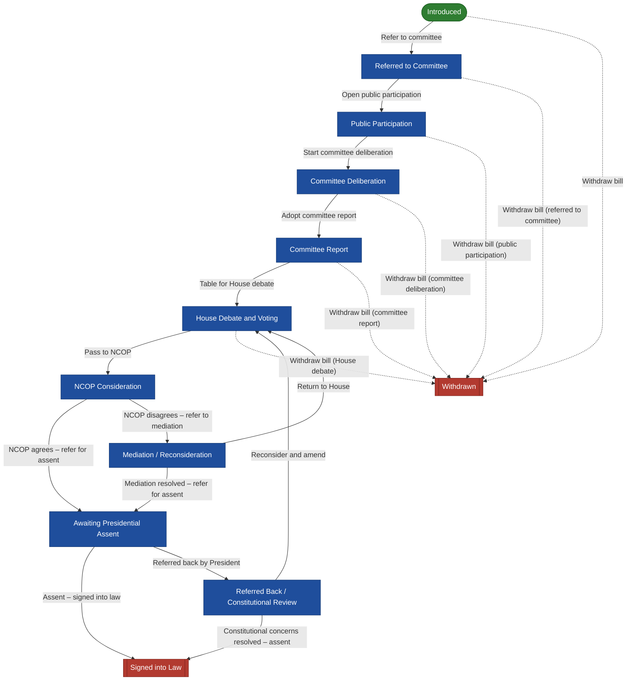

# Bill workflow

Bill lifecycle (Online Bill Tracking BRS): Introduced → Referred to Committee → Public Participation → Committee Deliberation → Committee Report → House Debate and Voting → NCOP Consideration → Awaiting Presidential Assent → Signed into Law, with mediation, presidential referral back and withdrawal branches. Internal states map to the BRS §12 public statuses through State.public_name.

