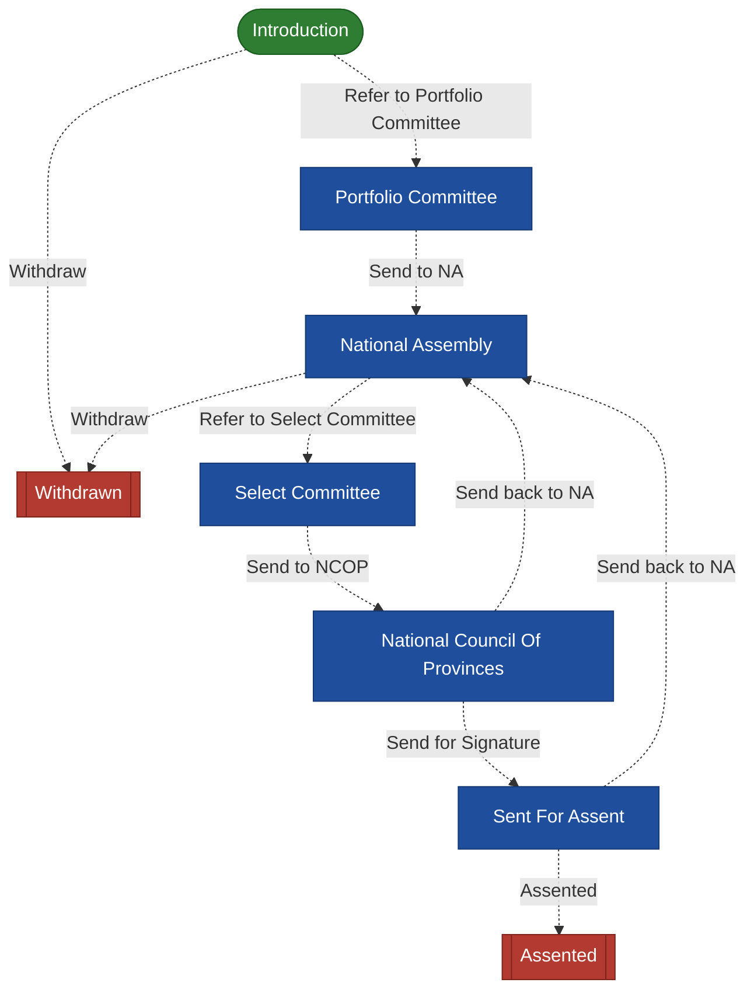

# Bill workflow

Revised design of Bill Tracker

```mermaid
%% Generated by `manage.py generate_diagrams`; do not edit by hand.
%% Workflow: Bill
flowchart TD
    classDef initial fill:#2F7D32,stroke:#1B5E20,color:#FFFFFF,stroke-width:1px
    classDef regular fill:#1F4E9C,stroke:#163A73,color:#FFFFFF,stroke-width:1px
    classDef terminal fill:#B23A30,stroke:#7F241D,color:#FFFFFF,stroke-width:1px
    s0(["Introduction"]):::initial
    s1["Portfolio Committee"]:::regular
    s2[["Withdrawn"]]:::terminal
    s3["National Assembly"]:::regular
    s4["Select Committee"]:::regular
    s5["National Council Of Provinces"]:::regular
    s6["Sent For Assent"]:::regular
    s7[["Assented"]]:::terminal
    s6 -.->|"Assented"| s7
    s0 -.->|"Refer to Portfolio Committee"| s1
    s3 -.->|"Refer to Select Committee"| s4
    s5 -.->|"Send back to NA"| s3
    s6 -.->|"Send back to NA"| s3
    s5 -.->|"Send for Signature"| s6
    s1 -.->|"Send to NA"| s3
    s4 -.->|"Send to NCOP"| s5
    s0 -.->|"Withdraw"| s2
    s3 -.->|"Withdraw"| s2
```
