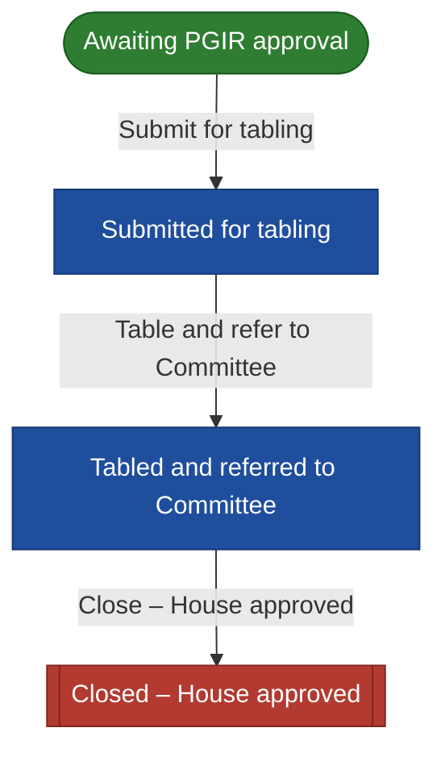

# Delegation Report workflow

Delegation report lifecycle (BRS BR02): Awaiting PGIR approval → Submitted for tabling → Tabled and referred to Committee → Closed – House approved.

```mermaid
%% Generated by `manage.py generate_diagrams`; do not edit by hand.
%% Workflow: Delegation Report
flowchart TD
    classDef initial fill:#2F7D32,stroke:#1B5E20,color:#FFFFFF,stroke-width:1px
    classDef regular fill:#1F4E9C,stroke:#163A73,color:#FFFFFF,stroke-width:1px
    classDef terminal fill:#B23A30,stroke:#7F241D,color:#FFFFFF,stroke-width:1px
    s0(["Awaiting PGIR approval"]):::initial
    s1["Submitted for tabling"]:::regular
    s2["Tabled and referred to Committee"]:::regular
    s3[["Closed – House approved"]]:::terminal
    s0 -->|"Submit for tabling"| s1
    s1 -->|"Table and refer to Committee"| s2
    s2 -->|"Close – House approved"| s3
```
