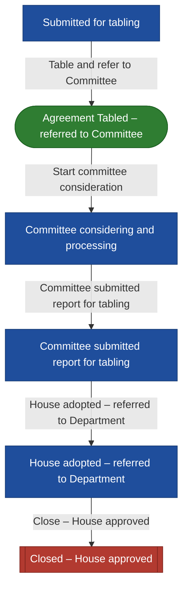

# International Agreement workflow

International agreement lifecycle (BRS International Agreements Tracking and Monitoring): Submitted for tabling → Agreement Tabled – referred to Committee → Committee considering and processing → Committee submitted report for tabling → House adopted – referred to Department → Closed – House approved.

