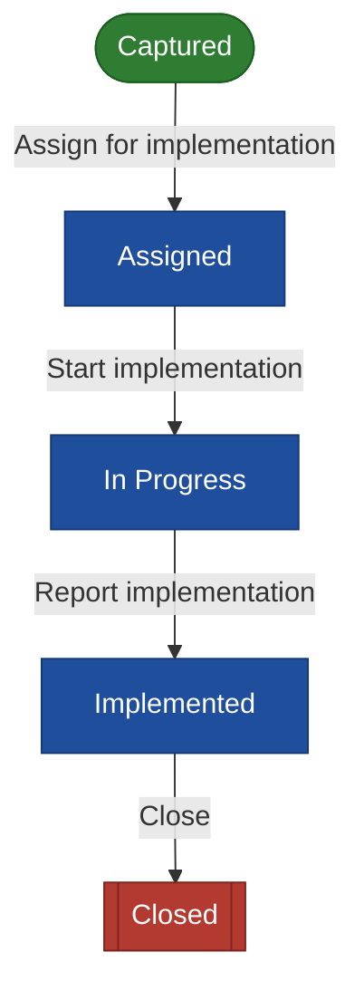

# International Resolution workflow

International resolution implementation tracking: Captured → Assigned → In Progress → Implemented → Closed.

```mermaid
%% Generated by `manage.py generate_diagrams`; do not edit by hand.
%% Workflow: International Resolution
flowchart TD
    classDef initial fill:#2F7D32,stroke:#1B5E20,color:#FFFFFF,stroke-width:1px
    classDef regular fill:#1F4E9C,stroke:#163A73,color:#FFFFFF,stroke-width:1px
    classDef terminal fill:#B23A30,stroke:#7F241D,color:#FFFFFF,stroke-width:1px
    s0(["Captured"]):::initial
    s1["Assigned"]:::regular
    s2["In Progress"]:::regular
    s3["Implemented"]:::regular
    s4[["Closed"]]:::terminal
    s0 -->|"Assign for implementation"| s1
    s1 -->|"Start implementation"| s2
    s2 -->|"Report implementation"| s3
    s3 -->|"Close"| s4
```
